# 发布的最佳 iPad 应用 

> 原文：<https://web.archive.org/web/http://techcrunch.com/2010/04/02/best-ipad-apps-launch/>

为了准备明天 iPad 的发布， [iPad 应用程序已经在 iTunes 中上线](https://web.archive.org/web/20230203071851/https://techcrunch.com/2010/04/01/ipad-apps-live/),我们正在尽可能快地挑选最好的应用程序。但是苹果应用商店里有超过 2000 个 iPad 应用，这些选择已经让人望而生畏了。

为了帮助你在发布时找到最好的应用，我们整理了下面的最终列表。它包括所有在 TechCrunch 上评论过的 iPad 应用程序，以及其他我们还没有看到的有前途的应用程序。如果你有一个最喜欢的，你认为应该在这个名单上，告诉我们为什么在评论中。

以下是我们的列表，我们会在 iPad 发布时不断更新:

### iBooks

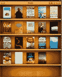

苹果对亚马逊 Kindle 的回应是，iBooks 将 iPad 变成了电子书阅读器，推出时有 60，000 本书可供选择(该应用程序是免费的，电子书不是)。尽管 Kindle 有更多的书籍(450，000 本)，iBooks 允许你用手指在彩色屏幕上翻阅虚拟页面。内置的搜索和字典会派上用场。字体大小和亮度可以调整。页面可以添加书签或高亮显示。书籍可以在整页视图中垂直阅读，也可以像普通打开的书一样在两页视图中水平阅读。书店是应用程序的一部分，看起来像书籍的 iTunes，有畅销书和最受欢迎的列表。每次你买书，它都会直接下载到你的 iPad 上。

价格:App 免费；每本书通常从 9.99 美元到 14.99 美元不等，许多都是免费的。( [iTunes 链接](https://web.archive.org/web/20230203071851/http://itunes.apple.com/us/app/ibooks/id364709193?mt=8))

### iPad 版 Kindle

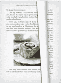

为了不被苹果的 iBooks 应用程序超越，亚马逊为 iPad 发布了自己的 Kindle 应用程序，其功能几乎与 iBook 应用程序的功能相匹配:全彩色触摸屏应用程序，动画翻页，可调字体大小和亮度(加上你可以改变背景颜色)，纵向或横向模式，以及直接从应用程序购买书籍的能力。当然，亚马逊有更多的书可供选择(45 万对 6 万)。(搜索和词典功能“即将推出”。它还包括亚马逊的 Whispersync 技术，可以让你从普通 Kindle、iPhone Kindle 应用程序、黑莓、Mac 或 PC 上停止的地方继续。Kindle 商店包括你能在亚马逊网站上找到的所有常规顾客评论。让数字图书大战开始吧。

价格:免费，书籍单独定价( [iTunes 链接](https://web.archive.org/web/20230203071851/http://itunes.apple.com/us/app/kindle/id302584613?mt=8)

### 抽头抽头辐射

来自我们[的帖子](https://web.archive.org/web/20230203071851/https://techcrunch.com/2010/04/02/tap-tap-revenge-ipad/):“新游戏在许多方面与 iPhone 游戏系列相似——你仍然可以随着音乐的节奏点击屏幕上的按钮。但为了优化 iPad 的游戏性，还是做了一些关键的改动。首先，大多数人会把 iPads 平放在桌子上或膝盖上玩游戏(而不是像 iPhone 一样单手拿着)。由于游戏玩家将解放双手，辐射的游戏更加复杂，促使游戏玩家在 iPad 的整个屏幕上跳舞时有节奏地点击这些发光的小球。多人也可以在同一台设备上同时玩游戏。”

价格:免费( [iTunes 链接](https://web.archive.org/web/20230203071851/http://itunes.apple.com/us/app/tap-tap-radiation/id364160328?mt=8))

### 网飞

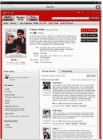
来自我们的[帖子](https://web.archive.org/web/20230203071851/https://techcrunch.com/2010/04/01/netflix-ipad/):“假设你是网飞的会员，新的 iPad 应用程序可以让你想看多少电影就看多少电影(假设你可以在网飞的即时观看服务上观看电影)。是的，这可以让你观看 20，000 多部电影和电视节目。您还可以从应用程序中浏览电影和管理您的队列。你甚至可以从你离开电视或电脑的地方继续观看。”

价格:免费( [iTunes 链接](https://web.archive.org/web/20230203071851/http://itunes.apple.com/us/app/netflix/id363590051?mt=8))

### Loopt 脉冲

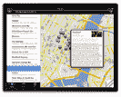

来自我们的[帖子](https://web.archive.org/web/20230203071851/https://techcrunch.com/2010/04/02/loopt-ipad/):“iPad 可能更适合围绕位置来规划活动，而不是主动参与位置。使用 Loopt Pulse，你可以打开主屏幕，查看你在哪里以及你周围发生的一切。在屏幕的左边，你会看到一个地方的列表，在右边，你可以在地图上看到这些地方，以及更多关于它们的细节。

“这些有特色的地方出现是因为很多 Loopt 用户喜欢这个地方，或者目前正在那里。或者这个地方在当地报纸上有正面评价。您也可以按事件和朋友进行排序。在“朋友”选项卡上，您只能看到您的脸书朋友喜欢的地方(您通过脸书连接进行连接)。但 Loopt 也想利用 iPad 又大又漂亮的屏幕，所以他们还建立了一个新功能，让你可以通过图片浏览当地的地方。”

价格:免费( [iTunes 链接](https://web.archive.org/web/20230203071851/http://itunes.apple.com/us/app/loopt-pulse/id364158180?mt=8))

### TweetDeck

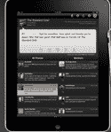

TweetDeck 的 iPad 产品与其流行的桌面流阅读器非常相似。你可以将你的 Twitter 和脸书流分成不同的栏目，滑动以查看更多内容，或者上下浏览。你可以使用 iPad 的触摸屏键盘撰写推文。一个新功能是显示你关注的人的所有地理标记推文的地图。它看起来很华丽。观看[演示视频](https://web.archive.org/web/20230203071851/http://www.youtube.com/watch?v=0KB-K5na0r4)。

价格:免费( [iTunes 链接](https://web.archive.org/web/20230203071851/http://itunes.apple.com/us/app/tweetdeck-for-ipad/id364153769?mt=8))

### 船长日志

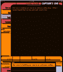

这可能只是 iTunes 商店中最好的应用程序。它把你的 iPad 变成了《星际迷航》中的船长日志。你可以添加自己的笔记，或者用它在 Twitter 和脸书上发布更新。这个应用程序可能没有你在 TweetDeck 中找到的所有铃铛和口哨，但它会让你感觉像一个星舰船长。它是如此的复古，又是如此的未来。

价格:0.99 美元

### SGN 的 EXO 星球

来自我们的[帖子](https://web.archive.org/web/20230203071851/https://techcrunch.com/2010/04/02/sgns-intergalactic-capture-the-flag/):“虽然一些游戏开发商只是将 iPhone 应用程序转换为 iPad 格式，但多人游戏《EXO 星球》正试图通过让玩家只需转动手指即可访问八个拍摄角度来提升射击游戏体验。游戏的第一阶段发生在未来精英部队的训练场。玩家穿着“巨大的 EXO 宇航服”——厚重的金属宇航服，在零重力的未来空间中跳跃和缩放。在训练阶段，目标是获取对方(或团队)的旗帜。八个摄像头的视角创造了一个非常无缝的观看体验。此外，如果你正试图越过你的战斗机看过去，角色将短暂地出现透明，以最大化你的视线。”

售价 6.99 美元( [iTunes 链接](https://web.archive.org/web/20230203071851/http://itunes.apple.com/us/app/exo-planet/id364883227?mt=8)

### 潘多拉电台

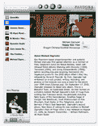

来自我们的[帖子](https://web.archive.org/web/20230203071851/https://techcrunch.com/2010/04/01/pandora-ipad/):“Pandora 的 3.0 版本是一个通用的应用程序，这意味着它包括 iPhone 和 iPad 的版本。iPad 版本利用了该设备的 9.7 英寸大屏幕。不必切换视图来查看电台等内容，它们可以位于屏幕的左侧，因为您的专辑插图和艺术家信息位于右侧。艺术家信息是这个新应用程序的一个特别强调的领域。顶部的播放器看起来和现在的 iTunes 很像，有播放和暂停按钮，还有拇指向上和拇指向下按钮。顶部还有一个易于访问的搜索框。”

价格:免费( [iTunes 链接](https://web.archive.org/web/20230203071851/http://itunes.apple.com/us/app/pandora-radio/id284035177?mt=8))

### 美味的食谱和购物清单

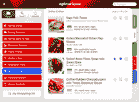

来自我们的[帖子](https://web.archive.org/web/20230203071851/https://techcrunch.com/2010/04/01/conde-nast-cooks-up-a-tasty-digital-cookbook-with-the-epicurious-ipad-app/):“这款应用的功能与它的姐妹 iPhone 应用相似，本质上是一个标签式的数字食谱，允许你访问美食和好胃口网站的 27，000 种食谱。你可以浏览食谱收藏，通过关键词搜索，并根据你冰箱里的东西、季节性食物、假期等过滤你的搜索。你可以添加任何食谱到你的收藏夹来保存它，也可以通过电子邮件把食谱发给你自己和其他人。

“你还可以将保存的食谱中的配料添加到购物清单中，并在购买时进行核对。。。。iPad 的特性可能会给烹饪和菜谱应用程序注入新的活力。一边烹饪一边在 iPhone 和其他移动设备上阅读食谱可能会很艰难；iPad 的大屏幕模拟了一本数字烹饪书。

价格:免费( [iTunes 链接)](https://web.archive.org/web/20230203071851/http://itunes.apple.com/us/app/epicurious-recipes-shopping/id312101965?mt=8)

### NYT 的编辑选择

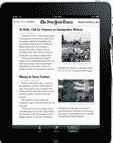

来自我们的[帖子](https://web.archive.org/web/20230203071851/https://techcrunch.com/2010/04/02/the-new-york-times-launches-free-ipad-app-for-real-now-paid-app-on-the-way/):“iPad 应用程序提供了由时报编辑选择的新闻、观点和专题文章，可以自动下载到平板设备上。它提供了两页的内容，包括最新新闻、商业、技术、观点和专题部分的八到十篇文章，并附有视频和照片幻灯片。”

价格:目前是免费的，但一个付费应用程序即将推出

### 华尔街日报

这份报纸的限量版及其所有免费文章。订户可以得到整份报纸。iPad 应用模仿了纸质版的外观，还包括市场数据、视频和照片幻灯片。订户可以下载一周的文章供以后阅读。

价格:免费，付费升级( [iTunes 链接](https://web.archive.org/web/20230203071851/http://itunes.apple.com/us/app/the-wall-street-journal/id364387007?mt=8))

### iPad 的易贝

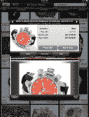

来自我们的[帖子](https://web.archive.org/web/20230203071851/https://techcrunch.com/2010/04/02/ebays-ipad-app-go-graphic-big-or-go-home/):“易贝推出了一款 iPad 应用程序，旨在通过将图像放在设计的中心，使用超大缩略图和在设备边缘出血图像特写来吸引用户。iPad 的触摸屏功能增强了传统的易贝搜索，让用户只需轻点几下手指就能快速浏览多个搜索页面。页面底部还有一个价格直方图，可以让你将搜索范围缩小到特定的价格范围——直方图还包括一个成交量图表，这样你就可以看到商品在价格范围内的集中程度。就感觉和设计而言，这似乎是网站和 iPhone 应用程序的巨大进步。”

价格:免费( [iTunes 链接](https://web.archive.org/web/20230203071851/http://itunes.apple.com/us/app/ebay-for-ipad/id364203371?mt=8)

### iPad 镀金

从我们的[帖子](https://web.archive.org/web/20230203071851/https://techcrunch.com/2010/04/02/gilt-groupe-brings-flash-sales-to-the-ipad/)来看:Gilt Groupe 旗下奢侈品的销售，包括 Gilt、Gilt Fuse 和 Gilt Man，都可以直接从应用程序中访问。该应用程序允许您接收实时销售警报，检查即将到来的销售，并在您下载该应用程序时立即获得 Gilt 会员资格。该应用程序的购物车总是可见的，允许成员快速触摸并拖动所需的物品到他们的购物车中。

价格:免费( [iTunes 链接](https://web.archive.org/web/20230203071851/http://itunes.apple.com/us/app/gilt-for-ipad/id363337072?mt=8)

### 极光佯攻 3

来自我们的[帖子](https://web.archive.org/web/20230203071851/https://techcrunch.com/2010/04/02/aurora-feint-debuts-social-gaming-app-for-the-ipad/):“随着 Aurora Feint 3 的发布，Aurora Feint 正在进入 iPad 游戏，这是一款基于虚拟商品的免费大型多人社交游戏应用程序。不出所料，这款游戏利用了 OpenFeint X，允许游戏开发者创建类似 Zynga 的免费游戏，包括微交易和虚拟商品。虽然这款游戏可以免费玩，但它的主要收入来源将来自应用程序中的微交易。随着 Zynga 和 PlayFish 在脸书的成功，Aurora Feint 希望在游戏市场分一杯羹，并希望在移动设备上帮助创建类似 Farmville 的游戏。”

价格:免费，微交易( [iTunes 链接](https://web.archive.org/web/20230203071851/http://itunes.apple.com/us/app/aurora-feint-3/id362847295?mt=8))

### 鲑鱼

来自我们的[帖子](https://web.archive.org/web/20230203071851/https://techcrunch.com/2010/04/01/freshplanet-ipad-game-1-5m-clavier/):“红鱼是基于一个流行的法国儿童学习网站，名为 Poisson Rouge。FreshPlanet 授权了这款游戏，并专门为 iPad 开发了一个版本。没有 iPhone 版本。红鱼教 3 到 7 岁的孩子数数、阅读、拼写，甚至作曲，所有这些都使用 iPad 迷人的触摸屏。这款应用程序是免费的，有 12 种不同的活动，但解锁其余的(总共有 50 种)需要花费 9.99 美元。

价格:免费，9.99 美元升级( [iTunes 链接](https://web.archive.org/web/20230203071851/http://itunes.apple.com/us/app/redfish-for-ipad/id364257022?mt=8))

### ABC 播放器

美国广播公司(ABC)的 iPad 免费剧集播放器从该网络的节目列表中播放广告支持的视频。你可以从网络上观看精选剧集的完整长度，包括*迷失*、*实习医生格蕾*和*现代家庭*。您还可以浏览节目和剧集，暂停一集，稍后观看并查看您的观看历史。视频流入占据屏幕上半部分的播放器，同时让你沿着底部浏览其他剧集。(大概也有全屏选项吧)。

价格:免费( [iTunes 链接](https://web.archive.org/web/20230203071851/http://itunes.apple.com/us/app/abc-player/id364191819?mt=8))

### 皮划艇航班

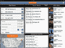

Kayak 是网络上最有用的旅游搜索引擎之一，它的 iPad 应用程序也为平板设备带来了同样的功能。这款应用可以让你比较 Priceline、Expedia、Travelocity、Hotwire 和航空公司网站上的航班价格。此外，该应用程序将保存您的搜索历史，映射您的搜索，并允许您直接从应用程序预订。

价格:免费( [iTunes 链接](https://web.archive.org/web/20230203071851/http://itunes.apple.com/us/app/kayak-flights/id363205965?mt=8)

### 美国全国公共广播电台

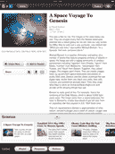

NPR 的 iPad 应用程序与它的 iPhone 应用程序类似，因为它具有 NPR 节目和 1000 多个会员站流的链接，允许你同时浏览新闻报道和收听节目。NPR 网站已经针对 iPad 进行了修改，以支持 HTML5，并在屏幕底部包括一个音频播放器，这样你就可以轻松地收听媒体。

价格:免费( [iTunes 链接](https://web.archive.org/web/20230203071851/http://itunes.apple.com/us/app/npr-for-ipad/id364183644?mt=8))

### 拼字游戏

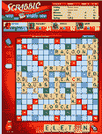

Scrabble 的 iPad 应用程序比它的 iPhone 应用程序更加生动有趣，让你可以和脸书上的朋友联系，同时玩多达 25 个 Scrabble 游戏。当你在玩的时候，应用程序的教师功能会让你看到你上一轮的最佳单词选择。

价格:9.99 美元

### 雅虎娱乐

Yahoo Entertainment 是一个交互式电视指南，它从不同的 Yahoo 资产和合作伙伴(新闻、体育等)接收视频流。)

价格:免费( [iTunes 链接](https://web.archive.org/web/20230203071851/http://itunes.apple.com/us/app/yahoo-entertainment/id363783657?mt=8))

### 平方

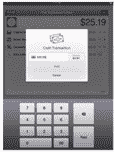来自我们的[帖子:](https://web.archive.org/web/20230203071851/https://techcrunch.com/2010/04/03/square-ipad/) Square 配备了外围信用卡刷卡器，允许任何商店或商人在 iPhones 上接受信用卡(或现金)支付，现在，iPads 也可以。它可以在触摸屏上进行手指签名，生成电子邮件或短信收据，计算销售税，并带有一个在线会计仪表板来跟踪销售情况。

价格:免费( [iTunes 链接](https://web.archive.org/web/20230203071851/http://itunes.apple.com/us/app/square/id335393788?mt=8)

### iPad 版 Gmail

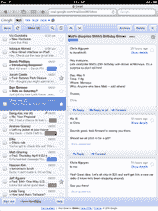来自我们的[帖子](https://web.archive.org/web/20230203071851/https://techcrunch.com/2010/04/02/gmail-ipad-app/):这不是你从 App Store 得到的应用程序——这是一个网络应用程序。只需从你的 iPad 进入[Gmail.com](https://web.archive.org/web/20230203071851/http://www.gmail.com/)，你就会被自动导向这个优化版的 Gmail。这个基于 HTML5 的网站，当你从设备上访问 Gmail.com 时会自动激活，它有一个漂亮的两栏视图，左栏是消息列表，右栏是消息内容。

### Amazon.com IMDb

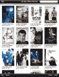来自我们的[帖子](https://web.archive.org/web/20230203071851/https://techcrunch.com/2010/04/04/imdb-ipad/):亚马逊为 Kindle 开发的第二款 iPad 应用是其 IMDb(互联网电影数据库)iPhone 应用的优化版本。据该公司称，用于 iPad 的 IMDb 电影电视应用程序可以让客户访问超过 150 万部电影和电视节目，以及 320 万名名人、演员、女演员、导演和工作人员的信息。

用户还可以使用该应用程序观看高清电影预告片，查找美国本地化的电影放映时间，浏览照片库，购买 DVD 和蓝光版本。这款应用是免费的——到目前为止，它还没有在 iTunes 上获得任何评论。

价格:免费( [iTunes 链接](https://web.archive.org/web/20230203071851/http://itunes.apple.com/us/app/imdb-movies-tv/id342792525?mt=8))

### Fwix

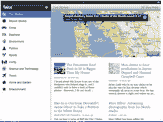来自我们的[帖子](https://web.archive.org/web/20230203071851/https://techcrunch.com/2010/04/04/fwixs-brings-hyperlocal-news-feed-to-the-ipad/):该应用旨在模拟阅读当地报纸。Fwix 的应用程序允许你以地图格式查看新闻故事，向你显示新闻的确切地理位置。您可以通过您所在的位置获取新闻，然后按主题(如体育、艺术、政治、犯罪)过滤新闻。你可以在脸书、推特或通过电子邮件分享所有内容。

价格:免费( [iTunes 链接](https://web.archive.org/web/20230203071851/http://itunes.apple.com/us/app/fwix/id306686874?mt=8)