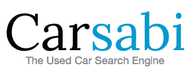

# 的精选:Y Combinator 演示日的 10 大最佳创业公司

> 原文：<https://web.archive.org/web/https://techcrunch.com/2012/03/27/best-of-y-combinator-demo-day/>

今天，65 家初创公司在 Y Combinator 的展示日展示，我们涵盖了所有 39 家准备向公众开放的公司。在与风投和科技巨头交谈后，TechCrunch 团队聚在一起，选出了这 10 家最佳公司。他们正在颠覆商业，进化我们的交流方式，并且[让我们的手机变得更加强大](https://web.archive.org/web/20221209183859/https://beta.techcrunch.com/2012/03/27/ycmobile/)。

查看我们对[第一场](https://web.archive.org/web/20221209183859/https://beta.techcrunch.com/2012/03/27/yc-demo-day-session-1/)、[第二场](https://web.archive.org/web/20221209183859/https://beta.techcrunch.com/2012/03/27/yc-demo-day-session-2-midnox-42floors-sonalight-your-mechanic/)、[第三场](https://web.archive.org/web/20221209183859/https://beta.techcrunch.com/2012/03/27/y-combinator-demo-day-session-3/)、[第四场](https://web.archive.org/web/20221209183859/https://beta.techcrunch.com/2012/03/27/y-combinator-demo-day-session-4/)和[第五场](https://web.archive.org/web/20221209183859/https://beta.techcrunch.com/2012/03/27/yc-demo-day-winter-2012-session-5/)的报道，选择你自己最喜欢的，但这里有一张我们认为将重塑大型行业~~改变世界~~、或至少赚一大笔钱的创业公司的小抄。

 [Carsabi](https://web.archive.org/web/20221209183859/http://carsabi.com/) :一个进化而来的购买二手车的搜索引擎。Carsabi 积极搜索它能找到的所有在线汽车销售列表，从分类广告到经销商。它已经比行业领先的 AutoTrader 提供了更多的交易，并具有让你按最大节省排序的功能，而不仅仅是最低价格。社交功能让用户向朋友寻求购买建议，这巧妙地成为一种病毒机制。这是一个巨大的市场，因为去年汽车销售支出为 6500 亿美元，汽车广告支出为 38 亿美元。自 2 月中旬推出以来，Carsabi 的周环比增长率为 10%，因为当人们存钱时，他们会告诉朋友。

上周，TechCrunch 首次报道了一个针对情侣的私人社交网络[，Pair 允许两个人创建一个私人时间线，在那里他们可以分享照片、视频、草图、活动等等。这款 iPhone 应用四天前刚刚推出，已经获得了超过 5 万名注册用户，他们使用 Pair 发送了超过 100 万条信息。Pair 获得了 SV Angel 和 Path 创始人戴夫·莫兰(Dave Morin)的资助，他告诉 Pair 的团队，脸书创造了社交网络的“城市”，Path 正在建造它的“房子”，Pair 就像它的“卧室”我认为一键“想你”按钮会大受欢迎。](https://web.archive.org/web/20221209183859/https://beta.techcrunch.com/2012/03/23/pair-is-a-path-for-the-two-of-us/)

 [价格经济学](https://web.archive.org/web/20221209183859/http://priceonomics.com/):任何东西的[在线价格指南](https://web.archive.org/web/20221209183859/https://beta.techcrunch.com/2011/12/22/priceonomics/)。输入你想要的任何东西，它会告诉你它应该值多少钱，比如智能手机、笔记本电脑、电视、音响等等的凯利蓝皮书。Priceonomics 通过数亿笔交易来发现人们在卖什么，卖了多少钱。它在 3 月份获得了 25 万次页面浏览量，计划通过定向广告赚钱，并已经获得了来自 SV Angel、Andreessen Horowitz、CrunchFund 和几个天使的投资。

 [你的机械师](https://web.archive.org/web/20221209183859/http://www.yourmechanic.com/):你的机械师是一个网站，旨在成为“汽车维修的 Airbnb”，将你与当地社区最好的机械师联系起来，并委托他们上门为你修车。据该公司称，这比典型的机械师或汽车经销商平均便宜 30%。在私人测试版中，你的机械师到目前为止已经有 90，000 美元的账单，平均每个用户每笔交易节省 200 美元。

[sona light](https://web.archive.org/web/20221209183859/http://sonalight.com/):sona light 自诩为“类固醇上的 Siri”，它是一款旨在让你在开车时[只用你的声音](https://web.archive.org/web/20221209183859/https://beta.techcrunch.com/2012/03/08/sonalight-lets-android-users-text-while-driving-without-touching-a-phone/)发送短信的应用。据称，即使手机在你的口袋里，该应用程序也能工作。自去年 10 月推出以来，这款应用已经以每周 5 万条的速度发送了 50 万条短信。从长远来看，Sonalight 团队的目标是将其语音命令功能引入其他设备，如恒温器。

[【42 层楼】](https://web.archive.org/web/20221209183859/http://www.42floors.com/):42 层楼以成为商业地产的 Trulia 为目标，为寻找办公空间的公司建立了一个圆滑的网站。42Floors 还为室内设计师和家具供应商等服务提供商建立了一个市场，供商业租户在需要装修新办公室时使用。42Floors 已经有包括 SV 天使和 Startfund 在内的 10 家投资者。

 [Exec](https://web.archive.org/web/20221209183859/http://iamexec.com/) :你有没有想过拥有自己的私人助理？Exec 应用程序可以让你在 10 分钟内拥有一个，每小时 25 美元。你可以使用 Exec 来外包差事和小工作，如干洗取件和基本研究任务，到目前为止，它已经证明非常受欢迎:在过去的一周内，99%的客户对 Exec 完成的工作给予了四星或五星的评价，29%的客户在使用它的第一周内回来，该公司自今年早些时候推出测试版以来已经处理了价值 3.2 万美元的交易。你可以在这里阅读我们之前关于[高管](https://web.archive.org/web/20221209183859/https://beta.techcrunch.com/2012/03/26/exec-justin-kan-corporate-accounts/)和[高管](https://web.archive.org/web/20221209183859/https://beta.techcrunch.com/2012/02/29/exec-justin-tv)的报道。

 [Midnox](https://web.archive.org/web/20221209183859/http://midnox.com/) :他们已经开发了[Luma](https://web.archive.org/web/20221209183859/http://http//itunes.apple.com/us/app/luma./id429372480?ls=1&mt=8)，这是一款 iPhone 应用程序，可以实时稳定用手机拍摄的视频。该应用程序还实时添加了全分辨率视觉滤镜，这是“非破坏性的”，这意味着它们可以在录制结束后被更改或删除。该公司还为用 Luma 拍摄的视频建立了编辑工具和共享功能。

 [众筹](https://web.archive.org/web/20221209183859/https://www.crowdtilt.com/):任何人众筹任何东西的简单方式。虽然 Kickstarter 对更大的组织和创业公司来说很棒，但 [Crowdtilt 是为朋友群体](https://web.archive.org/web/20221209183859/https://beta.techcrunch.com/2012/02/10/y-combinator-backed-crowdtilt-launches-to-become-the-kickstarter-for-any-group/)优化的。它专门确保组织者得到他们的钱，在推出后的六周内，它已经通过其系统获得了 40 万美元。这个数字正以每周 21%的速度增长，34%的用户会回来投资另一个项目。想象一下，当你和朋友分担费用时，你可以去参加有趣的旅行和聚会。

 通过解决这些问题，iCracked 已经建立了一个非常繁荣的业务。iCracked 表示，它是目前美国最大的 iOS 设备维修公司，在全球范围内拥有 500 多名技术人员，他们可以在半小时内找到你，以竞争对手一半的价格修复你有裂缝或被水损坏的设备。该公司在过去三个月中拥有超过 10，000 名客户，是 1 月份的三倍，并且每周注册 10 名新的设备维修人员。展望未来，iCracked 正寻求在 iOS 之外扩张，建立一个保险部门，并推出设备再分配模式。

*Eric Eldon 和 Colleen Taylor 撰写的其他博客* 
*阅读更多 Y Combinator 演示日报道，查看所有 39 家公开展示的创业公司:*

*   [在 Y Combinator 有史以来最大的演示日，移动设备正在接管](https://web.archive.org/web/20221209183859/https://beta.techcrunch.com/2012/03/27/ycmobile/)
*   [YC 演示日第一场:](https://web.archive.org/web/20221209183859/https://beta.techcrunch.com/2012/03/27/yc-demo-day-session-1/) PlanGrid、Medigram、Zillabyte、HireArt、Flutter、Givespark、Popset、SendHub、Screenleap、Coderwall、LVL6
*   [YC 演示日第二场](https://web.archive.org/web/20221209183859/https://beta.techcrunch.com/2012/03/27/yc-demo-day-session-2-midnox-42floors-sonalight-your-mechanic/) : Midnox，42 层，Sonalight，你的机械师
*   [YC 演示日第三场](https://web.archive.org/web/20221209183859/https://beta.techcrunch.com/2012/03/27/y-combinator-demo-day-session-3/) : Crowdtilt、Flypad、Carsabi、Anyperk、TiKL、Dealupa、Priceonomics、Kyte、EveryArt
*   [YC 演示日第四场](https://web.archive.org/web/20221209183859/https://beta.techcrunch.com/2012/03/27/y-combinator-demo-day-session-4/) : Shoptiques、Pair、Daily Muse、Per Vices、iCracked、Socialcam、AnyVivo
*   [YC 展示日第五场](https://web.archive.org/web/20221209183859/https://beta.techcrunch.com/2012/03/27/yc-demo-day-winter-2012-session-5/) : Hackpad、FamilyLeaf、Ark、Chute、Minefold、Exec、99dresses、Matterport