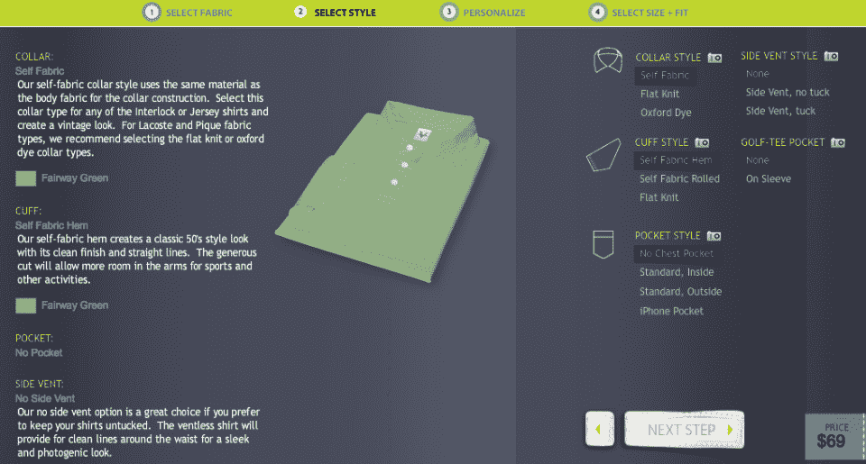
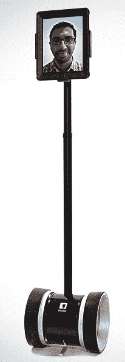
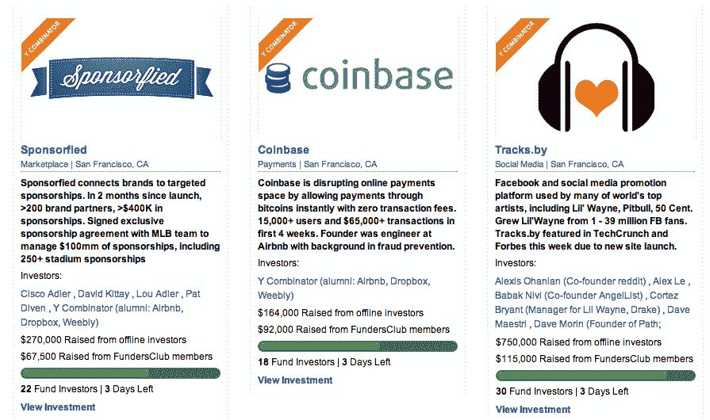
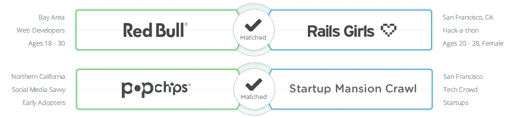
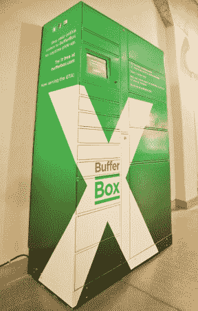
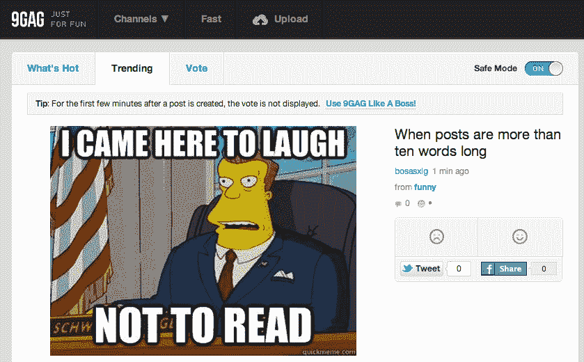

# TechCrunch 的精选:Y Combinator S12 演示日的 10 大最佳创业公司

> 原文：<https://web.archive.org/web/https://techcrunch.com/2012/08/21/best-of-yc-demo-day/>

75 家创业公司今天在 Y Combinator 的第 15 个展示日上倾尽全力。我们看到小企业肯定会进行高风险的大赌注，但在收集了他们的 YCS12 同学和顶级风投的意见后，这些是 TechCrunch 的 10 大精选。

*【由 TechCrunch 作家 Josh Constine、Anthony Ha、Colleen Taylor 和 Kim-Mai Cutler 随机选择和编辑。还有许多其他很棒的演示，所以从我们对所有 64 家创业公司的全面报道中选择你自己最喜欢的吧:[第一批](https://web.archive.org/web/20230316161606/https://techcrunch.com/2012/08/21/yc-demo-day-s12/)，[第二批](https://web.archive.org/web/20230316161606/https://techcrunch.com/2012/08/21/y-combinator-second-batch/)，[第三批](https://web.archive.org/web/20230316161606/https://techcrunch.com/2012/08/21/y-combinator-s12-demo-day-batch-three-getgoing-bigcalc-tracksby-and-more/)，[第四批](https://web.archive.org/web/20230316161606/https://techcrunch.com/2012/08/21/y-combinator-s12-batch-4/)，*

#### [Vastrm](https://web.archive.org/web/20230316161606/http://vastrm.com/)——衬衫的 Warby Parker

**为什么？我们的衣服不合身，真可笑。**

[Vastrm](https://web.archive.org/web/20230316161606/http://vastrm.com/) 有一个非常简单的目标:[给你买一件最合身的衬衫](https://web.archive.org/web/20230316161606/https://techcrunch.com/2012/08/09/y-combinators-vastrm-promises-the-perfect-fitting-polo/)。创始人乔纳森·唐(Jonathan Tang，应该提到的是，他在给投资者做演示时可以令人信服地穿上一条粉红色的裤子)的血统相当不错:他的家族多年来一直从事面料生意，他说现在美国人穿的每六件 t 恤中就有一件是他们制作的。据唐说，服装行业的圣杯是找到合适的合身衣服。

Vastrm 旨在通过提供一套独特的 t 恤尺寸来解决这一问题，让顾客在家试穿几件，直到找到一件合适的为止，从而找到适合自己的尺寸。Vastrm 还与整个服装行业供应链建立了联系，这将有助于提高公司的利润率。唐说，这里的潜在市场比 Warby Parker 更大，因为“不是每个人都戴眼镜，但每个人都穿衬衫。”阅读更多关于 T21 的信息。

#### **[双机器人](https://web.archive.org/web/20230316161606/http://www.doublerobotics.com/) —一个用 iPad 做脸的电话会议机器人**

**为什么？让苹果公司建造你的电子人的大脑。**

"忘掉你所知道的关于远程呈现机器人的一切."Double Robotics 已经[创造了一种叫做 Double](https://web.archive.org/web/20230316161606/https://techcrunch.com/2012/08/13/meet-the-double-a-teleconferencing-robot-with-an-ipad-for-a-face/) 的机器，它本质上是一个可驱动的 iPad 机器人支架——你只需安装一个 iPad 应用程序就可以开始电话会议。通过这种方法，Double Robotics 可以提供更实惠的远程呈现机器人，每双收费 1999 美元。

测试者包括强生公司和可口可乐公司。第一批双倍应该会在今年晚些时候发出，尽管网站上说第一批已经卖完了。Double Robotics 表示，它已经看到超过 50 万美元的预订，订单来自 7 家财富 500 强公司。[阅读更多关于双机器人的信息。](https://web.archive.org/web/20230316161606/http://www.doublerobotics.com/)

#### [Zapier](https://web.archive.org/web/20230316161606/https://zapier.com/) :网络应用的跨 API 连接器

**为什么？外面是一片蜜蜂的丛林。**

这家初创公司让企业可以轻松实现网络上常见任务的自动化，并在不同的网络应用程序之间同步数据。It [最近宣布推出其第三方开发者平台。该公司表示，向云服务的大规模迁移和大量新的 web APIs 使得服务更难与其他应用程序连接。Zapier 说，它的服务就像一个枢纽，代表着所有这些不同的部分。](https://web.archive.org/web/20230316161606/https://techcrunch.com/2012/08/01/yc-backed-zapier-the-ifttt-for-business-users-launches-developer-platform/)

**为什么？因为不可能每个人都是硅谷圈内人。**

超过 90%的创业价值创造发生在私人市场，这意味着许多投资者被边缘化。认真的投资者，尤其是那些硅谷以外的投资者，可能无法接触到他们相信的初创企业。因此，FundersClub 创建了一个私人市场，投资者只需 1000 美元就可以通过一个在线平台为私人公司和创业公司提供资金。

LendingClub 和 Kickstarter 证明了汇集资本支持创新是可能的。FundersClub 也找到了动力，当它最初的目标是 25 万美元时，它为自己筹集了 52 万美元，并在推出后不到一个月的时间里看到 130 万美元通过该系统涌入。FundersClub 可以通过让创始人获得众筹资金来增加最好的风投和天使投资人，这将让他们在不增加吵闹的大牌投资者的情况下完成融资，这些投资者可能不会增加他们资金以外的价值。[阅读更多关于 FundersClub](https://web.archive.org/web/20230316161606/https://techcrunch.com/2012/08/20/ipo-vc-angel-fundersclub/) 的信息。

#### [光桌](https://web.archive.org/web/20230316161606/http://www.kickstarter.com/projects/ibdknox/light-table):新的编程环境

**为什么？看着你的产品以你能编码的速度进化。**

Light Table 的创建者克里斯·格兰杰(Chris Granger)表示，开发者目前正在“黑暗中工作，就像戴着眼罩的画家一样。”这就是为什么 Granger 正在构建一个新的软件开发环境，它具有易于访问的文档、即时反馈和受制图表启发的可视化设计等功能。他在 Kickstarter 上从 7000 多名支持者那里筹集了 31.6 万美元，并刚刚推出了光桌游乐场的初始版本[。](https://web.archive.org/web/20230316161606/http://app.kodowa.com/playground)

#### 被赞助者:一个赞助市场

**为什么？他们是最适合这项工作的团队。**

大多数非常大的公司都赞助过贸易展览或会议。例如，微软今年在会议赞助上花费了 3000 万美元，而百事可乐花费更多。Sponsorfied 说，问题是这个市场停留在 20 世纪 90 年代。它是分散的、离线的，极难管理。Sponsorfied 表示，它将把市场集中到赞助商的网络上，就像谷歌做广告一样。他们已经做了 200 笔交易，获得了 40 万美元的赞助，并且正在与 PBR、爆米花和红牛等品牌合作。两周前，他们与一家每年销售超过 1 亿美元赞助的大型运动队签署了独家协议。

**为什么？猖獗的云存储碎片化。**

Filepicker 表示，网络和移动应用只能处理用户硬盘上的内容，不能访问基于网络的文件。比方说，如果一个用户想在脸书上编辑一张照片，它必须与其他应用程序来回切换。但是，如果脸书和一个网络应用程序可以直接对话，事情可能会更容易。Filepicker 为开发人员提供了一个统一的 API，因此当他们想要上传文件时，他们可以直接从脸书、Google Drive、Instagram、Box 和所有其他在线存储内容的地方下载文件，只需执行一行简单的代码。这家初创公司表示，开发人员喜欢它，因为它让他们的应用程序变得更好。在过去的 12 周里，该公司已经实现了 20%的周环比增长。该平台共有 134 个应用程序，包括 Scribd、SurveyMonkey 和 Alfresco，将于下月实现盈利。

#### **[buffer box](https://web.archive.org/web/20230316161606/http://www.bufferbox.com/)**——你将如何收到包裹的未来。

**为什么？它将实现次日和当天发货。**

BufferBox 正在建立一个巨大的绿色锁箱网络，分散在城市和交通网络中，比如火车线路，在那里你可以安全地获得包裹。这意味着你不必坐在家里为你的货物称重，运输公司也不会浪费钱在多次送货尝试上，或者以不满意的客户告终。

[BufferBox](https://web.archive.org/web/20230316161606/http://www.crunchbase.com/company/bufferbox) 的总部设在滑铁卢，所以它首先在多伦多的联合车站推出。它计划到今年年底在 100 个地方安装缓冲箱。今天，这家初创公司宣布，除了沃尔玛之外，谷歌也已签署协议，允许电子商务客户将包裹送到箱子里。[阅读更多关于 BufferBox](https://web.archive.org/web/20230316161606/https://techcrunch.com/2012/08/16/sorry-we-missed-you-yc-backed-bufferbox-solves-the-problem-of-missing-packages/) 的信息。

#### 可行的:独特旅行体验的市场

**为什么？他们和 Airbnb 走在同一条轨道上，我们正在从物质文化转向体验文化。**

Vayable 为旅行者提供了在世界各地购买体验的机会——这有点像体验的 Airbnb。这些体验有多独特？网站上出售的早期作品之一是与一位斐济国王的钓鱼之旅。创始人说，“艺术家、博客作者、国王和市长，甚至田德隆的一个无家可归的人”已经开始在这个网站上建立小企业。而且已经盈利了。

#### **[9 gag](https://web.archive.org/web/20230316161606/http://9gag.com/)——网上搞笑模因的一站式商店** 

**为什么？这是一个很大的用户群。**

9gag 聚合了网络上的迷因和笑话——很像 Reddit，但是只专注于有趣的东西(gag，明白吗？)该网站已经非常受欢迎:其创始人表示，7 月份，9gag 的独立访问者超过 6500 万，而 Reddit 的独立访问者为 3970 万(第二个数字是由 9gag 提供的，所以不能全信。)它的其他指标同样令人瞠目结舌:脸书上有 380 万粉丝，Twitter 上有 92 万粉丝，用户每次访问该网站的平均时间超过 17 分钟。该公司三周前推出了第一款手机应用，目前已经有 75 万次下载。

用户生成的内容总是一个碰运气的游戏，但 9gag 的人说，总的来说，由于互联网的即时性，该网站可以生产出很多很棒的东西。9gag 的创始人之一在公司的演示中说:“洛杉矶没有一家工作室能如此及时地创造这种有趣的内容。”。

**祝贺今天站在舞台上的所有创业者。这些演讲非常精彩，尽管班级人数众多，但很明显 YC 创业公司的质量并没有被稀释。**

 **我们认为其他具有巨大潜力的初创公司包括 HD Trade Services、Scoutzie、Tastemaker 和 BigCalc。查看我们对它们的评论，并从我们今天呈现的四个批次的完整报道中挑选您自己的最爱: * 

*   [首批](https://web.archive.org/web/20230316161606/https://techcrunch.com/2012/08/21/yc-demo-day-s12/) : BufferBox、Kippt、Airbrite、Amicus MicroEval、Vastrm、VoiceGem、9gag、HubChilla、FundersClub、SpinPunch、daily . me、Double Robotics、SmartAsset、Submittable、Plivo Imgfave、Amicus
*   [第二批](https://web.archive.org/web/20230316161606/https://techcrunch.com/2012/08/21/y-combinator-second-batch/) : Flightfox、Mth Sense、Scoutzie、Instacart、Profig、Zapier、Coco Controller、Collections、Keychain Logistics、Parallel Universe、Survata、Sponsorfied、Filepicker.io、Referly、Rentio
*   [第三批](https://web.archive.org/web/20230316161606/https://techcrunch.com/2012/08/21/y-combinator-s12-demo-day-batch-three-getgoing-bigcalc-tracksby-and-more/) : GetGoing、Canopy Labs、Dreamforge、BigCalc、Easel、Kamcord、ReelSurfer、LeanMarket、TomoGuides、DataNitro、Eligible、Grid、HD Trade Services、TapIn、Tracks.by
*   [第四批](https://web.archive.org/web/20230316161606/https://techcrunch.com/2012/08/21/y-combinator-s12-batch-4/) : Study Edge、Statwing、Hiptype、RegistryLove、Virool、Circular、Viacycle、QuicklyChat、Knowmia、比特币基地、Markupwand、Healthy Labs、Vayable、Tastemaker、Light Table、Clever*