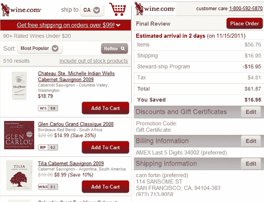

# 迟到总比不到好:Wine.com 有了一个手机网站

> 原文：<https://web.archive.org/web/https://techcrunch.com/2011/11/15/better-late-than-never-wine-com-gets-a-mobile-website/>

今天，这家面向葡萄酒爱好者的在线零售商(拥有杀手级域名)[Wine.com](https://web.archive.org/web/20230204225222/http://www.wine.com/)终于在[m.wine.com](https://web.archive.org/web/20230204225222/http://m.wine.com/)推出了一个移动网站。与桌面大小的网站一样，新网站允许客户全面访问 Wine.com 的葡萄酒、礼品和配件库存，通过过滤进行网站搜索，提供产品详情、账户管理，当然，还可以通过移动设备进行购买。

手机网站还能够自动识别你的位置，因此它知道哪些葡萄酒可以运送到你所在的地区。下订单后，您也可以通过新网站跟踪您的包裹。

在发布的同时，这家零售商还宣布了几个里程碑，包括它现在拥有超过 100 万注册用户的事实。Wine.com 表示，它每年运送超过 200 万瓶 win，比去年增长了 35%。至于库存的规模，有超过 13，000 种不同的瓶子可以运往 90%的美国人口，尽管运输酒精的法律很复杂。

移动化的需求非常迫切，因为 Wine.com 报告称，超过 7%的独特流量来自 iPhones(智能手机流量的 8%)。尽管事实上 Wine.com 在 iTunes 中有苹果和苹果的应用程序。这是其他在线零售商应该注意的事情:*应用程序是不够的*。如果你的客户习惯于在 *Web* 上访问你的网站，许多人会继续这样做，即使你很酷的 iOS 应用程序提供了额外的功能(就像 Wine.com 的一样，有 geo wineries 功能和 wine cave 等)。).

同样有趣的是:Wine.com 整体流量的 6%来自 iPad，但其收入的 8%来自 iPad。这意味着要么 iPad 拥有者购买更多的葡萄酒，要么 iPad 体验真的很棒，有助于购物。与此同时，只有 1%的收入来自 iPhone，iPad 的平均订单价值比网站高出 50%。该公司表示，现在有了一个新的手机网站，这种情况应该会改变。人们希望如此。

看到大型零售商在功能性移动网站之前就已经开发了移动应用程序，就像 Wine.com 一样，这有点不寻常。听着，我和其他人一样喜欢好的应用程序，但实际上，每个人使用最多的应用程序仍然是浏览器。谢天谢地，Wine.com 终于明白了这一点。

