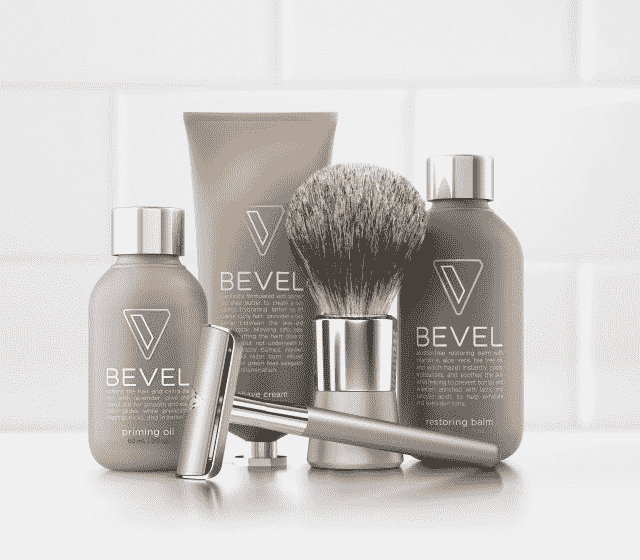
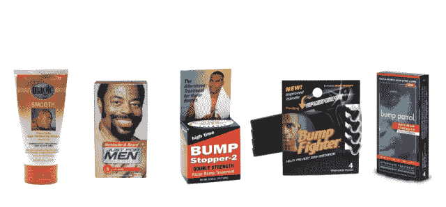

# 关于剃须套装的一千字 TechCrunch

> 原文：<https://web.archive.org/web/https://techcrunch.com/2014/02/11/bevel-is-a-product-that-should-exist/>

特里斯坦·沃克在六年内从石油交易变成了卖剃须膏。作为长岛石溪大学经济学专业的学生，沃克在班上名列前茅，他迷恋上了纽约市的旗舰行业:金融。“我知道我想尝试一下，”他说。

沃克喜欢金融业对成功的量化定义。“在交易中，你的表现是客观的；一天结束时，你看看自己的损益表，就知道自己成功了。”

虽然在华尔街当交易员实际上是离开皇后区的一条出路，但它最终失去了光彩，沃克随后走上了申请商学院的传统金融职业道路，进入了他唯一的选择斯坦福大学，在那里他第一次遇到了创业场景。他真的离华尔街越远越好。

“这真的是世界的未来，”他在电话中告诉我他对科技世界的第一印象，“我必须成为其中的一部分。

他说:“我在硅谷混得风生水起。”他指的是他在 Foursquare 担任业务开发主管的第一份工作，在那里，他促成了美国运通(American Express)交易等，以及这件事如何塑造了他。

他仍然认为 Foursquare 创始人丹尼斯克劳利是他的灵感之一。

“Foursquare 的丹尼斯就是品牌，”他说，这就是公司走到今天这一步的原因。“这是真正困扰我的一件事，正如[沃克的导师]本·霍洛维茨所说，‘你必须做你独特定位的事情，否则你会被烤得很硬。’"

这种心态解释了沃克最近的努力，[沃克和他的公司，](walkerandcompany.com)一家被他比作黑人的监督者赌博的创业公司。沃克公司本周将开放其首款产品的直接订单: [Bevel](https://web.archive.org/web/20221209103825/https://getbevel.com/) ，这是一款专为粗糙卷发男士设计的剃须系统。该产品将于周一开始定期发货。

它还推出了重新设计的网站，为以前没有刮过胡子的男性提供教育和建议。

沃克吹捧斜角作为世界上第一个“端到端剃须系统。”最初每月 59.95 美元，每个月 29.95 美元，Bevel 客户将收到一套 20 片刀片、一个加重支架、一个剃须膏刷、底漆和一个须后水。该套件包含 90 天的供应量(补充套件中有 60 个刀片)，相当于约 90 次剃须，每次剃须的成本为 1 美元。

当被问及他认为最接近的竞争对手是谁时，沃克没有提到哈利的 T2 或 T4 的美元剃须俱乐部，或其他风投支持的订阅剃须服务。相反，他提到了剃须刀的替代品，比如电动剪刀和脱毛膏，是的，还有信用卡，因为黑人“已经放弃用剃须刀刮自己的脸了，”他说。“所有的(替代方案)都非常糟糕，”他叹息道。

Bevel 是一款单刃剃须刀，沃克非常热衷于[保持简单的愚蠢原则](https://web.archive.org/web/20221209103825/http://en.wikipedia.org/wiki/KISS_principle)是剃须的最佳策略。他对多刀片剃须刀深表怀疑。“第四把刀片会切断你皮下的毛发。第五把刀会剥你的皮，第六把刀会给你做早餐，”他开玩笑说。

“所有的刺激都来自额外的刀片，”他以一种更严肃的语气补充道，并提到了这样一个事实，即在临床试验中，参与者在使用单刀片斜角剃须刀四周后，刺激减少了 40%。

沃克认为，多刀片剃须刀的扩散是由于剃须刀行业的专利战。他认为，因为你不能为单刃剃须刀申请专利，像宝洁这样的现有公司就没有动力投资最佳解决方案。单刃没有专利。“如果你能把(你的六刀片剃须刀)作为最新最棒的产品来推销，你就能卖更多。”

我在周末尝试斜面，没有割伤自己。这很简单，让我觉得自己很特别，尽管我还不是目标市场。Bevel 的设计和包装非常漂亮，体现了一种尊严和成熟，代表了黑色剃须产品发展的下一步。很有抱负。

针对非裔美国消费者的典型商店品牌。

虽然每月 50 美元和每月 30 美元对许多人来说可能太贵了，但 Walker 认为 Bevel 客户可以通过订阅模式暂停使用该产品。我认为，如果你只需要更新供应，用便利店的安全刀片替换它可能真的很容易。

> 我们为大众创造产品”这是大公司的说法。但是我们说“大众在 20 年后会有很大的不同。

如果沃克公司做得好，这将是一个巨大的市场机会。剃须市场每年有 140 亿美元，沃克已经盯上了其中的一块。 “每个种族都有[剃刀突起]的问题，只是黑人在这个问题上指数过高，”沃克说。“Bevel 不是一款黑色产品，而是一款面向所有人的产品。我们正在解决的问题，有色人种过度关注，但每个人都有。

“我们为大众创造产品”这是大公司的说法。但是我们说“20 年后大众会看起来非常不同”

沃克已经从[advanced Ventures](https://web.archive.org/web/20221209103825/http://www.crunchbase.com/financial-organization/upfront-ventures)、 [Andreessen Horowitz](https://web.archive.org/web/20221209103825/http://www.crunchbase.com/financial-organization/andreessen-horowitz) 、 [SV Angel](https://web.archive.org/web/20221209103825/http://www.crunchbase.com/financial-organization/sv-angel) 、Floodgate、 [Collaborative Fund](https://web.archive.org/web/20221209103825/http://www.crunchbase.com/financial-organization/collaborative-fund) 、 [Daher Capital](https://web.archive.org/web/20221209103825/http://www.crunchbase.com/financial-organization/daher-capital) 以及威廉·莫里斯合伙人查尔斯·金、Livingsocial 联合创始人亚伦·巴茨、说唱歌手 NAS 和前 Bliss 和 LVMH 的伊丽莎白·科里甘等天使投资人那里筹集了 240 万美元。

“你有一个企业家，他了解他将很好地服务的客户群，并由此而来的真实性，”投资者[马克](https://web.archive.org/web/20221209103825/http://www.crunchbase.com/person/mark-suster) [苏斯特](https://web.archive.org/web/20221209103825/http://www.crunchbase.com/person/mark-suster)说。“我相信他将能够比一家试图向目标客户群营销的大公司更好地服务于他的目标客户。”

[https://web.archive.org/web/20221209103825if_/https://www.youtube.com/embed/AhPbaNAHhA8?feature=oembed](https://web.archive.org/web/20221209103825if_/https://www.youtube.com/embed/AhPbaNAHhA8?feature=oembed)

视频

“如果我能把具有(特里斯坦)特质的人与他们能独一无二解决的问题联系起来，那就是我的工作。”自从沃克在斯坦福大学时，他就认识了他，他对扩展的潜力感到兴奋。“我不知道他会选择什么方向，是香水还是肥皂，但你可以用专门为有色人种设计的产品建立一个惊人的品牌。”

沃克认为，沃克及其公司的未来不会局限于男性，也不会局限于剃须。他有兴趣深入研究其他具体问题，如维生素 D 缺乏症。

“我们现在的愿景是让有色人种的健康和美丽变得简单，”沃克说。“在 20 年内，我们应该让健康和美丽对每个人都变得简单。”