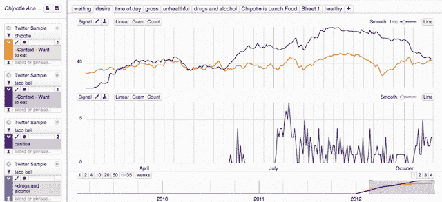

# 大数据可视化初创公司 Lucky Sort 与 StockTwits 合作，让投资者实时绘制股票趋势图 

> 原文：<https://web.archive.org/web/https://techcrunch.com/2012/11/01/big-data-visualization-startup-lucky-sort-partners-with-stocktwits-lets-investors-chart-stock-trends-in-real-time/>

总部位于波特兰的可视化引擎 Lucky Sort 宣布了它的第一个合作伙伴: [StockTwits](https://web.archive.org/web/20221210044314/http://www.crunchbase.com/company/stocktwits) ，这是一个交易者社交网络，允许用户实时分享股票相关信息。此外，StockTwits 首席执行官兼联合创始人[霍华德·林德森](https://web.archive.org/web/20221210044314/http://www.crunchbase.com/person/howard-lindzon)，现在也和其他几个天使投资人一起投资了 Lucky Sort，他们加在一起，为 Lucky Sort 早先的[50 万美元种子轮](https://web.archive.org/web/20221210044314/https://beta.techcrunch.com/2012/02/20/lucky-sort-grabs-half-a-million-for-big-data-visualization-on-web-ipad/)额外增加了 10 万美元。

作为背景，Lucky Sort 今年 2 月发布的第一款产品[是 TopicWatch，这是一项让用户从社交媒体、政府文件、新闻和评论中筛选实时更新的服务，以便找到、总结和分析基于文本的内容。虽然这听起来有点类似于情绪分析引擎，但不同的是，这样的事情可以在 Lucky Sort 平台的 *top* 上*完成，但不是这里的关键产品。*](https://web.archive.org/web/20221210044314/https://beta.techcrunch.com/2012/02/20/lucky-sort-grabs-half-a-million-for-big-data-visualization-on-web-ipad/)

“我们的大计划是与拥有有价值的数据集的人合作，并以一种可以被那些不想做大数据工作，但只想看看结果并做一些分析的人分析的方式公开它们，”Lucky Sort 首席执行官兼创始人 Noah Pepper 解释说，为什么该公司现在与 StockTwits 合作。“我们现在专注于金融服务垂直行业，因此我们将宣布的第一个合作伙伴是 StockTwits。”

通过合作，Lucky Sort 现在拥有 StockTwits 的完整历史数据库(社区内发布或分享的所有内容)，以及进入其服务的实时反馈。这些数据集现在可以在 Lucky Sort 的分析界面中获得，允许投资者进入并检查 StockTwits 社区中的聊天如何与价格行为相关联。

要使用这项服务，投资者需要登录 Lucky Sort，选择他们想要处理的数据集，然后进行查询。出于合规性目的，数据也是只读的。一旦登录，投资者可以添加他们想要研究的股票和关键词或短语，可以是“做空”或“卖出”等一般术语，也可以是与特定公司相关的社区内正在进行的讨论相关的特定短语。例如，对“想吃”的查询向 StockTwits 社区展示了对 Taco Bell 新菜单的热情可能是暂时的。(参见下面的示例)

Lucky Sort 正在对其平台和数据集的访问收费，并将很快推出自助服务许可证。目前，仅提供企业许可证。Pepper 说，价格在“每个用户每月几百美元”的范围内。

在接下来的一个月左右，Lucky Sort 将增加其他合作伙伴，重点也是金融服务领域。额外的整合将有助于投资者更好地了解消费者(相对于投资者，如 StockTwits)在社交网络服务上对公司的看法。

在即将发布的更新中，Lucky Sort 提供的图表和图形将随着新数据的到来而实时刷新，但目前，用户必须通过点击一个按钮来手动刷新数据。关于这项服务的更多信息请点击[这里](https://web.archive.org/web/20221210044314/http://luckysort.com/)。