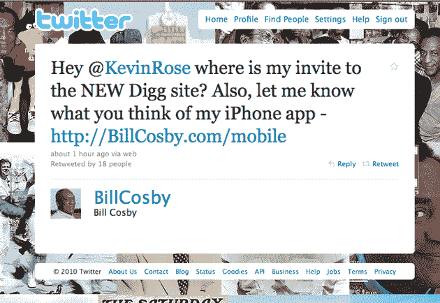

# 比尔·科斯比，新可乐最大的支持者，想要加入新的 Digg 

> 原文：<https://web.archive.org/web/http://techcrunch.com/2010/08/17/bill-cosby-twitter-spam/>

# 比尔·科斯比，新可乐最大的支持者，想要参与新的挖掘

喜剧演员[新可乐](https://web.archive.org/web/20230203011017/http://www.youtube.com/watch?v=o4YvmN1hvNA)和[果冻布丁流行](https://web.archive.org/web/20230203011017/http://www.youtube.com/watch?v=mjrtsIY4WqQ)的比尔·科斯比代言名气完全是为了[新 Digg 4](https://web.archive.org/web/20230203011017/http://new.digg.com/auth/alpha?url=%2F) [而兴奋，以至于他迫不及待的等了几周](https://web.archive.org/web/20230203011017/http://new.digg.com/auth/alpha?url=%2F) [即将推出的](https://web.archive.org/web/20230203011017/https://techcrunch.com/2010/05/28/exclusive-video-and-screenshots-of-digg-version-4/)而需要像现在这样的 alpha 邀请。

考斯比最近因为一些关于种族的有趣观点而出现在新闻中，他也可以利用这位 Digg 创始人的帮助来开发他的新 iPhone 应用程序，iPhone 版的[比尔·科斯比。](https://web.archive.org/web/20230203011017/http://billcosby.com/mobile/)

以免你认为是某个痴迷于挖掘的年轻实习生写了上述信件，科斯比在他的个人网站上有以下免责声明，你可以在脸书、Twitter、Myspace、Ustream、Cinch、Vimeo、12Seconds、Blogtalkradio 而不是 Digg、*上与他联系，“相信我，真的是我在发微博！”*

现在是太平洋时间上午 11 点，我还没有醉到可以充分探索开这个玩笑的可能性。然而，CrunchGear 的 Greg Kumparak 对 Cosby spam 的推文给出了创造性的解释:

> 嘿@KevinRose！我的新 Digg 网站邀请在哪里？伟哥山羊草 100%合法无处方必要的墨西哥。

我已经给凯文·罗斯发了邮件，询问他是否会向科斯比发出邀请，敬请关注最新消息。

**更新:** Rose 回复，*“现在给他发邀请！”*

感谢:[保罗](https://web.archive.org/web/20230203011017/http://twitter.com/wherespaul)

【YouTube = http://www . YouTube . com/watch？v = qfhFBTL-Xsw&NR = 1&feature = player _ embedded&w = 630]