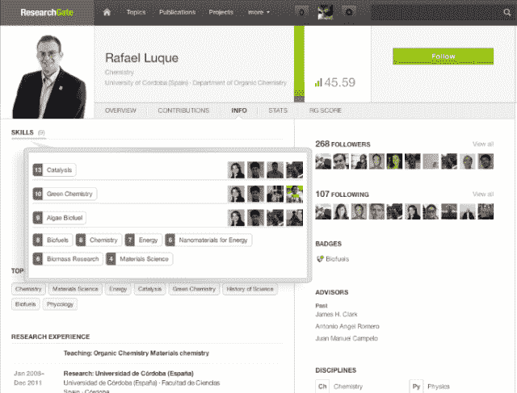
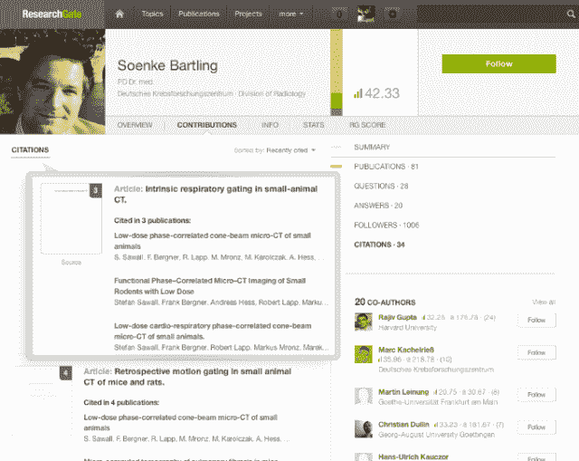

# 比尔·盖茨、Benchmark 等向科学家社交网络 ResearchGate 投资 3500 万美元

> 原文：<https://web.archive.org/web/https://techcrunch.com/2013/06/04/bill-gates-benchmark-and-more-pour-35m-into-researchgate-the-professional-network-for-scientists/>

Ijad Madisch 在 2008 年创建了 ResearchGate 来改变科学方法，这取决于你的立场，它要么像听起来那样雄心勃勃，要么不像听起来那样雄心勃勃。马迪士并不是要推翻科学家用来调查和系统观察现象的技术，而是工具。今天，无论是化学、物理、生物还是介于两者之间的众多学科，都在进行着数量惊人的科学研究。然而，通常情况下，科学家，尤其是那些在学术界或学术界周围工作的科学家，大多生活在离线世界中。

因此，今天困扰科学研究、创新和突破的最大问题之一是冗余。一个致力于蛋白质数据分析的科学家小组公布了他们的结果，却发现世界另一端的一个小组也做了同样的事情。作为一名医生和研究人员，Madisch 认为减少研究冗余的最佳方式是创建一个在线专业网络，科学家可以在其中轻松共享数据、信息和结果。研究将变得更有效，科学也将因此变得更好。

创始人兼首席执行官告诉我，事实证明，将一个专业的科学家网络货币化(这可能很棘手)比改变科学家和学术界的僵化思维要容易得多。无论是否与微生物研究人员打交道，将整个社区和交流方法带到网上都是一个缓慢的过程，幸运的是，对于愿意接受其未来愿景的投资者来说，ResearchGate 没有被欺骗。

这种支持变得更加深入。今天，ResearchGate 宣布完成了微软创始人比尔·盖茨和 Tenaya Capital 的 3500 万美元 C 轮融资，Dragoneer 投资集团和 Thrive Capital 也参与了融资。在这一大笔第三轮融资之前，它分别在 2010 年和 2012 年筹集了[轮 A 轮和 B 轮融资](https://web.archive.org/web/20230227081130/https://techcrunch.com/2012/03/01/armed-with-new-funding-a-global-mission-researchgate-adds-paypal-co-founder-to-board/)，其中包括 Accel Partners、Simon Levene、Bebo 联合创始人 Michael Birch、Founders Fund、Benchmark Capital 和 Yammer 首席执行官 David Sacks 等投资者。

对 ResearchGate 的投资者来说，短期回报可能不是等式的一部分，但比尔·盖茨(Bill Gates)并不羞于在潜在的高影响力教育、能源和健康相关技术上下大赌注，即使这些是长期投资。Benchmark 合伙人(也是 ResearchGate 董事会成员)Matt Cohler 也很快谈到了为什么他投资了一家企业“这家企业肯定没有成为十亿美元公司的短期计划。”原因显而易见，马迪士在描述他的初创公司今天的使命时告诉我们，ResearchGate 旨在帮助“将知识从象牙塔中解放出来，将其数字化，让每个人都可以访问，以加速科学进步。”

苛勒意识到，ResearchGate 的雄心与他早年在 LinkedIn 和脸书看到的类似，就像这两家公司一样，这家初创公司可能正在成为“真正的网络效应企业”诚然，ResearchGate 的增长曲线与早期的两个社交网络不太一样，但它已经开始在科学界找到一些牵引力，自推出以来，已经发展到超过 280 万名成员，分布在 131 个国家，其中 30%的人现在每月登录一次。

【T2

自从我们上次与 ResearchGate 合作以来，这家初创公司一直在努力让科学家更容易走出他们的小天地，在那里他们经常研究利基和非常特殊的问题，并寻找具有非常特定技能的合作者。通过创建一个网络，任何学科的科学家都可以创建一个简单的个人资料，显示与他们所在领域的科学家相关的信息，包括学位、关注领域、关键词、顾问、出版物等，该团队希望这有助于解决该领域的一个长期问题:科学家可以用来快速发现类似领域研究的公共资源非常少。

更重要的是，ResearchGate 努力为研究人员提供一个平台，他们不仅可以上传他们发表的期刊，还可以分享原始数据——以及失败或成功的实验——以努力使知识在更广泛的背景下可用。这可能是社区向前迈出的一大步，因为科学家正在研究的记录或他们汇编的数据通常会被丢弃或丢失。但是，通过 ResearchGate，他们现在有能力上传、存储和与现有或潜在的合作者分享这些数据。

虽然简单地让科学家在 LinkedIn 之外拥有专业档案可能是这方面研究的一大进步，使他们能够找到与合作作者的联系，发现可能适合他们研究的新出版物，并在其个人网络中查看他们工作的所有引用。不仅如此，Madisch 还表示，该团队正在寻求将这一想法提升到一个新的水平，为科学家发布他们的结果和数据集创造一种新的方式。虽然同行评议过程是出版前过程的固有部分，但 ResearchGate 创始人表示，他希望让研究人员也能够进行出版后同行评议——他说，这并不是当前系统的一部分。

“科学家对已发表的工作给出反馈的过程既缓慢又过时，”马迪士说。“未来是透明的，而不是必须手写信件给编辑……我们希望帮助科学论文的作者更快地发现他们研究中的问题或错误，并在更短的时间内增加他们能够获得的反馈量。”这位创始人继续说道，这不仅有助于一个人在自己的领域获得声望或尊重，还可能导致作者对他们发表的东西更加谨慎。如果有更多的信息被共享，并随时可用，它可以帮助这些科学家在发表之前找到重复的研究。

该团队还在忙于构建其声誉系统(科学界自己的 Klout 版本)，例如，在该系统中，用户根据其项目的质量和他们在社区中的活动进行排名，以及内部问答或类似 Quora 的系统，该系统使用户能够快速 ping 社区的其他成员以提出问题、请求数据等。这家初创公司还在建立创始人所说的“科学界最大的就业委员会”，成员可以在其中找到工作机会，发现补助金和寻找特定技能或人才的机构。

首先，在社区不断增长的就业板块中，创始人看到了未来的赚钱机会。截至目前，公司和机构可以免费在社区中发布信息，但马迪士表示，未来，人们可以想象 ResearchGate 开始向雇主收取费用，让他们在求职论坛上发布信息。这位创始人还看到了一个赚钱的机会，即在 ResearchGate 内部创建一个科学设备和服务的市场，让制造商和负责制作和分发这些服务的公司能够从社区获得直接反馈，了解哪些可行，哪些不可行。

ResearchGate 创始人表示，在短期内，该公司将专注于利用新的 3500 万美元来扩大规模，提高增长和参与度。该公司还开始尝试创建一个 API，并找到开放平台的最佳方式，使第三方开发者能够基于其内部聚合的数据开发应用和工具。

游戏仍处于早期，但 ResearchGate 开始显示出一些迹象，它不仅有机会影响每年花费在科学研究上的数万亿美元，还可以影响科学家如何分享数据和知识，相互联系——以及发表他们的发现。ResearchGate 越是能够加速这一过程并减少摩擦，该网络就越能帮助闭合研究与现实世界的结果和影响之间的回路。

