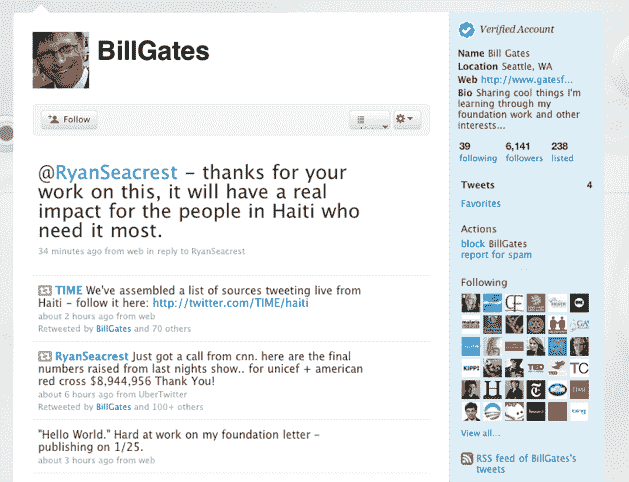
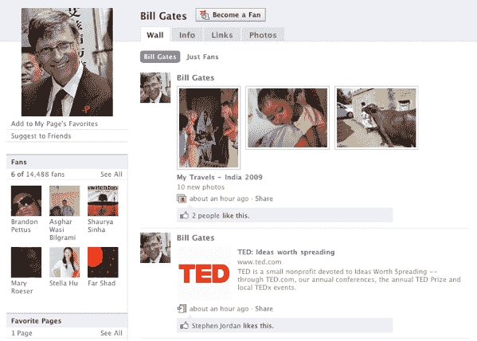

# 比尔·盖茨重返脸书，也尝试了一下 Twitter

> 原文：<https://web.archive.org/web/https://techcrunch.com/2010/01/19/bill-gates-facebook-twitter/>

# 比尔·盖茨重返脸书，也尝试了一下 Twitter

去年夏天，微软创始人比尔·盖茨宣布了一个有点令人惊讶的消息，他在收到大量好友请求后决定离开脸书，他解释说“这实在太麻烦了，所以我放弃了”。今天，看起来他决定再试一次。几个小时前，盖茨发布了新的[脸书页面](https://web.archive.org/web/20230304024034/http://www.facebook.com/BillGates)和推特账户([@比尔盖茨](https://web.archive.org/web/20230304024034/http://www.twitter.com/billgates))。

盖茨在 Twitter 上的第一次更新最先被 [TheNextWeb](https://web.archive.org/web/20230304024034/http://thenextweb.com/socialmedia/2010/01/20/bill-gates-joins-twitter-web-interface/) 注意到，主要与海地危机有关，这很可能促使他决定加入。奥巴马总统最近在海地的一个援助中心发出了他的第一条推特，许多其他名人也使用这个平台来帮助鼓励捐款。新的 Twitter 账户已经被 Twitter 确认为真实交易。

我们仍在等待脸书的回复，以确认 Facebook.com/BillGates 页面是合法的，但它似乎是合法的。**更新**:脸书已经确认账户是真实的。该账户似乎是上个月创建的，但直到几个小时前才发布任何更新，并且两个账户使用相同的个人资料照片。他的第一条更新是指向他的慈善机构比尔·梅林达·盖茨基金会的链接。他的第二个共享项目？链接到 Microsoft.com，这不会为他赢得任何创意点。其他分享的物品包括他去非洲和印度旅行的相册，以及他所就读的预科学校主页的链接。

正如我们的一些评论者所指出的，盖茨将不必处理他过去在脸书上收到的无数好友请求，因为 Twitter 和他的脸书页面都使用单向连接——任何人都可以关注他，而不需要他采取任何行动。

