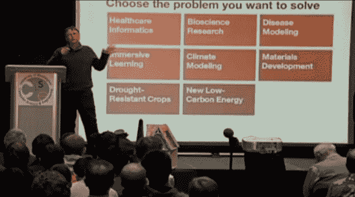
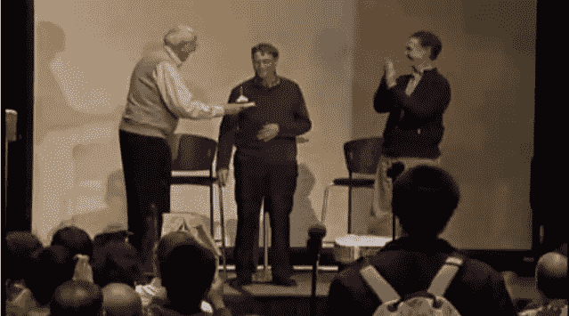

# 比尔·盖茨谈“可用性的奇迹”并将计算机科学应用于世界 

> 原文：<https://web.archive.org/web/https://techcrunch.com/2011/10/27/bill-gates-on-the-miracle-of-availability-and-applying-computer-science-to-the-world/>

比尔·盖茨刚刚在华盛顿大学计算机科学与工程学院做了一次演讲。作为他的典型演讲，这一次广泛地关注于新的和有益的技术实现。随后是公开问答环节。

没有什么激进或新的提议或透露，但盖茨一如既往地聪明和引人注目，下面是谈话的要点。UW 方面应该很快就会发布这次谈话的视频。

我已经尽量直接引用比尔的话(粗体字是给那些渴望声音字节的人看的)，但可能会有措辞上的小错误。如果有引号，那就是他的原话，尽管我可能需要在这里或那里纠正几个词。

## “如果周围没有那么多书，也许我会更全面”

盖茨首先通过回忆计算的早期来建立他在计算机科学上的可信度，但在这一点上没有必要。他回忆道，在 UW，**“在奇怪的时间，你基本上可以破门而入，偷走计算机的时间，”**在 B5500 等当时的批处理计算机上。这实际上是他最初论点的延续，即像他这样的人不会带来下一代的突破。

他列举了难以置信的存储量和几乎可以忽略不计的成本，以及作为一个在千字节和兆字节中长大的人，他在意识形态上根本不适合分配兆字节和千兆字节。但是伴随着它长大的人会做一些事情，比如，建议在大学里的每一次演讲都被记录和保存。一旦他克服了那些想保存每一个字节的人的偏见，他说他认为**“我们*而不是*这样做实际上有点荒谬。”**

盖茨说，最大的进步是**“可用性的奇迹。”当某样东西从世界上的精英和富人拥有的设备变成最贫穷的人可以利用的东西时，就会发生这种变化。稍后给出的一个例子是美国农场使用的精密 GPS 驱动的联合收割机。很巧妙，但是你能造出一个非洲村庄买得起的吗？**

作为进一步的例子，他展示了一个使用 Kinect 的应用程序，我实际上在 8 月份[已经强调过了](https://web.archive.org/web/20230205040635/https://techcrunch.com/2011/08/10/video-free-moving-kinect-used-to-map-room-and-objects-in-detailed-3d/)。这并不是说它对一个饥饿的孩子有用，但正如微软研究和无数黑客为 Kinect 和其他设备展示的那样，它有巨大的潜力等待被释放。

## “社会中的许多问题只是设计糟糕的算法”

盖茨称赞了替代教育模式，展示了一个代数教学计划，该计划积极监控学生的表现，教学方法的效果，并随时调整课程。我们看到了一些其他的想法，比如关于公司的 [Imagine K12 】,我相信如果盖茨还不知道的话，他会很感激的。](https://web.archive.org/web/20230205040635/https://techcrunch.com/2011/09/23/imagine-k12s-2011-startup-class-aims-to-invigorate-education-with-technology/)

他还盛赞了可汗学院，我们在这里经常提到它。但是，正如他后来在问答环节中阐述的那样，这并不意味着它是学习机构的替代品。**“从幼儿园到大学，对成人监督的需求肯定会有所下降。但请记住，教育在某种程度上是关于动机的。”**他指出，大约有 20 所学校已经围绕可汗学院和类似的服务彻底调整了课程，老师安排学生在自己的时间观看讲座和测验，然后把教室不是用作演讲厅，而是用作讨论平台，增加背景，澄清观点，并为无法掌握材料的学生提供更多一对一的机会。

至于早在小学就将计算机科学加入课程，他持怀疑态度:**“我认为计算机是一个很棒的工具，你应该尽可能多地使用它。但是哈希表和数据库索引，我不知道它们会出现在哪里…很难说在课程中有什么是必要的。就我个人而言，我希望更多的人学习统计学而不是微积分。”**

尽管他对此轻描淡写，但他确实认为教育是重中之重。当被问及对政治话语和财富集中有何看法时，他回答说，客观地说:“今天的世界比历史上任何时候都更公平。也就是说，穷国变富的速度快于富国变富的速度。所以赤贫人口的数量，占总人口的百分比，现在处于历史最低点，而且还在继续下降。创新将继续推动这一趋势。”但话虽如此，**“如果一个社会没有不同收入水平之间的流动性，那就不好了。如果你真的看看我们在美国梦方面让人们失望的地方……那就是我们没有提供足够的教育。”**

没有适当的教育，人们怎么能在日常生活中做出理性的选择，更不用说选民面临的问题了？**“我担心的一件事是复杂性。我们不能直接谈论问题，所以我们谈论个性。”当一个政治时代最有争议的法案(奥巴马的医疗保健法案)长达 4000 多页，普通选民完全无法阅读时，这是如何有效的？**

## “我喜欢散列表，不喜欢疟疾”

他接着谈到了贫困和疾病的问题。当他与研究人员一起创建一个随机模型**“我的一个反应堆”时，他有了初步的认识。这非常复杂，但他们所拥有的计算能力使之成为可能。他想，如果我们可以用所有这些力量和材料模拟一个反应堆，为什么我们不能模拟疾病，包括蚊子，人，环境，和解决方案？**

因此，他们致力于此，并最终提出了一个极其复杂的模型，用于疾病载体、天气、疫苗、生命周期、季节和其他一切。他们将它与真实的统计数据进行了比较，结果是正确的。他信心满满地说:**“全世界消灭疟疾的努力将基于这一模式。”既然我们已经有了精确模拟世界的计算能力，那么问题的建模方法在其他地方也同样重要。无论是疟疾、小儿麻痹症、农作物、核反应堆、卫生设施还是教育，**“它让你在做什么的时候变得更加理性。”****

他演示了模型的一些应用，并解释了很多关于疾病本身和它的一些历史。但是你可以在业余时间了解疟疾。

## “这是同一个汉堡”

在财富这个必须被视为专家的话题上，他淡化了金钱的作用。一位提问者就如何变得像他一样富有征求意见。他从容应对这个略显不得体的问题，表示自己从未打算变得极其富有，更重要的是做自己感兴趣的事情。他还说，虽然他理解赚几百万美元的驱动力，这种财富水平提供了**“有意义的自由”，**在那之后，**“它仍然是同一个汉堡。迪克的提价还不够……”这引起了观众的笑声，他们可能对这家当地的西雅图汉堡店太熟悉了。**

## “你只是想把东西放在眼睛上”

当被问及从个人电脑到笔记本电脑再到智能手机的变化会带来什么时，他很兴奋:**“我们会回过头来嘲笑我们有这些大玻璃屏幕，如果你把它摔了，它会碎的……你所做的只是把东西放在你的眼睛上！”**也就是说，这只是一种通过你的眼睛将信息从世界传递到你大脑的方式。他认为，直接投射到视网膜上可能是下一个重大进展，或者可调节尺寸的柔性屏幕。

最后，主持人指出明天(28 日)是比尔的生日，并邀请老比尔·盖茨上台，他拿着一个带蜡烛的纸杯蛋糕，让小比尔吹灭。

如果你对比尔·盖茨的持续冒险感兴趣，你可以在[盖茨笔记](https://web.archive.org/web/20230205040635/http://www.thegatesnotes.com/)继续关注他。

(10/28:用逐字引用更新了一些粗略的引用)