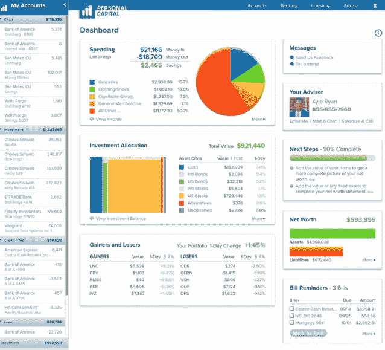

# Intuit 前首席执行官 Bill Harris 推出个人资本 

> 原文：<https://web.archive.org/web/https://techcrunch.com/2011/09/20/bill-harris-launches-personal-capital/>

比尔·哈里斯(Bill Harris)的整个职业生涯都是在金融和技术行业的交汇处度过的，先是担任 Intuit 的首席执行官，然后是 PayPal，然后在过去十年里成为了一名投资者。现在，他将他所有的经验汇集到他最新的创业公司[个人资本](https://web.archive.org/web/20230205034548/https://www.personalcapital.com/)中，该公司经过两年的发展，拥有 40 名员工和 2700 万美元的[资本](https://web.archive.org/web/20230205034548/https://techcrunch.com/2011/08/26/ex-paypal-intuit-ceo-raises-25m-for-next-generation-financial-advisor/)，今天正式启动。(他在上面的视频中给我解释了这个概念)。个人资本连接到你所有的个人金融账户，从银行、经纪公司、401(k)到抵押贷款、信用卡和贷款。它像 Mint 一样以易于阅读的图表和图形来展示你的财务生活，只是它的首要目标是帮助你找到最佳的资产配置，并说服你通过它的一个财务顾问来管理你的资金。

分析是免费的，但财务顾问不是。个人资本收取的管理费不到所管理资产的 1%，其中包括所有的经纪费和其他费用。“在某些方面，硅谷并不真正了解金融服务，”哈里斯告诉我。“我们认为软件是一切的答案。金融服务业也不明白这一点，他们没有利用技术来增强与客户的互动。”

个人资本瞄准了拥有几十万到几百万美元投资的富裕家庭。这高于共同基金的水平，但低于私人资金管理公司的门槛，后者专注于可投资资产在 500 万美元或以上的人。通过引入你所有财务账户的数据，个人资本承诺给你一个完整的财务状况图。

它的全职财务顾问可以利用同样的数据来制定投资策略和资产配置计划。他们还想方设法推迟收益和收获损失，以尽量减少税收。哈里斯估计，由于网站所做的所有繁重工作，每个财务顾问将能够服务 100 至 200 名客户。

该网站显示了你所有的账户和你的资产配置(股票、债券、现金等)。)它能让你在漂亮的图表中看到全局，以及下面的交易细节。一目了然——假设你所有的账户都连接上了——你可以看到你的净值、现金状况和投资配置。

如果你决定让个人资本财务顾问来管理你的部分资金，他们会为你量身打造一份个人投资组合。“共同基金曾经是个好主意，但现在不是了，”哈里斯宣称。股票和债券的交易成本如此之低，以至于共同基金提供的规模经济(每个人一个投资组合)不再是优势。哈里斯认为，通过结合使用软件和人力顾问，他可以为投资带来大规模定制。

