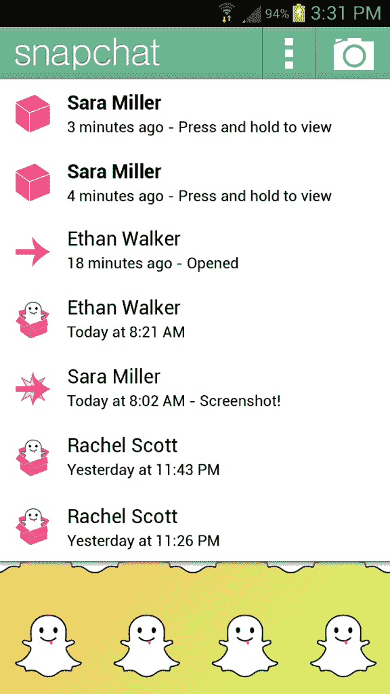

# 你知道什么很酷吗？十亿张 Snapchats:应用程序每天分享超过 2000 万张照片，发布在 Android  上

> 原文：<https://web.archive.org/web/https://techcrunch.com/2012/10/29/billion-snapchats/>

Snapchat 是一个非永久性的图片信息应用，今天它发布了一个 Android 版本。联合创始人[埃文·斯皮格尔](https://web.archive.org/web/20230326023759/http://www.linkedin.com/in/evanspiegel)告诉我，用户已经在 iOS 应用上分享了超过 10 亿张照片。

Spiegel 表示，用户每天分享超过 2000 万张照片，这个数字还在不断增长。该应用目前在免费应用排行榜上排名第 19，在[免费摄影应用排行榜上排名第三，仅次于 YouTube 和 Instagram。](https://web.archive.org/web/20230326023759/http://www.appdata.com/leaderboard/app_store_apps?id=3991-top-free-apps-photography-genre)

今年 5 月，我[写了关于【Snapchat 如何每秒处理大约 25 张图片，并将其与 Instagram 在 1000 万用户群中每秒处理 25 张照片进行了比较。以目前每天 2000 万张图片的速度，Snapchat 每秒可以处理超过 231 张分享的照片。](https://web.archive.org/web/20230326023759/https://techcrunch.com/2012/05/12/snapchat-not-sexting/)

Instagram [于 4 月 3 日推出其 Android 应用](https://web.archive.org/web/20230326023759/https://techcrunch.com/2012/04/03/instagram-android-demum/)，iOS 上有 3000 万用户；10 天之内，它的用户数量激增至 4000 万。那段时间，脸书买下了 Instagram(以防你没听说)。

> “我认为，通过图像进行交流是未来几年你将会看到的媒介之一，因为实现技术发生了根本性的转变。”

MG Siegler [在 2010 年 Instagram 的预览版](https://web.archive.org/web/20230326023759/https://techcrunch.com/2010/10/06/instagram-launch/)中写道，但它现在可能比 Instagram 更适用于 Snapchat。Instagram 是一个社交网络:你把你的内容发布给一个精选的追随者圈子，与广泛的受众交流，其中一些人选择交流。

 

Snapchat 是一对一的交流，比短信或电子邮件更私人，因为内容消失了。这是我使用的最接近电话交谈或真实生活互动的技术。

用户可以发送照片，并控制接收者在应用程序上查看照片的时间(最多 10 秒)。如果你试图拍摄照片的截图，应用程序会通知发送者。Snapchat 自推出以来就一直与色情短信联系在一起，这一形象并没有因为其一些有伤风化的营销材料而得到改善。我个人怀疑这款应用被用于非法目的的频率——我认识的大多数用户互相发送愚蠢的图片。

“我们越来越接近让交流变得有趣的目标，”斯皮格尔告诉我。

Snapchat 团队除了我们之前报道的光速创投的 485，000 美元种子轮外，还筹集了一笔小型过桥资金。Spiegel 表示，这笔资金来自光速公司和一家未披露的投资者，金额未披露。他补充说，他没有筹集下一轮资金的确切时间表，但正在尽最大努力与人接触，寻找合适的合作伙伴。

该团队将在“可预见的未来”留在洛杉矶，正如 Spiegel 所说，他们正在“拼命招聘”，在年底前再招聘三名工程师。目前的团队由斯皮格尔、联合创始人鲍比·墨菲、两名工程师和一名社区经理组成。

Spiegel 表示，缩放是该公司最大的挑战，因为很难实时传送图像；他解释说，如果社交网络上传失败，用户可以稍后再上传照片。但如果照片在 Snapchat 上发送失败，对话就会终止。

当团队致力于开发安卓应用程序时，他们发现许多安卓相机的功能不同，在图片预览的底部和顶部都有黑条。因此，他们花了一个半月的时间为安卓版本重建相机功能，以给用户更好的体验。

Spiegel 表示，他们对许多应用程序的用户统计方式感到失望，拒绝透露用户数量。明镜周刊称他们专注于订婚。

“这对我们来说并不重要，”他告诉我。“我们关心客户的使用频率和长期保持率”

Snapchat 将在假期前的某个时候发布苹果手机更新，明镜周刊称这将“真正扩大服务”。他说这是下一个产品迭代的第一波，因为团队计划在 2013 年初建立在这些变化之上。

谈到[的盈利计划](https://web.archive.org/web/20230326023759/http://www.youtube.com/watch?v=jTmXHvGZiSY)和该公司的长期战略，他解释说，该公司希望主导一个以通信为中心的移动领域。

尽管对科技界有很大兴趣，而且经常与 Instagram 相提并论，但 Spiegel 表示，Snapchat 团队对被收购没有兴趣。

“我不可能为别人工作，”斯皮格尔说。“我认为你不会很快看到我们销售。”

公平地说，我敢肯定，在 Instagram 宣布收购时，凯文·斯特罗姆会发誓说该公司对被收购没有兴趣；每个企业家都坚持这条路线，但大多数都有一个价格。

“下一个 Instagram”还有市场吗？我不知道。手机和手机短信是一个巨大的市场，仍有大量玩家手握大把现金。很容易把市场一笔勾销，认为它已经结束；如果我们都这样做了，我们现在就会使用 Myspace 和 Flickr。

更让我感兴趣的是，Spiegel 和 Snapchat 团队是否会为他们古怪的宝贝开出高价。我认为他们只是疯狂到拒绝一个巨大的报价，继续自己的事业。