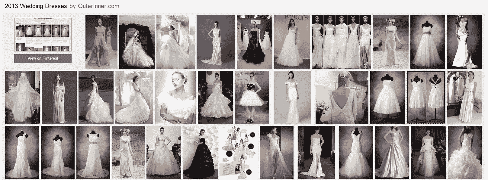

# Bing 将 Pinterest 收藏加入图片搜索 

> 原文：<https://web.archive.org/web/https://techcrunch.com/2013/10/02/bing-adds-pinterest-collections-to-image-search/>

# Bing 将 Pinterest 收藏加入图片搜索

Bing [今天](https://web.archive.org/web/20221005155404/http://www.bing.com/blogs/site_blogs/b/search/archive/2013/10/02/explore-pinterest-boards-with-bing.aspx)宣布已经将 Pinterest 数据整合到其图片搜索功能中。注意到计算机排序是一个强大的工具，但个人也可以有效地策划，Bing 增加了一个新的图像收集功能。

Pinterest 是一个受欢迎的工具，它允许用户聚集任何类型的图片，并与其他人分享这些“图板”。Pinterest 非常重要，以至于在上次总统选举期间，第一夫人和罗姆尼夫人[都注册了。](https://web.archive.org/web/20221005155404/http://gawker.com/5918275/ann-romneys-pinterest-is-better-than-michelle-obamas-pinterest)

Bing 已经允许你从图片搜索中直接“锁定”到你的 Pinterest 图板，将图片收藏放在正常搜索结果的右边。实际情况是这样的:

当你点击进入时，你会看到:

当然，上面最重要的部分是“查看 Pinterest”按钮，完成了这个循环。如果你好奇的话，这并不存在版权问题，因为 Bing 仅仅是以索引互联网的方式抓取 Pinterest。

这是对 Bing 的一个很好的补充，可以让 Pinterest 的忠实用户更感兴趣。然而，它确实感觉很吵——可以有一种更优雅的方式将这些集合引入界面。

我不会对 Bing 和 Pinterest 的进一步整合感到惊讶:Bing 有钱，Pinterest 正在努力赚钱。

如果你想在实践中看到它，你可以在这里运行一个搜索[。](https://web.archive.org/web/20221005155404/http://www.bing.com/images/search?q=pumpkin%20pie)

*顶级形象信用:[市场营销](https://web.archive.org/web/20221005155404/http://www.flickr.com/photos/mkhmarketing/)*