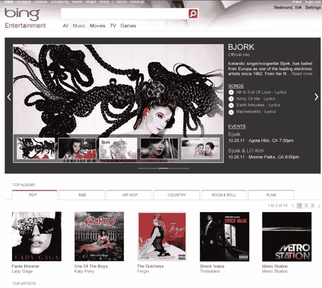

# Bing Entertainment 为搜索带来完整的音乐流，以及游戏、电影和电视节目 

> 原文：<https://web.archive.org/web/https://techcrunch.com/2010/06/22/bing-entertainment-music-streams/>

必应的 iPhone 应用并不是今天在微软搜索引擎中唯一升级的。必应也开始为其主要的网络搜索引擎推出近 100 项新功能。最大的变化是在[必应娱乐](https://web.archive.org/web/20221006230928/http://www.bing.com/entertainment)下的一个新的主要搜索类别，这将包括更好的搜索音乐、电影、电视节目和游戏的方式。高级副总裁 Yusuf Mehdi 解释说:“去年我们确实开展了旅游、健康、购物和当地活动。“现在网络释放了所有这些娱乐，但对许多人来说，他们花太多时间寻找他们想做的事情，而不是享受它。我们正试图消除所有那些阻碍你享受它的障碍。你应该可以看节目，听在线音乐，或者点击几下就可以玩游戏。”

据迈赫迪称，大约 10%的搜索与娱乐相关。90%的人每月至少进行一次娱乐搜索。Bing Entertainment 旨在为音乐、电影、电视节目和游戏提供更深入、更直观的搜索体验。

音乐领域将会有一个最显著的变化。音乐搜索现在将返回 500 万首歌曲的歌词和可播放流，这些歌曲已经通过微软的 Zune 服务获得许可。每首歌曲的完整流将每人播放一次，然后 30 秒的剪辑将在随后的搜索中可用。(在这方面，必应正在追赶谷歌，谷歌[去年年底推出了类似的音乐搜索](https://web.archive.org/web/20221006230928/https://beta.techcrunch.com/2009/10/28/live-from-hollywood-googles-music-onebox-debuts-powered-by-myspace-and-lala/)。这个想法是为了让人们更容易发现音乐和尝试音乐。还会有亚马逊、iTunes 和 Zune 的链接来购买完整下载。

当你搜索一位艺术家或一首歌曲时，一个特殊的答案框(非正式地称为[必应框](https://web.archive.org/web/20221006230928/https://beta.techcrunch.com/2010/03/25/bing-box/))会出现在搜索结果页面的顶部。它可能充满了艺术家的照片，流行歌曲的播放列表，即将举行的活动，他们的推文，以及艺术家官方网站的链接。

电影搜索将创建一个带有照片剧照、概要、当地放映时间和预告片链接的答案框。搜索结果将有助于你计划一个看电影的夜晚，包括地图、停车场、附近餐馆的建议等等。对于电视节目，你将获得你所在地区的电视列表，有时还会通过 Bing Videos 获得来自 Hulu、Viacom、CBS 和其他合作伙伴的视频流。只要有可能，预告片和电视节目都会在 Bing 中播放。

游戏搜索将面向铁杆游戏机玩家(青少年)和休闲网络游戏玩家(妈妈们)。对于主机游戏，结果将被过滤，以轻松找到演练，评论和作弊。偶尔的游戏搜索有时会带你去必应上玩的游戏，比如跳棋和宝石迷阵。

通过带来娱乐体验，搜索者可能会停留更长时间。过去，搜索会把你带到你在网上寻找的东西，但现在数据(包括音乐、视频和游戏)可以移动到任何地方，甚至搜索引擎。也许是时候废除这条规则了。

