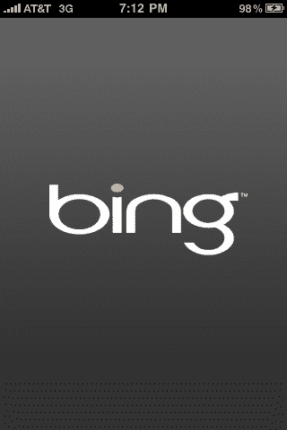
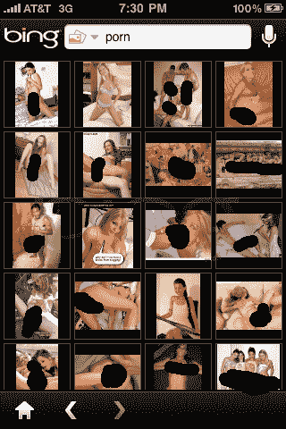

# 必应去了 iPhone。对黄片来说还是很棒的。

> 原文：<https://web.archive.org/web/https://techcrunch.com/2009/12/15/bing-iphone-porn/>

# 必应去了 iPhone。对黄片来说还是很棒的。

自从[冰](https://web.archive.org/web/20230304182312/http://bing.com/)出现以来，它就格外擅长一件事:[找色情](https://web.archive.org/web/20230304182312/https://techcrunch.com/2009/06/01/badda-bing-indeed/)。其今晚在应用商店发布的新 iPhone 应用程序也没有什么不同。

默认情况下，该应用程序的安全搜索设置为“中等”以这种方式搜索“色情”会产生几个有希望的结果。然而，只需两次点击，任何孩子都可以关闭安全搜索，然后离开！色情的结果是什么，如果不是令人印象深刻的。

我喜欢这一点有两个原因:1)该应用程序被评为 4+，但它非常简单，只需点击几下就可以访问核心色情内容。这继续凸显了苹果在 App Store 上的[虚伪](https://web.archive.org/web/20230304182312/https://techcrunch.com/2009/10/23/app-store-hypocrisy-update-asian-boobs-fine-top-seller-satirical-app-banned/)。允许你提起亚洲女学生服装的应用程序是[很好](https://web.archive.org/web/20230304182312/https://techcrunch.com/2009/10/07/satirical-iphone-apps-not-cool-upskirt-iphone-apps-cool/)。讽刺公众人物的应用被禁止。而现在，让你触手可及的硬核色情应用被评为 4+。当然，这些内容在网络上，而不是在应用程序本身，但对观众来说，有什么区别？2)必应仍然是色情网站的重要资源。

公平地说，谷歌的 iPhone 应用程序也允许你搜索色情内容。但是，1)使用谷歌应用程序搜索图片并不容易(图片搜索是必应应用程序的一个优势), 2)搜索结果不太可靠，3)如何关闭安全搜索设置也不太明显。

尽管如此，Bing 应用程序实际上还是很不错的。语音搜索功能(就像谷歌在 iPhone 上的功能)非常好用。该应用程序还具有标准的必应每日图片，并配有悬停仿真陈述。它在主屏幕上也有一个漂亮的覆盖图，可以方便地搜索电影、地图、商业、新闻、方向和图像。[在此找到 App Store 中的应用](https://web.archive.org/web/20230304182312/http://itunes.apple.com/us/app/bing/id345323231?mt=8)。这是免费下载的。

下面两张图片都是在安全搜索关闭的情况下搜索“色情”时拍摄的。正如你所看到的，必应获得了更多的好成绩。巴德达·宾。

 