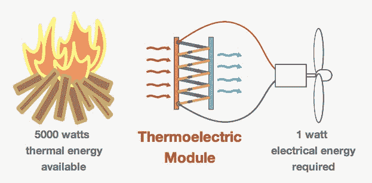

# BioLite 炉灶在做饭时为手机充电 

> 原文：<https://web.archive.org/web/http://techcrunch.com/2011/07/08/biolite-stove-charges-your-phone/>

# BioLite 炉灶在做饭的时候给你的手机充电

烧木头的炉子并不是特别高效，它们的烟雾不仅含有大量的碳排放，还会对吸入这些气体的人造成健康风险。BioLite 的一个便携式设计旨在解决这个问题，并在这个过程中把炉子变成手机充电器。

炉子将热能转化为电能，驱动一个小风扇来促进木材的燃烧。除此之外，还可以通过 USB 端口为手机或 LED 灯充电一到两瓦。

该公司认为他们的炉子有两个市场:发展中国家的家庭，以及狂热的背包客和露营者。BioLite 将在 2012 年春天首先发布 [CampStove](https://web.archive.org/web/20230203082909/http://www.biolitestove.com/CampStove.html) 版本。他们希望该产品的利润能够帮助发展中国家的家庭补贴“T4 家庭住宅”模式的费用。

BioLite 声称需要一半的木材作为明火，并减少多达 95%的烟雾排放。因为数十亿人依赖木材作为烹饪燃料，这种炉灶有可能改善健康，或许还能稍微遏制森林砍伐。

CampStove 型号的重量不到两磅，在不到四分钟的时间内烧开一升水。各种各样的材料都可以用来为它提供能量，包括树枝、松果、粪便、稻壳和灌木丛。这对于那些厌倦了携带罐装汽油或石油来给他们的炉子提供能量的露营者来说是很方便的。

BioLite 的设计已经赢得了奖项，包括[圣安德鲁斯环境奖](https://web.archive.org/web/20230203082909/http://www.thestandrewsprize.com/lists/2011.htm)和 [2010 年可持续品牌创新公开赛](https://web.archive.org/web/20230203082909/http://www.sustainablelifemedia.com/events)第一名。

BioLite 的首席运营官·乔纳森·登·哈托格解释了炉子的工作原理:

【YouTube http://www.youtube.com/watch?v=qpcJPVEex8Q？rel=0&w=640&h=510]

这是运行中的野营炉:

【YouTube http://www.youtube.com/watch?v=JmHCIBvI6vE？rel=0&w=640&h=510]