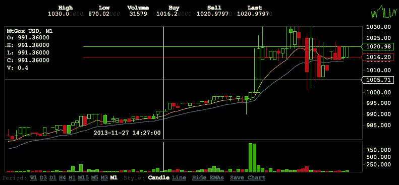

# 比特币在 Mt.Gox 交易所突破 1000 美元大关

> 原文：<https://web.archive.org/web/https://techcrunch.com/2013/11/27/bitcoin-crosses-the-1000-mark-on-the-mt-gox-exchange/>

# 比特币在 Mt.Gox 交易所突破 1000 美元大关

没有什么比疯狂的投机更能拉开假日消费季的序幕了。

在其最大的交易所之一 Mt . Gox 上，比特币的交易价格刚刚超过每枚硬币 1000 美元的大关——在我们撰写本文时，比特币的交易价格为 1022 美元，几分钟前曾达到 1030 美元的高点。

过去几天，人民币汇率大幅上涨，每单位飙升数百美元，引发了人们对人民币汇率过热的抱怨，导致人民币价格脱离了任何内在效用。嗯，是的，但看起来还是很有趣。

这里有一张[图](https://web.archive.org/web/20230402011157/http://bitcoin.clarkmoody.com/)，显示了价格是如何攀升的:

即使在中期，比特币市场的市值也远远高于该货币的潜在存储功能用途，这在我看来意味着它被高估了。做你想做的，只是要小心。

*Top Image Credit:[Flickr](https://web.archive.org/web/20230402011157/http://www.flickr.com/photos/aukirk/)*