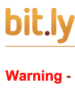
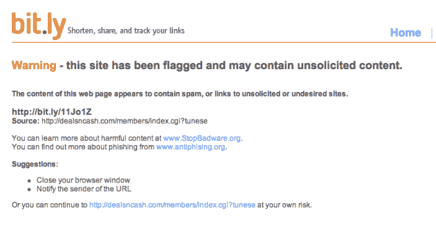

# Bit.ly 开始警告恶意链接 

> 原文：<https://web.archive.org/web/http://techcrunch.com/2009/07/16/bitly-starts-starts-warning-of-malicious-sites/>

# Bit.ly 开始警告恶意链接

自从成为 Twitter 的[默认](https://web.archive.org/web/20230202235001/http://techcrunch.com/2009/05/06/url-shortening-wars-twitter-ditches-tinyurl-for-bitly/)网址缩写， [Bit.ly](https://web.archive.org/web/20230202235001/http://bit.ly/) 一直在[疯狂增长](https://web.archive.org/web/20230202235001/http://techcrunch.com/2009/05/07/when-it-comes-to-url-shorteners-bitly-is-now-the-biggest/)。正如我们从蜘蛛侠*身上学到的那样*，能力越大，责任越大。

Bit.ly 已经开始警告用户潜在的恶意网站，根据它所掌握的关于网址被缩短的信息。例如，如果您点击[此链接](https://web.archive.org/web/20230202235001/http://bit.ly/11Jo1Z)，您将看到一条消息，内容为“*警告-此网站已被标记，可能包含未经请求的内容。此网页的内容似乎包含垃圾邮件，或者指向未经请求或不受欢迎的站点的链接。*然后给出以下建议:

> 关闭浏览器窗口
> 
> 通知发件人该 URL

或者，如果您点击页面上的另一个 URL，您也可以自行承担风险，继续访问该链接。

这一善举很可能符合 Bit.ly 的更大计划，即成为一个更像 Digg 的内容目的地。

Bit.ly 显然是从 StopBadware.org 和 antiphishing.org 获取恶意网站信息，就像许多其他服务一样。

*【感谢[亚当](https://web.archive.org/web/20230202235001/http://twitter.com/adamjackson)通过[tunese](https://web.archive.org/web/20230202235001/http://twitter.com/tunese/status/2677286106)*