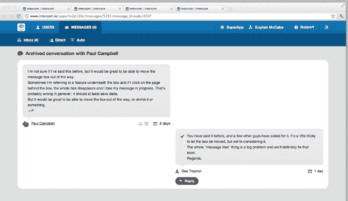

# 比兹·斯通、500 Startups 和其他公司投资 100 万美元用于 Web Businesses Intercom 的 CRM TechCrunch

> 原文：<https://web.archive.org/web/https://techcrunch.com/2012/01/25/biz-stone-500-startups-and-others-put-1m-in-social-crm-for-web-businesses-intercom/>

CRM 和 500 家创业公司孵化的公司 [Intercom](https://web.archive.org/web/20221205125606/http://intercom.io/) 已经从天使投资人那里筹集了 100 万美元的种子轮，投资人包括 twitter 联合创始人比兹·斯通、Huddle 创始人安迪·麦克洛林、丹·马爹利、500 家创业公司和 Digital Garage。

Intercom 的客户关系管理工具(CRM)是专门为网络业务设计的。基于网络的 SaaS 具有类似谷歌分析的整合功能，因此其客户数据库总是自动更新，跟踪每一次互动。通过其灵活的过滤功能，可以将用户划分为不同目标的群体(例如，将免费用户转化为付费客户)。

这是这家初创公司与标准 CRM 的不同之处。Intercom 从用户添加到应用程序的 JavaScript 片段中获取数据，类似于 Google Analytics。因此，该平台会自动了解企业的客户群，以及他们如何使用产品。

对讲机包括从产品本身直接联系客户的能力，所以如果你看到一个高调的用户注册，在应用程序中用个人消息问候他是超级简单的。您还可以根据应用程序中的规则创建消息。例如“当用户花费超过 100 美元时显示此消息”，或者“向所有拥有超过 1000 名 twitter 追随者的用户显示此消息”。

为了弄清楚谁是企业的用户，Intercom 将跟踪客户使用应用程序的频率的活动数据、与他们参加什么计划和/或他们花了多少钱有关的业务数据、社交网络个人资料数据以及通信和联系数据。

首席执行官兼联合创始人 Eoghan McCabe 解释说，所有这些数据，加上上述功能，将有助于在线企业将试用用户转化为付费账户，并与客户建立长期关系。

例如，像 GitHub 这样的测试版客户正在使用 Intercom 的消息传递功能来了解他们的客户并与他们互动——单独地、自动地、大规模地。该对讲机产品一直处于私人测试阶段，目前拥有来自 500 家公司的 1500 名活跃用户，跟踪并与超过 100 万名客户进行沟通。

“内部通信将真实的人际关系带回到网络商业和他们的顾客的画面中，”McCabe 说。“正如马克·安德森所说的‘软件吞噬世界’，所有的业务都变成了网络业务，真正个性化的客户服务是公司区分其产品和对抗商品化的最有效、最持久的方式。”

麦凯布和他的联合创始人德斯·特雷纳、西亚兰·李和大卫·巴雷特都来自爱尔兰，之前的创始人创建了错误跟踪服务 Exceptional，该服务于 2011 年被收购。

今天，对讲机将向公众开放，并将免费提供，直到今年夏天该产品的第一个完整版本推出。

