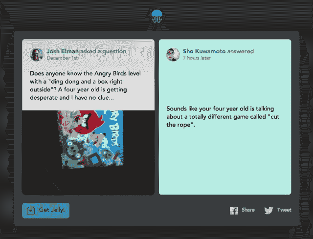

# 比兹·斯通果冻筹集了由格雷洛克领导的 B 轮融资，乔希·埃尔曼加入董事会

> 原文：<https://web.archive.org/web/https://techcrunch.com/2014/01/23/biz-stones-jelly-raises-series-b-led-by-greylock-and-josh-elman-joins-the-board/>

# 比兹·斯通果冻筹集了由格雷洛克领导的 B 轮融资，乔希·埃尔曼加入董事会

Twitter 联合创始人比兹·斯通已经筹集了由 Greylock Partners 领投的 B 轮投资，Spark Capital 也参与其中。不到一年前，该公司通过其发现基金(Discovery Fund)从斯帕克、杰克·多西和格雷洛克(Greylock)获得了首轮融资。

该应用程序——本质上是一个由图像驱动的人力发现和搜索解析引擎——[于本月初推出](https://web.archive.org/web/20230328005505/https://techcrunch.com/2014/01/07/jelly-biz-stones-new-qa-platform-will-go-live-today/)。

“Jelly 是一个资本要求不高的小团队，我们打算保持这种方式，同时发展全球服务，改变我们寻找答案的方式，”Stone today 说。“与 Greylock 的合作意味着我们有更多的时间与董事会中一些有才华和有帮助的人一起专注于改善 Jelly。”

目前还不清楚这笔投资涉及的金额，但此前有传言称 [Greylock 可能参与博客平台 Medium](https://web.archive.org/web/20230328005505/https://techcrunch.com/2014/01/08/the-medium-is-the-message-2/) 的 2000 万美元融资，该融资来自斯通的 Twitter 联合创始人 Ev Williams。Jelly 的第一季没有公布数字，但我们听说有几百万。

TechCrunch 采访了 Greylock 的合伙人乔希·埃尔曼，他也将在这一轮加入 Jelly 的董事会。埃尔曼曾是 Twitter 的产品经理，与斯通共事。Elman 和我们分享了他早期测试这款应用的经历。

“当我在早期玩这个产品的时候，我有一些经历让我感谢我有果冻。Jelly 上的一个人帮我意识到我的淋浴器漏水了，这是基于我 20 英尺下的侧线上的一个点。我能够帮助其他人计划旅行和购买完美的新显示器，”他今天在一篇帖子中详细介绍道。“我最喜欢的一次是我女儿反复让我找一部和《董阿定和一个盒子》差不多的《愤怒的小鸟》。几个小时后，经过一番寻找和抱怨，果冻终于有了完美的答案，帮助我成为她的英雄…

Jelly 的其他投资人还包括[波诺](https://web.archive.org/web/20230328005505/http://en.wikipedia.org/wiki/Bono)(是的)[伊万·威廉姆斯](https://web.archive.org/web/20230328005505/http://www.crunchbase.com/person/evan-williams)和[詹森·高德曼](https://web.archive.org/web/20230328005505/http://www.crunchbase.com/person/jason-goldman)、[阿尔戈尔](https://web.archive.org/web/20230328005505/http://www.crunchbase.com/person/al-gore)、导演[格雷格·艾坦尼斯](https://web.archive.org/web/20230328005505/http://www.crunchbase.com/person/greg-yaitanes)和企业家[罗亚·马布卜](https://web.archive.org/web/20230328005505/http://en.wikipedia.org/wiki/Roya_Mahboob)。Spark 普通合伙人 [Bijan Sabet](https://web.archive.org/web/20230328005505/http://www.crunchbase.com/person/bijan-sabet) 已经在 Jelly 的董事会任职。

*帖子更新调整传言 A 轮金额。*