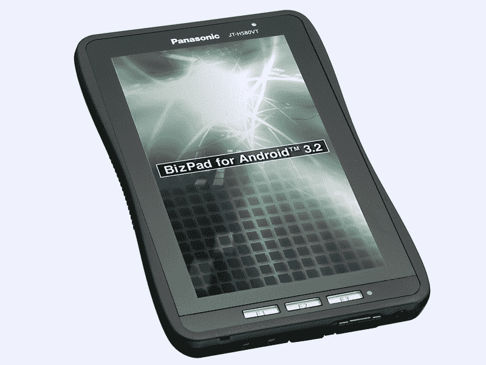
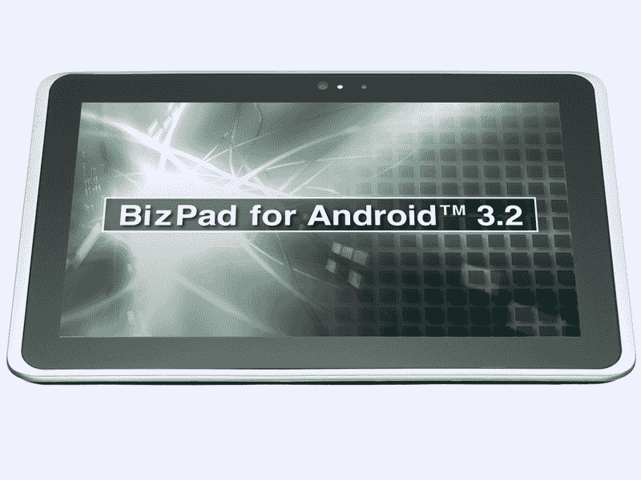

# BizPad:松下发布面向企业的 Android 平板电脑 

> 原文：<https://web.archive.org/web/http://techcrunch.com/2011/10/13/bizpad-panasonic-announces-android-tablets-targeted-at-businesses/>

# BizPad:松下发布面向企业的 Android 平板电脑

松下昨天宣布了两款面向国内市场的安卓平板电脑，即所谓的 biz pad JT-580 vt(7 英寸液晶显示屏)和 JT-581 vt(10.1 英寸液晶显示屏)。这两款设备都运行在 Android 3.2 上，并且专门针对企业(因此得名)。

这些平板电脑的共同之处还在于防震、防尘和防水。例如，松下说大型号可以吸收 80 厘米高的跌落，而小型号甚至可以处理 120 厘米高的跌落。

这两款设备都有 NFC 读卡器、可更换电池、蓝牙 2.1+EDR、USB 端口、GPS、microSD 插槽、ARM Cortex-A9 双核 CPU、1GB 内存、16GB 闪存和红外线。

【T2

7 英寸的型号(如上图)具有 1，024×600 分辨率的屏幕，3G 作为一个选项，500 万像素的摄像头和 IEEE 802.11a/b/g/n Wi-Fi。它重 400 克，将于 12 月上市。

10 英寸的 BizPad(如上图)配备了 1，280×800 分辨率的屏幕，1.3 百万像素的摄像头和 IEEE 802.11b/g/n Wi-Fi。这款机型重 700g，将于 2012 年 1 月在日本上市。

松下尚未宣布 BizPads 的价格和可能的海外销售计划。