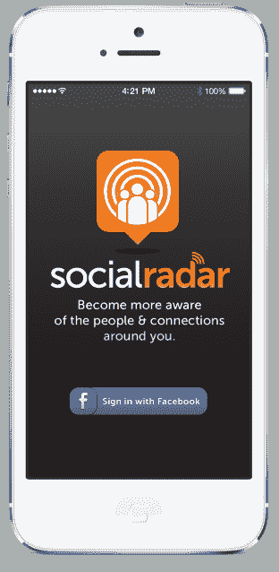

# Blackboard 联合创始人 Michael Chasen 为 SocialRadar 筹集了 1275 万美元的 A 轮融资，这是基于位置的人员发现应用 TechCrunch 的新举措

> 原文：<https://web.archive.org/web/https://techcrunch.com/2013/06/19/blackboard-co-founder-michael-chasen-raises-12-75m-series-a-for-socialradar-a-new-take-on-location-based-people-discovery-apps/>

如果你认为“环境位置”热潮已经过去，准备好大吃一惊吧。一家名为 [SocialRadar](https://web.archive.org/web/20221205160519/http://www.socialradar.com/) 的公司今天宣布，它已经从 [NEA](https://web.archive.org/web/20221205160519/http://www.crunchbase.com/financial-organization/new-enterprise-associates) 、 [Grotech Ventures](https://web.archive.org/web/20221205160519/http://www.crunchbase.com/financial-organization/grotech-ventures) 以及包括[史蒂夫·凯斯](https://web.archive.org/web/20221205160519/http://www.crunchbase.com/person/steve-case)、[泰德·莱昂西斯](https://web.archive.org/web/20221205160519/http://www.crunchbase.com/person/ted-leonsis)、[戴夫·莫兰](https://web.archive.org/web/20221205160519/http://www.crunchbase.com/person/dave-morin)和[凯文·科勒兰](https://web.archive.org/web/20221205160519/http://www.crunchbase.com/person/kevin-colleran)在内的其他人那里筹集了 1275 万美元的首轮融资，用于一款首先在 iPhone 上发布的基于位置的移动人物发现应用。

这款应用程序值得注意的是，除了它出现在许多人已经认为“寻人”已经过时的时候之外，该公司的创始人兼首席执行官是[迈克尔·蔡森](https://web.archive.org/web/20221205160519/http://www.crunchbase.com/person/michael-chasen)，他是 [Blackboard](https://web.archive.org/web/20221205160519/http://www.crunchbase.com/company/blackboard) 、[的前联合创始人兼首席执行官，在](https://web.archive.org/web/20221205160519/https://beta.techcrunch.com/2012/10/18/with-both-co-founders-now-gone-its-the-end-of-an-era-for-education-software-giant-blackboard/)[于 2011 年年中以 16.4 亿美元的价格被 Providence Equity Partners](https://web.archive.org/web/20221205160519/https://beta.techcrunch.com/2011/07/05/educated-buy-providence-equity-partners-to-acquire-blackboard-for-1-64-billion-in-cash/) 收购后，于 2012 年底辞去了他在该公司的职务。

Blackboard 可能不是最受欢迎的学习管理系统，但它确实确立了自己在这个领域的领导者地位，如今新的教育科技初创公司希望颠覆这个领域。现在，Chasen 相信他也能把 SocialRadar 推到“人物发现”的顶端。

Chasen 解释道:“Blackboard 的一个有趣之处在于，尽管我们是一家企业软件公司，但我们确实认为自己更贴近消费者。“我把所有时间都花在了大学校园里，与学生和教师打交道，帮助把课程放到网上。”在那里，他注意到了几个有趣的趋势。虽然只有 56%的美国用户拥有在线个人资料，但在大学校园里，这一比例几乎达到了 95%。他说，智能手机在美国的普及率约为 60%，但在大学校园里，这一数字超过了 90%。

 学生们不仅更有可能携带这些设备，他们还以不同的方式使用它们。“他们公开使用他们的智能手机作为定位信标，与其他人分享他们的位置，以及分享他们的社交信息，”他说。

但 Chasen 认为这很奇怪，尽管这现在是默认行为(至少在特定人群中)，但没有一种简单的方法可以走进一个房间，启动一个应用程序，并找出谁在那里以及你如何与他们联系。

当然，这并不完全正确。

在过去的几年里，包括 Highlight、Banjo、Sonar 等在内的许多初创公司都兴致勃勃地攻击基于位置的人们发现空间，这场运动在 2012 年奥斯汀的年度 SXSW 活动上真正达到了高潮。然而，从那以后，许多应用程序[一直在努力寻找主流应用。一些](https://web.archive.org/web/20221205160519/https://beta.techcrunch.com/2012/03/18/why-highlight-wasnt-a-breakout-success-at-sxsw/)[像 glance](https://web.archive.org/web/20221205160519/https://beta.techcrunch.com/2012/05/04/facebook-buys-location-based-discovery-app-glancee/)和 [Glassmap](https://web.archive.org/web/20221205160519/https://beta.techcrunch.com/2013/01/11/groupon-acquires-realtime-location-aware-service-glassmap-to-help-you-find-deals/) 都有卖。像 Kismet 这样的其他公司已经进入了新的产品类别。[简介](https://web.archive.org/web/20221205160519/https://getintro.net/)旋转。

尽管如此，Chasen 坚持认为 [SocialRadar](https://web.archive.org/web/20221205160519/http://www.socialradar.com/) 与那批人不同。

“我了解到，这些应用程序既使用定位功能，也共享信息，”他说。他在小组中最喜欢的一个是 Highlight，他解释说它在后台运行，当你靠近它认为你感兴趣的人时，它会给你发出警报。“这当然是一个很好的应用程序，可以让你在附近认识新朋友，Highlight 算法认为你应该认识他们，但它不会让你在走进房间时拿出手机，看看谁在你周围，”Chasen 说。

与此同时，像 [Sonar](https://web.archive.org/web/20221205160519/http://www.sonar.me/) 这样的应用程序——事实上它会告诉你哪些朋友在你附近(以及离你有多近)——Chasen 描述为只是一个“人的直接列表”，由朋友的朋友的朋友陪着。

相反，SocialRadar 不仅会关注谁在附近，还会关注你如何认识他们。例如，它会显示你的同事、大学同学等等，而不仅仅是名字。

但 SocialRadar 与其他应用程序之间的另一个重大区别在于，SocialRadar 旨在为用户提供更多控制。其他应用程序经常挖掘公开可用的签到数据，以找到附近的联系，或者[忽视真正的隐私问题](https://web.archive.org/web/20221205160519/https://beta.techcrunch.com/2012/03/03/highlight-needs-to-let-you-switch-off-friend-of-friend-notifications-before-austin/)。用户可以选择与所有其他人分享他们的位置，只与朋友分享，或者保持匿名。

用户还可以控制应用程序的运行方式，选择是否支持后台运行。这解决了 Highlight 等其他基于位置的人员查找工具的最终用户的一个主要痛点，据说这对电池消耗有负面影响。

SocialRadar 将允许自定义提醒，让您告诉它何时通知您，以及您对哪些人或组感兴趣。(例如，当我最好的朋友在附近时，当一个兄弟会成员在镇上时，当我的同事参加这个活动时，等等。)

Chasen 声称，这些差异将使 SocialRadar 在其他人停滞不前的地方取得成功。“在脸书出现之前，有数百个社交网络，”他说。“在我看来，这个领域的许多其他应用程序都是第一版，是试验性的。我甚至不一定会把他们放在同一个竞争对手圈子里。”

他们的战斗文字。

SocialRadar 现在是一个 10 人团队，总部设在华盛顿特区，今天宣布提供资金，但该公司八周前才正式成立。然而，Chasen 说，这项技术已经发展了很长时间。

尽管如此，现在还为时尚早。“七八周前，我们有了办公空间，三周前，我还在办公室里组装椅子，”他笑着说。(补充说明:在 Blackboard，Chasen 说他们有很多人，他有一个制造办公家具的部门。现在事情对他来说发生了怎样的变化。)

iPhone 版的 SocialRadar 将在几周内推出测试版。