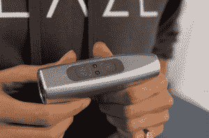

# Blaze 寻求用激光投影自行车灯拯救骑车人的生命 

> 原文：<https://web.archive.org/web/https://techcrunch.com/2014/01/07/blaze-seeks-to-save-cyclist-lives-with-a-laser-projection-bike-light/>

# Blaze 试图用激光投影自行车灯拯救骑车人的生命

越来越多的城市通勤者将骑自行车作为一种上下班和在城市周围的方式，越来越多的城市通过增加自行车道和使通勤更加安全和有趣来接受骑自行车的人。但是，即使在对自行车最友好的城市，自行车安全仍然是一个大问题。一家名为 [Blaze](https://web.archive.org/web/20221207072212/http://www.blaze.cc/) 的新创公司希望通过重新设计经典的自行车灯来提高骑车人的安全性。

Blaze 的自行车灯不仅让骑车人在天黑时更容易看到他们要去的地方，更重要的是，它的设计可以帮助驾车者看到他们，即使他们在汽车的盲点上骑车。这是通过一个激光投影来实现的，它将自行车的图像投射到他们骑车的地方前方五六米处。

“火焰自行车灯”试图克服骑自行车的人面临的最大问题之一——也就是，驾车者转弯时看不见他们的倾向。几乎[80%的自行车事故发生在](https://web.archive.org/web/20221207072212/http://www.trl.co.uk/online_store/reports_publications/trl_reports/cat_road_user_safety/report_collisions_involving_pedal_cyclists_on_britains_roads:_establishing_the_causes.htm)一个骑自行车的人直行时，一个骑摩托车的人撞上了他们。

(作为一名骑自行车的人，我可以说我经历过的最大失败是一辆车试图在没有打信号或看不见我的情况下撞上我。)

Blaze 自行车灯不仅让你更加安全，它还有许多其他优点。它可充电，USB 兼容，100%防水。它有磁性充电针，所以它有一个完全密封的外壳。

它显示的图像是绿色的，这是最容易看到的阴影，也需要很少的电力来产生。该灯有三种不同的模式(高，低，闪烁)，每次充电可提供约 13 小时的使用时间，并在电量开始下降时提醒用户。

Blaze 自行车灯配有一个安装支架和 USB 充电线，可预订，价格为 200 美元。与其他自行车灯相比，它可能有点贵，但你不能真的给安全定价。

[gallery ids="939978，939979，939980，939981，939982，939983，939984，939985，939986"]