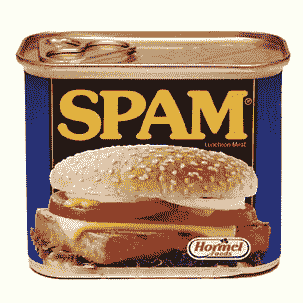

# Blekko 在其搜索结果中禁止像 Demand Media 的 eHow 这样的内容农场 

> 原文：<https://web.archive.org/web/https://techcrunch.com/2011/01/31/blekko-bans-content-farms/>

# Blekko 禁止像 Demand Media 的 eHow 这样的内容农场出现在搜索结果中

让你定制搜索结果的小搜索引擎初创公司 Blekko ，将打击网络垃圾邮件的斗争推向了一个新的高度。它已经允许搜索者将搜索结果标记为垃圾邮件，并保持一个[垃圾邮件时钟](https://web.archive.org/web/20230203000704/http://www.spamclock.com/)来计算网络上有多少垃圾邮件页面(7 . 43 亿，并且还在增加)。现在，它即将完全屏蔽像 Demand Media 的 eHow 和 Answerbag 这样的内容农场。其用户标记为垃圾网站来源的前 20 个网站现在将被阻止(见下面的完整列表)。

人们越来越担心垃圾邮件正越来越多地占据搜索结果。以至于谷歌最近发誓要更加警惕，并降低内容农场在搜索排名中的排名。

现在，Blekko 要做得更好，彻底禁止最恶劣的罪犯。以下是被禁网站的列表:

ehow.com
experts-exchange.com
naymz.com
activehotels.com
robtex.com
encyclopedia.com
fixya.com
chacha.com
123 people . com
download 3k . com
petitionspot . com
the free dictionary . com
networked blogs . com
buzzillions . com
shop wiki . com
wowxos . com
answer bag . com
所有专家

该你了，谷歌。