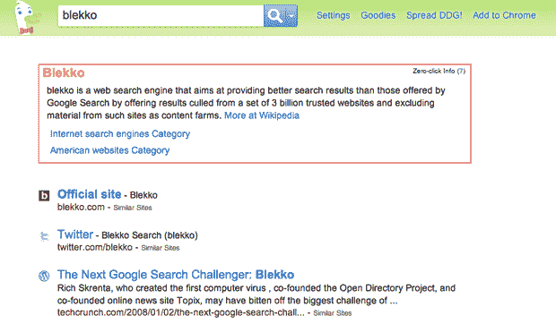

# Blekko 与搜索引擎 duck duck go TechCrunch 合作

> 原文：<https://web.archive.org/web/http://techcrunch.com/2010/11/23/blekko-duckduckgo/>

# Blekko 与搜索引擎 DuckDuckGo 合作

能够做到这一点的小型搜索引擎 Blekko 刚刚取得了成功，在它存在的第一周，每天就有 100 万个搜索查询和 30，000 个 slashtags(人类策划的搜索主题，如/colleges、/vegan、/blogs)。

现在，它采取了一种独特的*“如果你不能打败他们，就加入他们”*的搜索方法，并与市场上的异类同行 [DuckDuckGo](https://web.archive.org/web/20230202215627/http://www.duckduckgo.com/) 联系起来，像 Blekko 一样，这是一个搜索引擎，它以拥有比谷歌或必应更多的相关结果为荣，并且不保留任何个人身份信息。

Blekko 首席执行官里奇·斯克伦塔表示:“我们两家公司都有着共同的使命，那就是消除搜索中的垃圾信息，让用户从最好、最相关的网络资源中获取信息。”。

从今天起，Blekko 将在每个网站的基础上整合 DuckDuckGo 的[零点击信息](https://web.archive.org/web/20230202215627/http://duckduckgo.com/faq.html#zero)摘要，讽刺的是，当你在 Blekko 上点击搜索结果中的“信息”就可以访问这些摘要，而当你在 DuckDuckGo 上时，这些摘要会显示在你的查询页面的顶部。

DuckDuckGo 搜索结果现在将由 Blekko 提供支持，用于以下热门搜索:“个人金融”、“歌词”、“食谱”、“酒店”、“健康”、“大学”和“汽车”。Blekko 自己也在尝试对这些类别自动应用 slashtag 来改善查询，例如使用 slashtag /health 来筛选搜索“治疗感冒”的更好结果。

DuckDuckGo 用户还可以使用/date 搜索最近的结果，这实际上是我在 Blekko 上最喜欢的功能，如果你在寻找新闻文章或博客帖子或任何按时间顺序排列的东西，它特别有用。

Blekko 想出了一些非常新颖的方法来保持用户的回头客(查看它的搜索引擎优化工具)，如果 DuckDuckGo 不是我们从这个资金雄厚的搜索引擎中看到的最后一个合作伙伴，我不会感到惊讶。斯克伦塔说:“我们银行里有很多钱(确切地说是 2400 万美元)，所以我们哪儿也不去。”

你可以点击这里查看我们 TCTV 对斯克伦塔的采访，点击这里查看我们对布莱科[的全面评论。](https://web.archive.org/web/20230202215627/https://techcrunch.com/2010/07/19/techcrunch-review-the-blekko-search-engine-prepares-to-launch/)