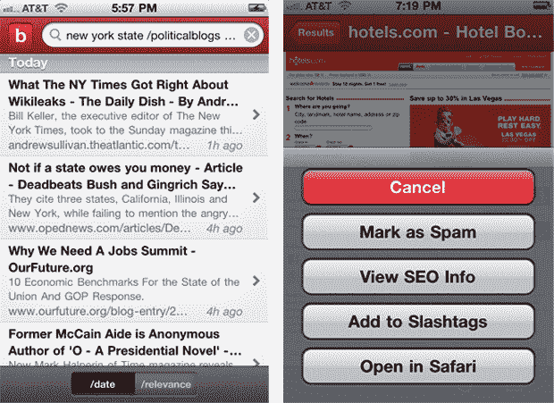

# Blekko 采用 iPhone 和 Android 应用管理搜索移动技术 

> 原文：<https://web.archive.org/web/http://techcrunch.com/2011/01/28/blekko-takes-curated-search-mobile-with-iphone-and-android-apps/>

# Blekko 将策划搜索移动与 iPhone 和 Android 应用程序

[Blekko](https://web.archive.org/web/20230203005623/http://www.blekko.com/) ，搜索引擎，正在与人类编辑进行[与](https://web.archive.org/web/20230203005623/https://techcrunch.com/2011/01/28/the-future-of-search-who-will-win-the-spam-wars/)对抗网络垃圾邮件的战斗，今天加入了谷歌和必应的移动搜索领域，带来了 Android 和 iPhone 应用程序的双重打击。Blekko 首席执行官[里奇·斯克伦塔](https://web.archive.org/web/20230203005623/http://www.crunchbase.com/person/rich-skrenta)，*说:“在一个人们希望随时随地获得最相关答案的世界里，移动搜索变得越来越重要。”*

该应用程序有一个简单的界面，无论你是否使用 Blekko 帐户登录，都可以查看搜索结果。除了与脸书的整合，该应用几乎提供了 Blekko 本身的所有功能，最显著的是通过 [/slashtag](https://web.archive.org/web/20230203005623/http://blekko.com/ws/+/about) 或精选主题进行搜索的能力。结果按最相关的日期排序。

当你向下滚动搜索时，该应用程序还会在顶部为每个搜索提供建议的斜线标签。对于 Blekko power 用户，可以通过点击搜索中每个结果旁边的箭头，然后点击右下角的框/箭头图标来显示更多选项，从而访问具有“标记为垃圾邮件”、“查看 SEO 信息”、“添加到 Slashtags”和“在 Safari 中打开”等隐藏功能的界面(见上图右侧)。

Blekko 自去年 11 月推出以来，已经拥有超过 100，000 个 slashtags，已经从罗恩·康韦、迈克·梅普斯、杰夫·克拉维尔和马克·安德森等风投巨星以及阿什顿·库彻等最近真正的超级巨星那里筹集了 2400 万美元。

从今天开始，这款应用在苹果商店和安卓市场都是免费的。