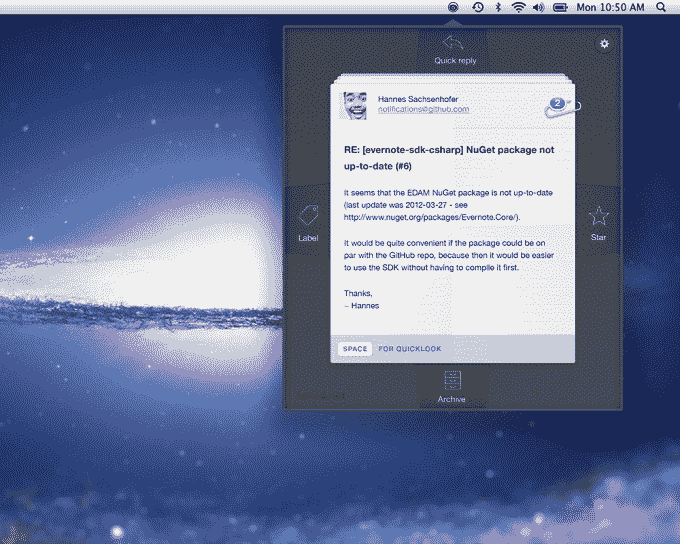
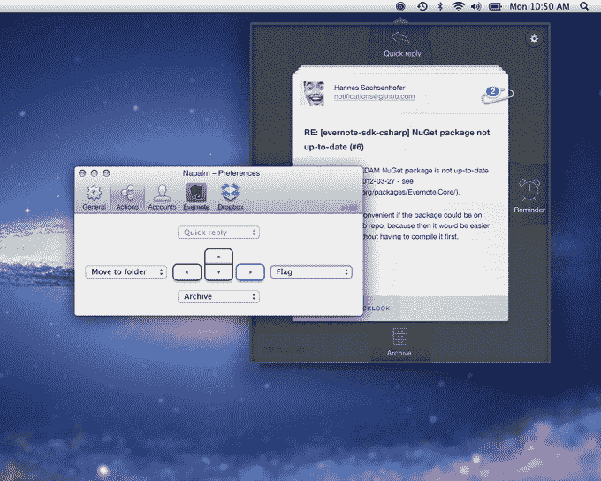

# BlinkMail 为 Mac 用户带来类似邮箱的电子邮件分流体验 

> 原文：<https://web.archive.org/web/https://techcrunch.com/2014/03/26/blinkmail-brings-a-mailbox-like-email-triage-experience-to-mac-users/>

一款名为 [BlinkMail](https://web.archive.org/web/20221006231723/http://www.blinkmailapp.com/) 的新应用今天发布测试版，为 Mac 用户提供了一种从桌面管理电子邮件收件箱的不同方式。虽然与其他 OS X 邮件客户如 Sparrow 或 Airmail 在同一个领域竞争，但 BlinkMail 的有趣之处在于它的主要重点是电子邮件分类。它的用户界面受到基于手势的移动应用程序的启发，如[邮箱](https://web.archive.org/web/20221006231723/http://www.mailboxapp.com/)，让你通过采取果断的行动快速浏览你的消息列表，例如存档、删除、回复甚至发送到 Evernote 或 Dropbox。

BlinkMail 是来自莫斯科 YaM Labs 的最新产品，该公司是 SaaS 解决方案提供商，也是 T4 更高效会议工具和电子邮件插件如 Powerbot 的制造商。这个 10 人团队由俄罗斯企业家 Anatoly Gaverdovsky 领导，他是 VDI (EPAM)的前首席执行官和 Mail.ru 的前首席技术官 Pavel Yakhitov。这家初创公司得到了 Foresight Ventures 和其他投资者的 200 万美元资金支持。

和早期的工具一样，BlinkMail 的总体目标是提高效率。安装电子邮件客户端后，您可以随意自定 Mac 的箭头键，将一个设定为删除或归档操作，另一个设定为回复，一个设定为添加标签，另一个设定为将邮件发送到云存储服务，等等。

BlinkMail 今天与 Dropbox、Evernote、Things 和 OmniFocus 集成，用于保存电子邮件和笔记，同时还允许用户从其主界面快速接受或拒绝活动邀请。

该公司声称，它的键盘快捷键能让用户在大约 200 秒内处理多达 100 封电子邮件。

BlinkMail 是免费下载的(适用于 Mac OS X 10.9 及以上版本)，但 19.99 美元的高级版本即将推出，该版本将支持多个帐户、提醒和 Evernote 集成。该公司表示，iPhone 和 Windows 应用程序也在开发中。

就我个人而言，我不确定我们基于桌面的电子邮件客户端是否应该试图完全反映我们的移动体验——毕竟，智能手机的独立分类应用之所以起飞，是因为完整的电子邮件管理解决方案还没有真正适用于较小的屏幕。更好的做法是做一些轻量级的任务，比如清理电子邮件，把更复杂的电子邮件和约会安排留到我们回到台式机或笔记本电脑的时候。

也就是说，我对电子邮件的看法来自于在企业环境中使用 Outlook 多年，后来转向基于云的解决方案，如 Gmail 和 Google Apps。然而，新一代用户正在以移动设备为先成长，iPad 等平板电脑是他们的第一台电脑。对于这些用户来说，与移动应用更相似的桌面应用可能更受青睐。

至少，对于任何一个群体来说，BlinkMail 都可以作为你首选的默认电子邮件体验的补充应用。

BlinkMail 的测试版面向 Mac 用户[这里](https://web.archive.org/web/20221006231723/http://www.blinkmailapp.com/)提供。