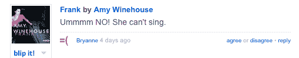
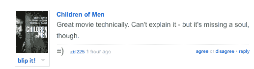
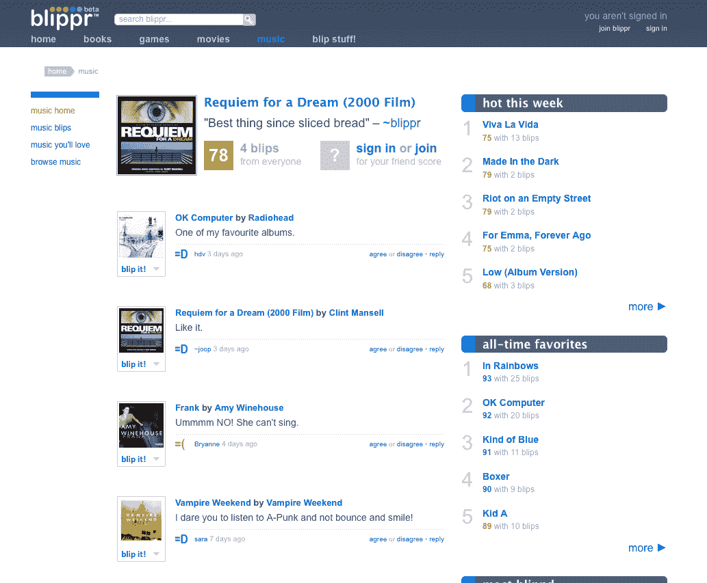

# Blippr 是微评论的 Twitter TechCrunch

> 原文：<https://web.archive.org/web/https://techcrunch.com/2008/07/28/blippr-is-twitter-for-micro-reviews/>

如果你不能用 160 个或更少的字符来表达，那么它就不值得说(当然，除了你在 TechCrunch 上读到的任何东西)。这种发短信的风气现在正转移到其他交流方式上，比如 Twitter(信息长度限制在 140 个字符以内)。最新的例子是 [Blippr](https://web.archive.org/web/20230121110201/http://www.blippr.com/) ，一个你可以在短信大小的地方评论书籍、游戏、音乐和电影的网站。

将一篇评论缩减到 160 个字符和一个评级，确实会迫使评论者抓住被评论作品的本质吸引力或缺陷。例如，你真的需要知道更多关于拉斯维加斯的恐惧和厌恶吗？一位评论家非常喜欢这本书，他说:“我认为这本书现在已经分崩离析了；)"?或者关于艾米·怀恩豪斯:“嗯，不！她不会唱歌。”

微评论网站会将你的评论转发到 Twitter、脸书和 FriendFeed(尽管它比 Twitter 多允许 20 个字符，这意味着过长的评论在翻译成推文时会被缩短)。与短信文化保持一致，四个评分分别是表情:=D，=)，=|，或者=(。

像 Twitter 一样，你可以关注你的朋友在发什么信息，更新你正在阅读、观看、播放或收听的“媒体状态”。现在每个人都可以成为评论家。

以下是一些样本信号的截图:

