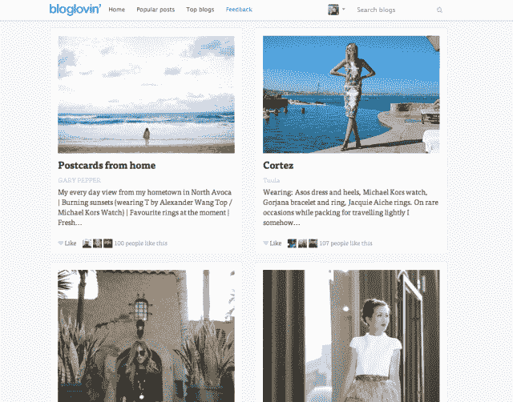

# Bloglovin 重新设计了其以时尚为重点的博客阅读器，以突出流行内容、社交功能

> 原文：<https://web.archive.org/web/https://techcrunch.com/2013/05/16/bloglovin-redesign/>

Bloglovin 是一个读者可以关注关于时尚和其他生活方式话题的博客的网站，该网站正在进行首席执行官兼联合创始人马蒂亚斯·斯文森所说的首次重大重新设计。

到目前为止，Swenson 说 Bloglovin 一直在以一种更加渐进的方式添加新功能。这一次，它有了新的外观和新的社交功能，Bloglovin 团队希望这将取悦铁杆用户和更多的休闲游客。

[Bloglovin 去年夏天从纽约市的孵化器 betaworks 和其他公司筹集了 A 轮](https://web.archive.org/web/20230319224750/https://techcrunch.com/2012/06/29/bloglovin-bbetaworks)，当时，Swenson 强调了 Bloglovin 社区的贡献。例如，他说 Bloglovin 用户平均关注 37 个博客。然而，他昨天告诉我，该团队已经意识到一种更随意的受众，这种受众不关注任何特定的博客或作者，而是在寻找他们感兴趣的主题的最新内容。

为了改善这些用户的体验，Bloglovin 重新设计了页面，以某个主题的“热门”帖子为特色。看看新旧页面，我不会说这是一个巨大的变化，但它允许 Bloglovin 在页面上包装更多的故事，而不会让事情变得拥挤——我会说它看起来更像杂志(它可能会让一些人想起 Pinterest，虽然我认为这种描述现在有点滥用，但斯文森并没有放弃这种比较。)

这些重新设计的页面上的每个帖子还显示了有多少 Bloglovin 用户“喜欢”它。访问者可以将这个数字扩展成一个完整的用户列表。对于博客作者来说，这可以更好地了解谁喜欢他们的内容，而对于读者来说，这是一个识别具有相似品味的用户的机会，他们可以跟随他们找到更有趣的内容:“所以我们正在把我们的用户变成策展人。”

斯文森还将 Bloglovin 与 Tumblr 进行了比较，在 Tumblr 中，许多用户并不制作原创内容，而是简单地转发他人拍摄和分享的照片。他说，这种分享变成了一种“表达自我”的方式，“Bloglovin 将成为这样做的终极平台”，部分原因是用户不局限于关注特定平台上的出版物(就像他们在 Tumblr 上一样)。

“一开始，我们的一些投资者对(重新设计)持怀疑态度，但后来他们给妻子和女儿看了，他们说，‘好吧，我们明天再做吧。’”他说。我问他们为什么持怀疑态度，他回答说，“我认为这与谷歌阅读器关闭有关。…但是他们意识到现在是进行这些重大变革的时候了。"

斯文森补充说，在谷歌阅读器消亡后，其他 RSS 阅读应用将陷入“功能战争”，因为它们追求以技术为中心的受众，而 Bloglovin 最终可能涵盖一切和所有人。首先，尽管 Bloglovin 允许用户关注他们喜欢的博客的 RSS 源，但它并没有真正将自己作为一个 RSS 阅读器进行营销。斯文森说，对“发现最佳内容”的日益重视应该会进一步推动网站朝着这个方向发展。

最终，他预测，Bloglovin 的用户已经增长到每月 470 万活跃用户，将由 10%的“重度用户”和 90%的访问者组成，“他们只是对时尚等感兴趣，他们只是想知道什么是流行的。”