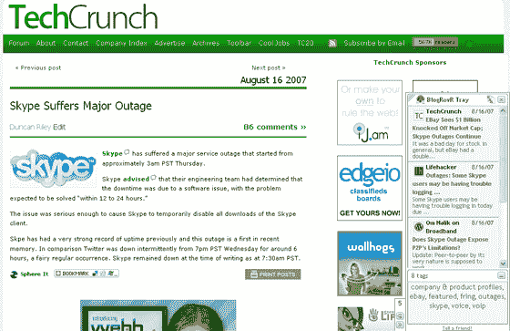

# Blogrovr 博客推荐:新的和改进的——

> 原文：<https://web.archive.org/web/http://www.techcrunch.com:80/2007/08/17/blogrovr-blog-recommendations-new-and-improved/>

# Blogrovr 博客推荐:新的和改进的

 关注你最喜欢的博客可能有点麻烦。罗伯特·斯考伯说他每天关注超过 700 条反馈。但是，如果你发现有太多的信息让人不知所措，那么把自己限制在几个博客上似乎是唯一的选择。然而，Activeweave 有一个解决方案。

他们的 [Blogrovr](https://web.archive.org/web/20201125113549/http://blogrovr.com/) 浏览器插件不会在你的订阅源中搜索相关内容，而是为你提供与你正在浏览的内容相关的博客帖子。SphereIt 有一个类似的嵌入文章的技术，就像这个博客一样。这个插件是从 Activeweave 的一个名为 Stickis 的早期项目中分离出来的。这些帖子来自你最喜欢的博客，并填充到你浏览器的侧边栏中。今天，他们发布了一个新版本的插件，具有改进的算法、个性化的建议和谷歌阅读器集成。

Blogrovr 的更新算法显著提高了出现的故事的质量和数量。他们的算法从我的 OPML 博客中提取故事，看起来很有针对性。看看最近一篇关于 Skype 中断的博文，我就知道了我是如何得到与 Skype 和中断相关的结果的，尽管这两个故事之间并没有直接的联系。它不是像 tech blog sphere[Techmeme](https://web.archive.org/web/20201125113549/http://techmeme.com/)那样的目的地，但 Blogrovr 可以扩展到各种各样的博客主题。

新版本还支持博客发现，推荐与你正在阅读的内容高度相关的新博客帖子，即使它们不在你的订阅列表中。

最好的功能增强是谷歌阅读器集成。Blogrovr 现在实时发布与你在谷歌阅读器中阅读的文章相关的博客文章。它在刷新内容方面仍然有点慢，但对于谷歌阅读器来说是一个有用的伴侣。

