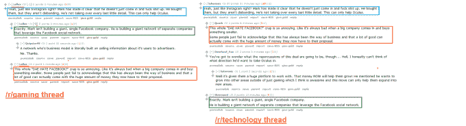

# 裂缝的反吹 

> 原文：<https://web.archive.org/web/https://techcrunch.com/2014/03/26/blowback-from-the-rift/>

酸葡萄。在这个数十亿美元收购和高期望的时代，拥有它们很容易。但是是什么引发了公众对 Oculus 及其以 20 亿美元卖给 T2 脸书 T3 的愤怒呢？对背叛的无休止的恐惧，迎合一个市场的团体或个人或品牌，然后，感觉到路的尽头，转向广阔的世界，重新调整自己，为大众接受。

需要明确的是，Oculus 欠它的支持者一样东西:一个耳机。他们不欠他们始终不渝的忠诚，永远的贫穷，或者在游戏会议上卑躬屈膝。认为 Oculus 会考虑其观众的想法是可笑的。在想要电视的[酷孩子和想要摇滚不倒翁的](https://web.archive.org/web/20230125234847/http://simpsons.wikia.com/wiki/Homer_Goes_to_College/Quotes)书呆子之间的选择中，书呆子总是会选择 20 亿美元。

另一件事也很清楚:认为脸书除了掏空 Oculus、把开发者分散到它巨大的内脏里、耸耸肩把外壳吐出来之外什么都不会做的想法是可笑的。如果 Oculus 发布产品，这将是 Oculus 产品支持者拥有的最后一批产品。下一个将出现的产品——如果它真的出现的话——将是一种“喜欢”现实世界中的实体广告的方式，以获得来自脸书品牌骆驼奶的营养浆的奖励。

但这是互联网，所以我们必须大声疾呼。首先，我们有一些非常有分寸的——和不可估量的——Twitter 来回。谢天谢地，乔尔·约翰逊巧妙地解释了这种恐怖:

https://twitter.com/joeljohnson/status/448787056416657408

https://twitter.com/joeljohnson/status/448781179194724352

然后我们有了真正的抱怨:Oculus 应该是关于游戏的，而现在是关于 VR 的。两年来，Oculus 一直是游戏玩家的天堂，让你可以使用虚拟厕所或在辉煌的 3D 中玩半条命 2。这应该是一种完全独自沉浸在游戏中的方式(可悲的是，这种前景更多地是关于游戏文化而不是技术)。然而，现在脸书想借助谷歌，想办法尽可能多地将他们的产品展示在更多人面前。游戏玩家本能地知道这是个坏主意。正如他们很少接受游戏中出现广告——并为此付出 60 美元购买一张光盘和一些塑料包装——他们知道在沉浸式环境中被推销并不好玩。就像从梦中被拉出来卖给可乐一样。

两年后，帕尔默·卢奇(Palmer Luckey)仍在谈论他“进军虚拟现实是出于增强我的游戏体验的愿望”，尽管他在 Reddit 上发帖解释说，Oculus 以 20 亿美元的价格将自己卖给了脸书，这家公司与游戏的主要关系是帮助制作可怕游戏的人变得异常富有。我仍然不后悔，因为我得到了我想要的，但对于那些认为 Oculus 的 Kickstarter 更像是一个小承诺，将游戏置于下一代虚拟现实的中心的人来说，整个事件将是一个警示故事。事实证明，有很多人都是这样，所以反应相当消极。粉丝和支持者，包括马库斯·佩尔森这样的高调人物，都攻击 Oculus 的动机。“我知道发生这种情况是因为在该公司投资的人看到了大袋的美钞，”佩尔松在 Reddit 上回复道，呼应了许多措辞更加丰富的回应，称这笔交易是背叛。

那么这个奇怪的[阴谋论又是怎么回事呢？脸书的员工](https://web.archive.org/web/20230125234847/http://www.reddit.com/r/oculus/comments/21d5zi/roculus_mods_what_can_be_done_to_keep_the/cgc7a6z?context=3)已经在论坛上传播这个好消息了。正如我们所见，这是相当糟糕的:

【T2

但是不要害怕！没有任何评论军队准备执行扎克的命令。其中一个用户否认了所有的事情，我们必须记住，在受害者对受害者的战争中，有两方。尽管全世界都对脸书感到愤怒，但还是会有一些支持者耸耸肩说:“嘿，这是个好主意。”在战争的迷雾中，很多事情被说出来，最终被遗忘。最终，这些战争无关紧要。更有趣的事情将会出现——[Morpheus 耳机可能会成为这里的赢家](https://web.archive.org/web/20230125234847/https://techcrunch.com/2014/03/18/sony-announces-project-morpheus-a-virtual-reality-headset-for-the-ps4/) ( [阅读 Greg 的观点](https://web.archive.org/web/20230125234847/https://techcrunch.com/2014/03/23/sonys-advantage/))—我们都将不得不为纯粹游戏的虚拟现实解决方案再倒一杯。我知道这很难，但当我们奔向未来时，总会有一些伤亡。您可以[随时取消您的预购](https://web.archive.org/web/20230125234847/https://support.oculusvr.com/hc/en-us/articles/201721253-Order-Cancellation-and-Refund-Policy)。

