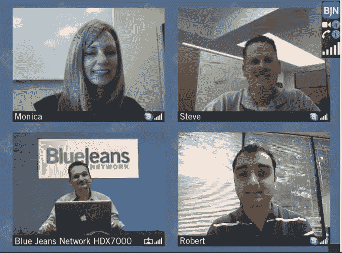

# 蓝色牛仔裤凭借视频会议平台赢得 2350 万美元，统治一切 

> 原文：<https://web.archive.org/web/https://techcrunch.com/2011/06/29/blue-jeans-nabs-23-5m-for-the-video-conferencing-platform-to-rule-them-all/>

在线视频会议平台的一个痛点是它们中的许多平台不能相互集成。例如，一个 Skype 用户需要与另一个 Skype 用户进行多方视频对话。今天，[蓝色牛仔裤网络](https://web.archive.org/web/20221208162627/http://bluejeans.com/)是[走出隐形](https://web.archive.org/web/20221208162627/http://www.businesswire.com/news/home/20110629005323/en/Blue-Jeans-Network-Launches-ware-Video-Conferencing)作为一个视频会议解决方案，以整合跨许多平台。在其公开发行的同时，蓝色牛仔裤宣布它已经从 Accel Partners，New Enterprise Associates 和 Norwest Venture Partners 筹集了 2350 万美元。

该公司的名字绝对是视频会议初创公司的原创，但该公司表示，这个名字正是客户在使用他们的产品时应该有的感觉。所以，你知道当你穿上你最喜欢的蓝色牛仔裤时那种舒适、轻松的感觉吗？该公司希望在云中发起多方电话会议时能够提供这种便利和舒适。

Blue Jeans Network 被称为“任何(软件)视频会议”，它将思科/Tandberg、Polycom、Lifesize 的会议技术与 Skype 和 Google Talk 等消费者平台连接在一起。远程工作人员、旅行者和远程办公人员只要能够使用 Skype 和支持视频的台式机或移动设备，就可以在传统的企业视频会议设备上与同事参加视频会议。

Blue Jeans Network 的每个用户在 Blue Jeans cloud 中都有一个私人“会议室”,他们可以用它来安排、主持和管理会议。与会者只需拨一个号码或点击他们系统中的一个链接就可以参加会议，无论是 Skype 还是 Tandberg。

蓝色牛仔裤的美妙之处在于无需购买新的基础设施或下载软件。所有需要的是一个互联网连接，一个现有的视频设备和人见面。

该服务自 2011 年初以来一直处于测试阶段，自 4 月中旬以来已经受到了相当大的关注。有 500 家公司正在使用这项服务，并且已经在 100 个国家的 1000 个城市举行了超过 15000 人参加的长达 50 万分钟的视频会议。

Blue Jeans Network 的客户遍布各种规模、行业和地理位置。目前的客户包括脸书、Fleming ' s Prime steak house and Wine Bar、Partners HealthCare、Heidrick and Struggles、Internet2 和宾夕法尼亚大学沃顿商学院。该公司还宣布与德国电信合作。

将 Google Talk 和 Skype 与 Polycom 等传统系统连接起来的能力是视频会议技术的重大进步。蓝色牛仔裤不仅在整合所有平台上投入了时间，还投入了资金。例如，该公司正在授权 Skype 的集成技术(但使用的是谷歌的开放 API)。

至于成本，蓝色牛仔裤向公司收取的费用类似于手机运营商按分钟向我们收取的费用。套餐从每分钟 0.10 美元到每分钟 0.25 美元不等。

