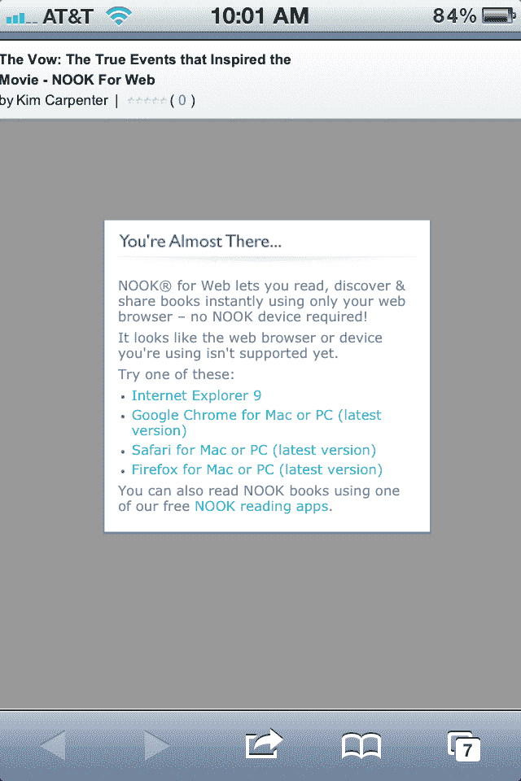

# B&N 推出网络版 Nook，但无法在 iPhone 或 iPad 上运行 

> 原文：<https://web.archive.org/web/https://techcrunch.com/2012/07/17/bn-launches-nook-for-web-doesnt-work-on-iphone-or-ipad/>

# B&N 推出网络版 Nook，但无法在 iPhone 或 iPad 上运行

Barnes & Noble 今天将把它的 Nook 阅读平台带到网络上，与 T2 Kindle 的云阅读器、iBooks 和 T4 Kobo 的即时阅读器正面竞争。这是一个重要的举措，因为人们需要一个网站来“感受”完整——也就是说，存在于读者可能想要使用的每个平台上。然而，Kindle Cloud Reader 在去年推出时并没有为了完整性而上线[——它这样做是因为苹果的条款规定，读书应用程序不能从其 iOS 应用程序中链接到自己的商店。换句话说，移动网络不仅仅是一件小事，它已经成为这些公司必须做的事情。](https://web.archive.org/web/20221206103739/https://beta.techcrunch.com/2011/08/09/kindle-cloud-reader/)

如今 Nook 的 iOS 应用程序也是如此——它与你的 Nook 账户同步，让你可以搜索和阅读你图书馆里的内容。但是买书还是要从网上完成。你可以从应用评论中看出，并不是每个人都明白推出精简版应用的决定不是 B&N 的——用户抱怨你仍然不得不去网上买书，这是多么令人失望！

因此，你可能会认为基于网络的 Nook 应用程序意味着用户现在可以放弃 iOS (iPhone/iPad)的原生体验，转而使用功能更强的 HTML 应用程序。但奇怪的是，当试图从 iPhone 或 iPad 上的移动浏览器访问该网站时，它只是告诉你需要一个桌面浏览器。

据该公司称，Nook for Web 可以在任何网络浏览器中工作，包括 IE、Firefox、Chrome 和 Safari(显然是桌面版本，所有)，并且可以在 Mac 和 PC 上工作。

为了吸引读者尝试，B&N 免费提供了六本书，包括詹姆斯·罗林斯的*白骨地图*、坎迪斯·布什奈尔的*欲望都市*、金·卡彭特的*誓言*、格特鲁德·钱德勒·华纳的*棚车儿童夏季特辑*、滕南特·雷德班克的*勇敢*和帕特丽夏·舒尔茨的完美岛屿度假。从现在到 7 月 26 日，用户可以立即阅读样本(甚至不用登录)，然后免费下载整本书。