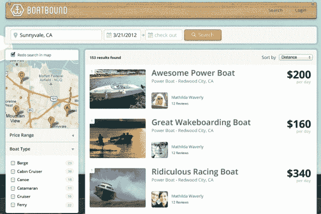
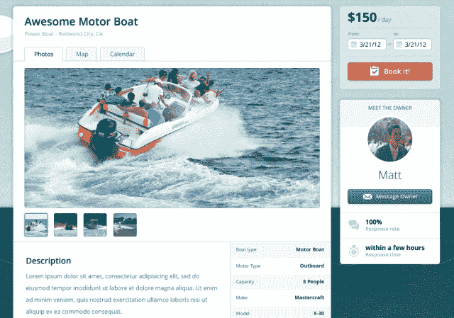
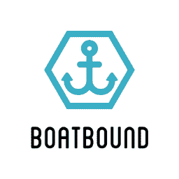

# 介绍“Boatbound ”,这是一家面向船只的 Airbnb 网站| TechCrunch

> 原文：<https://web.archive.org/web/https://techcrunch.com/2013/02/20/boatbound-aibnb-for-boats/>

一般船主一年只使用他们的船 14 天。这就是为什么[乘船](https://web.archive.org/web/20230314181740/http://www.boatbound.co/)是辉煌的。这是一家点对点的船舶租赁初创公司，通过 100 万美元的劳埃德保险计划，你可以一天一次预订从皮划艇到双体船到游艇的所有东西。创始人 Aaron Hall 在关于 Boatbound 的第一次采访中展示了他的计划，让划船对每个人来说都更容易。喂！

“买船和卖船是船主一生中最美好的两天，因为中间有各种费用。这是一笔巨大的资本成本，”霍尔告诉我。但是，如果 Boatbound 可以每月将业主与几个租户联系起来，它可以抵消这一成本，同时允许人们分享水上体验。“我们认为第三好的一天是在船上租你的船。你得到内心的平静，你的船不只是吞噬你的财务。

霍尔从小划船长大，在划船俱乐部呆了六年，他给我讲了超级英雄起源的故事[乘船](https://web.archive.org/web/20230314181740/http://www.boatbound.co/)。“这个想法是我和家人在德克萨斯州的一个湖边想租一艘船时产生的。码头说有四五艘船出租，但都被预订了，但还有数百艘船闲置着。我想‘肯定有一个针对船只的 Airbnb’，但没有。”(通常我们会远离[“Airbnb for……”这种陈词滥调](https://web.archive.org/web/20230314181740/https://techcrunch.com/2011/06/05/will-airbnb-ever-be-the-airbnb-for-x/)，但 Boatbound 却欣然接受。)

因此，霍尔和他的设计师兼联合创始人马特·约翰斯顿(Matt Johnston)决定将他们之前的创业项目“500 Startups-accelerated wedding e-commerce company Tailored”进行转型。该公司专注于婚礼的联合创始人离开了，剩下的五名定制团队成员组成了 Boatbound。在工作了近八个月并聘请 Airbnb 的第一名员工尼克·格兰迪(Nick Grandy)担任顾问后，Boatbound 现在正在考虑将哪些投资者引入一轮严重超额认购的融资。考虑到每个人都想惊呼“我在一艘船上”，这是有道理的无需购买。

### 上船吧，伙计

Boatbound 计划在今年晚些时候推出，但你可以在这里申请提前邀请。它是这样工作的。美国大约有 1300 万艘注册船只，95%的时间都没有使用。Boatbound 提供了一个市场网站，船主可以在上面列出他们的船只出租。从新手到有经验的船长，任何人都可以浏览船只并预订一天。你可以根据船只类型和位置进行搜索，根据价格和其他因素对结果进行排序，查看船只的描述，阅读船主的评论或给他们发消息，并通过日历小工具进行预订。

通常情况下，一艘 20 英尺长的船的购买价格为 10，000 至 50，000 美元，在码头的租金为 800 美元，而在 Boatbound 的价格为 200 至 400 美元。你只需花 20 到 50 美元就可以滑入 kayak，或者花 15000 到 20000 美元买一艘游艇。

Boatbound 保留了租赁价格的一定比例，这有助于支付每艘船附带的 100 万美元的劳埃德责任保险。这样双方都不必害怕刮擦甚至严重的撞车事故。如果不幸的事情发生了，你可以拨打 24 小时的索赔热线，就像汽车一样，索赔理算员会出现，船只会尽快得到修复。霍尔解释说，“这是关键，让船主感到舒适。”

为了确保你有能力驾驶船只，承租人必须通过身份检查，并概述他们的划船历史。缺乏经验的人被推到国家批准的学习指南。完成现场课程后，租户的个人资料上就会出现一个徽章，甚至可以获得消费积分。

当你遇到被霍尔称为“最后一道防线”的主人时，他们会审查你以确保你准备好了，最终由他们决定是否交出钥匙。一旦你准备好出发，船主会给你一个简短的游览，告诉你救生衣在哪里，任何窍门或其他重要信息。霍尔说，如果有必要的话，“租赁者可以选择收取额外的 50 美元或 100 美元来进行快速的船上培训，这样船主就可以准确地告诉你如何驾驶它。”

“我们的重点是尽可能保证安全，”霍尔强调说。幸运的是，常识通常会阻止人们预订超出他们能力范围的船只，就像你不会租一辆手动挡的保时捷一样，你不知道如何驾驶“carBnB”服务 [Getaround](https://web.archive.org/web/20230314181740/http://www.getaround.com/) 。“我们有一套行为准则，”霍尔告诉我，其中包括一个双向审查系统，以确保船只回来时干净、加满油且不受伤害。事故时有发生，但是“如果我们发现一个租房者在那里恐吓水，我们没有问题暂停他们。”

### “现在这是有钱白人的运动”

霍尔希望向一个全新的船工阶层开放这片水域。“人们要么认为它太贵，要么不知道如何划船，但我们希望降低门槛，让它成为周末必做的事情之一。现在这是有钱白人的运动。我们希望通过挖掘更年轻、更多样化的人群，让划船运动成为一种非精英运动。”

Boatbound 试图打造一种“Ahoy 文化”,部分是从 Lyft 的粉红色胡子和拳头肿块中获得启示。“当你租的时候，每个人都会得到有船形标志的帽子。而是说‘嗨！’一边挥手，一边讲述着这条船的故事以及它是如何命名的。"

霍尔认为，通过让它变得有趣和容易获得，人们会一次又一次地回来租房。如果船主能建立关系，让两三个人每月稳定地租一次船，他们就能完全抵消成本。

包括 Fun2Rent 和 Incrediblue 在内的一些公司已经涉足该领域，自从 Boatbound 上个月加入 AngelList 以来，Hall 表示克隆产品已经出现。然而，让 Boatbound 与众不同的是霍尔所说的“劳氏的第一款产品”。他暗示，其他地方列出的船只不会受到良好的保护。

一般来说，如果船主拿钱去租的话，他的保险是无效的。"我们必须制定一个计划，充当船只的主要保险人."霍尔提到，Airbnb 的崛起和一些有影响力的个人(可能是一些投资者)的推动，让劳埃德同意了这个计划。虽然不同的船只和租赁者会或多或少的花费来投保，但至少一开始 Boatbound 只是吸收了费用。

说服船工将他们的“婴儿”放在陌生人手中可能是一件很难的事情。有些人只是认为不值得花钱去担心他们的船，这可能会导致供应方面的短缺。Boatbound 将不得不尽一切可能避免一场 [Airbnb 式的灾难](https://web.archive.org/web/20230314181740/https://techcrunch.com/2011/07/27/the-moment-of-truth-for-airbnb-as-users-home-is-utterly-trashed/)，沉船和受伤的乘客。

美国每年有 7500 万划船者。我觉得还会有更多。自从我与霍尔交谈后，每当我向人们提到公司时，他们的眼睛都会发亮。他们要么想投资，要么马上起航。

租一辆车或一个睡觉的地方是标准。租一架私人飞机太贵了。但是船上通过合作消费给普通人带来令人眩晕的颓废。如此有趣的东西不应该成为富人的身份象征。你值得在水上呆上一天，周围都是朋友，浪花溅到你脸上，Boatbound 会给你的。

*Boatbound 计划在今年晚些时候推出，但你现在可以[请求提前邀请](https://web.archive.org/web/20230314181740/http://www.boatbound.co/)。*