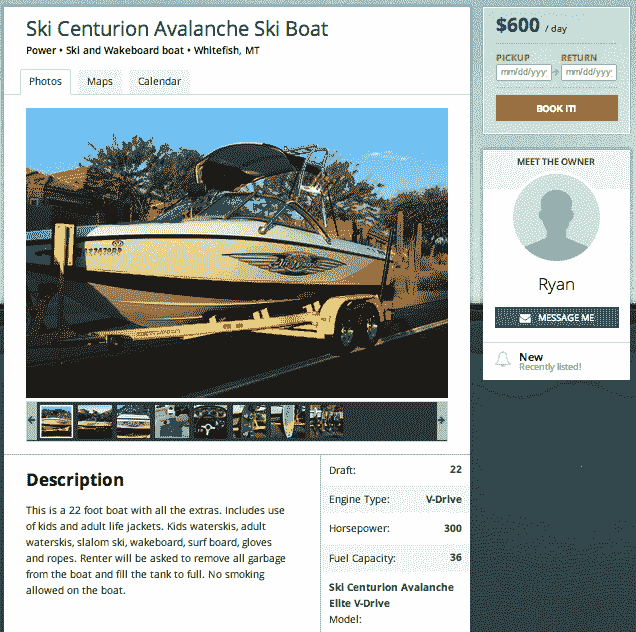

# 乘船出发的“码头到码头”船舶租赁市场

> 原文：<https://web.archive.org/web/https://techcrunch.com/2013/06/13/boatbound-boat-rentals/>

今天 [Boatbound](https://web.archive.org/web/20230314181744/http://boatbound.co/) ，即 [Airbnb for boats](https://web.archive.org/web/20230314181744/https://techcrunch.com/2013/02/20/boatbound-aibnb-for-boats/) 推出服务，帮助船主抵消拥有成本，让更多人体验水上的乐趣。由 Benjamin Ling 和 500 Startups 牵头的超过 100 万美元的资金，Boatbound 的上市网站允许预先筛选的船长在全国各地租赁完全保险的船只，从基本的摩托艇到帆船再到游艇。

早在二月份，联合创始人艾伦·霍尔给了我们第一次关于《船游 T5》的采访，因为它已经进入了私人测试阶段。他解释了为什么大多数船只一年中有 95%的时间闲置不用，这使得拥有船只的成本相对于其提供的价值来说高得令人难以置信。这就是为什么对于共享经济来说，船比家更有潜力。一个月只需几笔租金，大多数船只就能收回成本，不会给船主带来什么不便。

挑战在于让那些船主相信他们的船不会受损，如果受损，他们会得到全额赔偿。因此，自从我们上次谈话以来，霍尔和他的设计/ UX 大师联合创始人马特·约翰斯顿一直在花时间敲定细节，以便他们可以将 Boatbound 称为“第一个完全保险的船只租赁市场”

他们也一直在为 Boatbound 的 100 多万美元的早期融资进行游说。霍尔和约翰斯顿之前共同创立了婚礼电子商务初创公司 Tailored，这是 500 家初创公司的一部分，并带领他们回到加速器，让 Boatbound 离开码头。除了 500 和凌，完整的投资者名单还包括基马风险投资公司、Expansion Venture Capital、Atlas Venture Partners、戴夫·麦克卢尔(Dave McClure)、大卫·拜尔(David Beyer)、法布里斯·格林达(Fabrice Grinda)、谢苗·杜卡奇(Semyon Dukach)、哈龙·莫克塔尔扎达(Haroon Mokhtarzada)、迈克·沃什(Mike Walsh)、吉姆·帕特森(Jim Patterson)、蒂姆·森托斯(Tim Csontos)、周定、李凯文、阿波 stolakis 和乔尔“J”穆勒。

现在 Boatbound 已经准备好开展业务，并在全国范围内列出了各种船只，重点是旧金山、迈阿密海滩和南太浩湖等顶级划船目的地。船主们建立了列表，上面有他们的船的照片、对设施的描述、引擎和容量的细节、位置、要价和可用性。今天，它将列出大约 50 艘船，但有近 1000 艘已经预先批准，一旦可扩展性得到确保，将在下周添加到网站上。

根据船的大小，现行价格从每天几百美元到几千美元不等。这些费用用于支付价值高达 200 万美元的船只综合保险计划，外加 100 万美元的额外责任保险。这意味着任何大小的船只都可以投保，从刮擦和撞击到沉船和破损的码头。为了确保这种情况不会发生，承租人必须是有执照的海员，Boatbound 可以帮助那些还没有获得证书的人获得证书，这要感谢它与 [BoaterExam](https://web.archive.org/web/20230314181744/http://www.boaterexam.com/) 的合作。

这种认证通常要花费 30 美元，但现在它是免费的，而且带有浓厚的船务品牌色彩。霍尔表示，该网站将在未来六个月内帮助 15 万人获得许可，这将为他的网站带来大量流量。然后，租赁者可以浏览列表，找到他们喜欢的船，选择日期并付款。Boatbound 抽取一定比例的提成，其余的归船主。

霍尔告诉我，他很高兴看到他的网站成为与几个朋友远离陆地的乐趣的门户。他总结道，“如果你认识有船的人，让他们知道他们可以把自己的船放在 [Boatbound](https://web.archive.org/web/20230314181744/http://boatbound.co/) 上赚钱。”