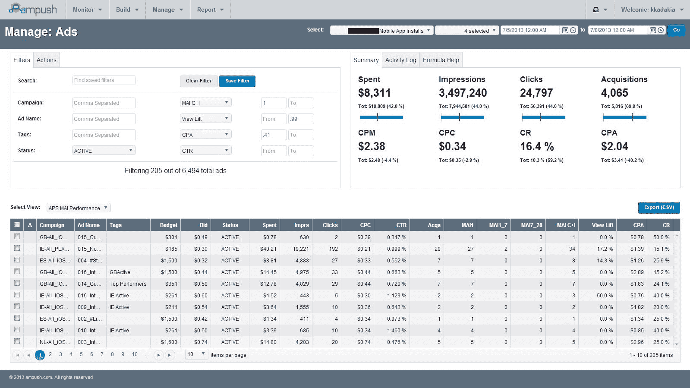

# 创业公司 Ampush 加入脸书营销开发精英行列 

> 原文：<https://web.archive.org/web/https://techcrunch.com/2013/07/10/bootstrapped-startup-ampush-media-joins-facebooks-elite-ranks-of-marketing-developers/>

# 创业公司 Ampush 加入脸书营销开发精英行列

今天，自举社交媒体营销平台 Ampush 被任命为脸书[战略首选营销开发商](https://web.archive.org/web/20221206111531/http://www.facebook-pmdcenter.com/strategic) (sPMD)。

脸书表示，成为 sPMD 是“卓越的最高荣誉”，如果公司“在我们的营销开发者生态系统中产生突出的积极影响”，就会被选中

Ampush 成立于 2009 年，以万事达卡、LivingSocial 和 Kellogg's 等客户为卖点，目前尚未筹集到任何外部资金。Ampush 首席执行官兼联合创始人 [Jesse Pujji](https://web.archive.org/web/20221206111531/http://www.linkedin.com/in/jspujji) 表示，该公司“根本不反对资本”，但自 2011 年以来每年都在盈利，还不需要筹集资金。

“我们认为这样更好，”Pujji 告诉我。

sPMD 公司每六个月评估一次，但 Ampush 是不定期加入的。Ampush 将成为第 14 个 sPMD，加入 Adobe 和 Salesforce 等主要公司。

Pujji 说，该公司一直在与新的脸书产品一起成长和创新。Ampush [在三月份的脸书最佳营销开发者创新大赛中凭借其“瑜伽项目”或者你的开放图表应用赢得了大奖](https://web.archive.org/web/20221206111531/http://www.insidefacebook.com/2013/03/19/facebook-announces-winners-of-pmd-innovation-competition-ampush-leads/)。Ampush 的广告集成有助于广告商放大开放的图表故事，并通过新闻提要接触新客户。

*Ampush 的广告经理平台。*

普吉和联合创始人尼克·沙阿和克里斯·阿莫斯 17 岁时在一个大学预科暑期项目中相遇，并在宾夕法尼亚大学一年级时同住一室。虽然他们都对创业感兴趣，但毕业后他们在咨询和银行业工作了四年。

“我不认为当时我们有信心真正开始创业，”Pujji 告诉我。然而，几年后，他们意识到他们的心不在银行业和咨询业，所以三人组决定“撕掉创可贴，离开我们的工作。”

此后，该公司迅速扩张，成为脸书营销开发商中的佼佼者。凭借 sPMD 称号，Ampush 将获得优先的产品和业务支持，并获得 alpha 和 beta 试用版，以及其他额外待遇。

Pujji 表示，制作独家名单有助于公司赢得客户，因为这是与一些最大的广告商会面的先决条件，并且对较小的广告商来说，这是一种宣传和积极的信号。

【YouTube = http://www . YouTube . com/watch？v=tJS1sHhj0u0&w=853&h=480]