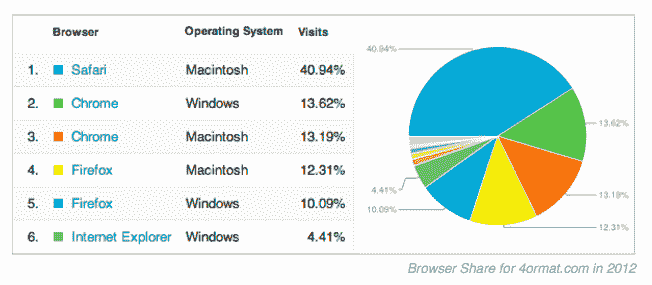

# 通过放弃 IE TechCrunch，Bootstrapped Startup 节省了超过 10 万美元

> 原文：<https://web.archive.org/web/https://techcrunch.com/2012/04/01/bootstrapped-startup-saves-over-100k-by-dropping-ie/>

# Bootstrapped Startup 通过放弃 IE 节省了超过 10 万美元

**编者按:** *这是在线投资组合初创公司 [4ormat](https://web.archive.org/web/20221209071716/http://4ormat.com/) 的联合创始人[泰勒·鲁尼](https://web.archive.org/web/20221209071716/https://twitter.com/#!/tylerrooney)的客座博文。*

创业后很快决定对 70%的潜在客户说“不”的情况并不常见。现在回想起来，这竟然是 4ormat 的秘密武器。

在 4ormat，我们的目标是为有创造力的专业人士提供一个创建和管理在线作品集网站的简单方法。尽管文件夹本身在所有浏览器中都看起来很棒，但直到今天，文件夹构建界面还不支持 Internet Explorer。而且我们不仅仅是指 IE6 甚至 IE7。我们指的是每一个版本的 Internet Explorer。

这可能看起来很激烈，但请考虑一下:当我们在 2008 年开始使用 4ormat 时，IE 拥有近 70%的市场份额，而 IE6 仍被四分之一的台式机使用。例如，Chrome 仅仅发布了两个月。称之为激烈是一种轻描淡写。

我们一边全职咨询，一边在业余时间启动 4ormat。我们花在开发上的每一个小时都是在我们把产品展示给客户之前的另一个小时。我们从一开始就不支持 IE6，但拒绝 45%的人使用 IE7(和新发布的 IE8)似乎会削弱业务。4ormat 的目标是尽可能简单地构建和更新投资组合。为了做到这一点，我们希望利用每一个可能的现代浏览器技术。

不到一周，我们就痛苦地发现，对于我们想出的每一个好主意，我们都必须创造出同样糟糕的黑客来支持 IE7 甚至 IE8。IE 的支持变体可以很容易地[将设计工作增加 30%到 100%](https://web.archive.org/web/20221209071716/http://www.smashingmagazine.com/2011/11/03/%E2%80%9Cbut-the-client-wants-ie-6-support%E2%80%9D/) ，但是复杂的功能可以很容易地将开发时间增加一倍(甚至三倍)。在这种“IE 税”花费你超过 10 万美元之前，不需要花费很多开发人员的工资。但是，作为一家初创企业，你损失的金钱与损失的时间和精力相比就相形见绌了。

在早期，你寻找快速的胜利来验证你的想法，并开始建立势头。没有什么比发现你辛辛苦苦建立起来的功能在 IE 中完全崩溃更令人沮丧的了。没有什么比花几天时间在虚拟机上痛苦地用 Internet Explorer 糟糕的开发工具调试问题更能颠覆开发人员的速度了。我们决定，为了推出一个可行的产品，我们不会支持 IE。这可能是有史以来最好的决定。

变化很简单。我们的[注册表单](https://web.archive.org/web/20221209071716/https://4ormat.com/signup)现在告诉 IE 用户他们可以在哪里下载 Chrome、Safari 或 Firefox。迄今为止，在推出 4ormat 近三年后，还没有一个人联系我们请求对 Internet Explorer 的支持。

【T2

我们意识到，在许多企业中，支持 IE 是一项硬性要求，但如果你是一家初创企业，IE 支持对你的客户来说并不重要，那么放弃它有一些主要的竞争优势:

*   巨大的生产力收益。团队中的每个人都可以专注于真正重要的事情。开发商可以开发，设计师可以设计。在早期，你没有专门的客户支持人员；对远程用户进行故障排除非常耗时。
*   较短的发布周期。支持工业工程是开发和设计的重要部分。删除它，新功能的周转时间就会减少。这对希望验证自己想法的新公司来说意义重大。
*   更易管理的错误。没有什么比包含“仅在 IE 中”的错误报告更有可能毁掉你的一天。IE bugs 往往有一个不可量化的未知因素。修复可能需要 5 分钟，也可能需要 5 天，这使得 sprint 计划更加困难。
*   更快乐、更满意的员工。人们只是更喜欢他们的工作，并且知道他们在一天结束时完成了一些真实的事情。如果您没有遗留的 web 开发问题，并且可以一直使用最新最棒的 JavaScript 库和 CSS 特性，您会有什么感觉？
*   招聘秘密武器。当我们向求职者保证“你没听错，我们真的不支持 IE”时，看到他们脸上难以置信的喜悦表情，我们的内心感到温暖。如果这听起来很有趣，看看我们的空缺职位。

**所以，要点:**不要害怕代表客户做出决定，以简化您的生活，让产品更快上市。测试你的假设很重要，尤其是在你创业的早期。在我们的例子中，我们假设没有一个头脑正常的人会想用 IE 建立一个网站。正因为如此，我们为自己省下了数不清的麻烦、大量的金钱和时间。更重要的是，我们更快乐，更了解我们的目标客户，并花更多的时间关注真正的客户问题。