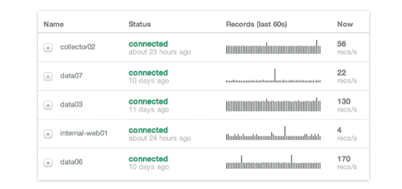

# Boundary 筹集了 400 万美元；实时监控私有云和公共云 

> 原文：<https://web.archive.org/web/http://techcrunch.com/2011/11/15/boundary-raises-4m-monitors-private-and-public-clouds-in-realtime/>

# Boundary 筹集了 400 万美元；实时监控私有云和公共云

TechCrunch 获悉，开发实时网络监控解决方案的旧金山初创公司 [Boundary](https://web.archive.org/web/20230203121147/https://boundary.com/) 已经从光速风险投资伙伴那里获得了 400 万美元的首轮融资。Boundary 的监控即服务[产品](https://web.archive.org/web/20230203121147/https://boundary.com/product/)旨在帮助开发人员实时监控网络和应用流量，包括 EC2 等公共云环境和私有云数据中心。

Boundary 声称，其基于 SaaS 的网络监控服务可以在几分钟内启动并运行，不需要任何硬件探测，每秒钟能够处理数百万个指标。

[边界平台](https://web.archive.org/web/20230203121147/https://boundary.com/about/#platform)虽然是一个完全访问 API，但将允许 IT 专业人员访问流数据和分析，以便与 Jenkins、Chef、Puppet 和其他现有流程集成。

该公司由首席执行官本杰明·布莱克(Benjamin Black)共同创立，他之前负责亚马逊网站和亚马逊 EC2 的网络、安全和工程的设计和实施工作。

Boundary 的另一位联合创始人 Cliff Moon 之前在 Powerset 工作，负责设计、实现和运营最终成为 Bing 搜索引擎的基础(微软[早在 2008 年就收购了 Powerset](https://web.archive.org/web/20230203121147/https://techcrunch.com/2008/07/01/ok-now-its-done-microsoft-to-acquire-powerset/) )。

