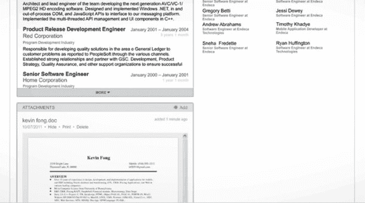

# Box 收购 Crocodoc，为云存储平台 TechCrunch 添加 HTML5 文档转换器和流畅的内容查看体验

> 原文：<https://web.archive.org/web/https://techcrunch.com/2013/05/09/box-acquires-crocodoc-to-add-html5-document-converter-and-sleek-content-experience-to-cloud-storage-platform/>

云存储公司 Box 已经收购了 HTML5 文档嵌入服务和 Y Combinator alum [Crocodoc](https://web.archive.org/web/20221208063842/http://www.crocodoc.com/) ，两家公司在今天的新闻发布会上宣布。这笔现金和股票交易的财务条款没有披露；然而，Box 首席执行官兼联合创始人亚伦·列维(Aaron Levie)表示，对投资者来说，这是一次成功的退出。Crocodoc 已经从 Y Combinator、SV Angel、Paul Buchheit、Joshua Schachter、Dave McClure、陈士骏和 XG Ventures 获得了 100 多万美元的资金。

**什么是鳄鱼？**

Crocodoc 由四名麻省理工学院的工程师于 2007 年创建，但最终在 2010 年转向扼杀 Acrobat。这家初创公司最初基于 Flash 的技术允许你上传 PDF，并在浏览器中接收同一文档的一个版本，然后你可以与同事分享，并用笔记、高亮显示、文本和钢笔工具进行注释，并将更改实时显示给其他用户。2011 年，Crocodoc [在 HTML5 中推出了](https://web.archive.org/web/20221208063842/https://beta.techcrunch.com/2011/02/16/crocodoc-launches-html5-based-document-viewer-with-annotations-embeds-and-its-own-api/)这项技术，用于移动嵌入。

去年，Crocodoc [推出了](https://web.archive.org/web/20221208063842/https://beta.techcrunch.com/2012/05/01/crocodoc-debuts-html5-document-embedding-technology-partners-with-dropbox-yammer-sap/)新版本的 HTML5 嵌入技术，专门针对消费者和商业网络和移动应用的规模和需求而设计。使用 Crocodoc，pdf、PowerPoint 或 Word 文档可以通过简单的 iFrame 或 JavaScript 库嵌入到任何 web 或移动应用程序中(不需要插件、下载或桌面软件)。该技术具有快速、清晰的渲染和高级安全性，包括 256 位文档加密、本地存储选项和多种部署选项，包括 SaaS 和私有云。

包括 Dropbox、LinkedIn、Yammer、脸书和 SAP 在内的 100 多家公司许可了这家初创公司的文件嵌入技术(并为此付费)，Levie 表示，该公司已经能够建立一个“强大的商业模式”

例如，Dropbox 已经使用 Crocodoc 的 HTML5 文档查看解决方案，允许他们的用户在他们的网络浏览器和移动设备上查看文档，而不必下载大文件或使用桌面软件(你可以在这里看到一个例子[)。通过 LinkedIn 的 Recruiter 产品，Crocodoc 使招聘人员能够上传 Word 和 PDF 格式的候选人简历，而不必下载文件并使用桌面软件打开它们。](https://web.archive.org/web/20221208063842/https://www.dropbox.com/s/l7k3gzaltdcrhbw/PWC%20Technology%20Forecast.pdf)

客户还可以定制 Crocodoc 查看器的外观和行为，并访问内置的评论、注释、突出显示和绘图工具。Crocodoc 现在有 7 名员工，它说它已经提供了 1.89 亿个文档预览和 1400 万个文档注释。

同样值得注意的是——今年早些时候，Crocodoc [发布了](https://web.archive.org/web/20221208063842/https://beta.techcrunch.com/2013/02/14/crocodoc-pdf-word-and-powerpoint-documents-html5-converter/)一个新版本的转换器，它同时使用 HTML5 和可缩放矢量图形(SVG)。在最新版本的播放器中，使用 HTML web 字体将文本覆盖在图像之上。新版本将文档中的所有内容显示为 HTML5 和 SVG，使转换后的文档线条和形状更加清晰。文档加载速度也明显加快，因为浏览器不必加载大图像来显示。

**为什么是鳄鱼？**

正如 Levie 今天解释的那样，Box 收购 Crocodoc 是因为该公司希望重新想象文档在云中的样子。“我们专注于建立最简单的方法，让企业在任何地方存储和管理文档，并在寻找改变用户与内容交互方式的方法，”他说。

我们被告知，Crocodoc 将继续运营并许可给现有和新用户，但 Box 将把 Crocodoc 的技术集成到自己的云存储平台中，以允许客户无缝使用嵌入器和查看器。Box 和 Crocodoc 首席执行官 Ryan Damico 还想对 Box 家族的产品做更多的事情。达米科将成为 Box 的平台总监，负责公司的内容服务，整个 Crocodoc 团队都将加入 Box。

 下一个产品是什么？Damico 解释说，更多安全的文档查看、移动协作、实时演示、表单归档和文档创作都将在来年添加。Levie 说，今年晚些时候还将推出一个新版本，有类似于翻书技术的新浏览器，以及文件的旋转体验。他补充说，围绕盒子平台还将有新的品牌。

Box 的工程副总裁 Sam Schillace 也是 Google Docs 的创始人之一，他解释说 Crocodoc 的技术看起来或感觉起来都不像企业软件。“它看起来非常漂亮和精致，这是所有人在查看文档时都必须努力达到的标准，”他说。

Box 拥有 1500 万用户，在零售、医疗保健、金融服务等领域拥有 15 万家企业，它正在快速发展，因为它预计明年将在进行[潜在的公开募股。进一步增长的一部分将围绕着为用户体验增加引人注目的体验。Levie 说，仅在 Q1 就发生了 20 亿次内容事件，因此思考改善内容体验的新方法是有意义的。考虑到它的技术被 Box 的主要竞争对手之一 Dropbox 使用，Crocodoc 是一个有趣的举动。](https://web.archive.org/web/20221208063842/https://beta.techcrunch.com/2013/02/25/eyeing-an-ipo-box-doubles-down-on-device-content-and-login-security-for-cloud-storage-platform/)

众所周知，Dropbox 在内容方面有自己的野心，正如今年早些时候 AllThingsD 所解释的那样。

但 Box 相信，它们和 Crocodoc 的技术一起，可以成为改善你在互联网上使用文档的每一种体验的领导者。与 YouTube 重塑在线视频体验、脸书和 Flickr 重塑照片体验的方式类似，Box 希望让嵌入文档不那么笨重。

你可以看看下面 Crocodoc 的经历: