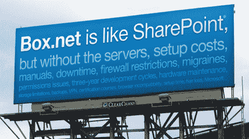

# Box.net 筹集 1500 万美元在云中挑战微软 SharePoint 

> 原文：<https://web.archive.org/web/https://techcrunch.com/2010/04/07/box-net-raises-15-million-to-take-on-microsoft-sharepoint-in-the-cloud/>

# Box.net 筹集了 1500 万美元在云中挑战微软 SharePoint

云存储和文档共享初创公司[Box.net](https://web.archive.org/web/20230328234400/http://www.box.net/)今天宣布重大消息:这家初创公司刚刚获得由 [Scale Venture Partners、](https://web.archive.org/web/20230328234400/http://www.crunchbase.com/financial-organization/scale-venture-partners)领投的 1500 万美元 C 轮融资，现有投资者 [Draper Fisher Jurvetson](https://web.archive.org/web/20230328234400/http://www.crunchbase.com/financial-organization/draper-fisher-jurvetson) 和[美国风险投资伙伴](https://web.archive.org/web/20230328234400/http://www.crunchbase.com/financial-organization/u-s-venture-partners-2)参与其中。这使得 Box.net 的风险投资总额达到 2950 万美元。作为交易的一部分，Scale Venture Partners 的董事总经理 Rory O'Driscoll 加入了 Box.net 的董事会。这家初创公司的首席执行官兼联合创始人 Aaron Levie 没有透露这轮融资的估值，但表示这笔资金将用于进一步建设该平台，并用于招聘公司销售和工程部门的员工。

自 2005 年推出以来，Box.net 一直在稳步发展其基于云的内容管理系统，目前已积累了超过 400 万用户，有数十万企业在使用该应用程序。这家初创公司的收入正在增长，从 2008 年到 2009 年，收入增长了 500%，第一季度创下纪录——比 2009 年的 Q1 增长了 300%——这要归功于与奥普拉·温弗瑞电视网(Oprah Winfrey Network)的交易，沃尔沃和诺基亚·西门子都在使用 Box.net(Box 拒绝透露确切的收入数字)。

Box.net 已经非常清楚地表明了谁是它的主要竞争对手:微软的内容管理应用 SharePoint。如果你开过美国 101 公路，你可能会看到去年夏天 Box.net 在三藩市和硅谷之间的路段上醒目展示的[广告牌广告](https://web.archive.org/web/20230328234400/http://blog.box.net/2009/06/29/calling-all-frustrated-sharepoint-users-this-ones-for-you/)。该广告要求 SharePoint 用户尝试 Box.net，并承诺如果他们不喜欢 Box，这家初创公司将支付 SharePoint 三个月的费用。[二月，](https://web.archive.org/web/20230328234400/http://blog.box.net/2010/02/04/new-billboard-boxnet-is-not-like-sharepoint/)这家初创公司贴出了如下所示的广告牌:

你明白了。那么 Box 正在蚕食 Sharepoint 的市场份额吗？李维似乎是这么认为的。他告诉我，这个盒子正在利用“企业消费化”的趋势。Levie 表示，Box 的[社交、](https://web.archive.org/web/20230328234400/https://techcrunch.com/2009/02/05/boxnet-hones-in-on-businesses-with-new-social-features/)协作特性以及 Box.net 管理平台的互联性使得企业用户可以在办公室之外，跨各种应用和设备简单地使用该应用。

Box 可以通过多种方式为用户实现这种高度集成。Box.net 与最近推出的 [Google Apps Marketplace、](https://web.archive.org/web/20230328234400/https://techcrunch.com/2010/03/09/google-apps-marketplace/)与[Salesforce.com、](https://web.archive.org/web/20230328234400/https://techcrunch.com/2009/10/22/box-net-launches-integration-with-salesforce/)与 [LinkedIn、](https://web.archive.org/web/20230328234400/https://techcrunch.com/2009/11/23/five-ways-startups-are-tapping-into-linkedins-api/)以及其他商业应用进行了整合。Box 还推出了与 QuickOffice 集成的新版 iPhone 应用程序，并在几天前将其内容管理平台带到了 iPad 上，这似乎是一款针对该设备的[创新型 Box 应用程序](https://web.archive.org/web/20230328234400/http://news.cnet.com/8301-27076_3-20001533-248.html)。而且 Box 的移动战略不会是苹果独占的；这家初创公司目前正在开发一款安卓应用。

此外，Box 正在努力提高其平台的协作能力。去年秋天，Box [收购了制造背板和嵌入式产品的 incredo Solutions](https://web.archive.org/web/20230328234400/https://techcrunch.com/2009/10/06/box-net-acquires-increo-solutions-to-expand-document-collaboration-and-sharing/)，以整合背板上的协同和标注功能。公司还在今年早些时候推出了[集成 Flash 文件查看器](https://web.archive.org/web/20230328234400/https://techcrunch.com/2010/01/21/box-file-viewer/)，用户可以通过浏览器立即查看 20 多种文件类型，包括最常见的文档格式、图像(包括 Photoshop)、音频和视频。