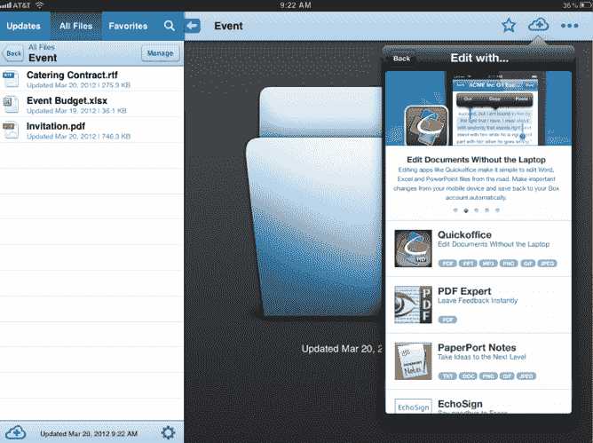
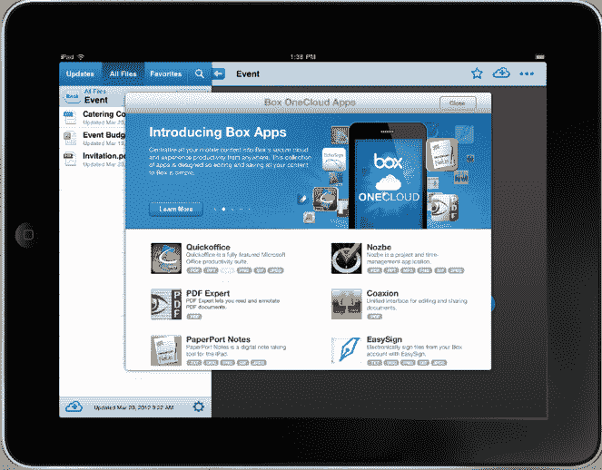

# Box OneCloud 将 30 多个企业应用程序引入新的移动、基于云的存储平台 

> 原文：<https://web.archive.org/web/https://techcrunch.com/2012/03/28/box-onecloud-brings-30-plus-enterprise-applications-to-new-mobile-cloud-based-storage-platform/>

云存储平台 [Box](https://web.archive.org/web/20221206043217/http://www.box.com/) 长期以来一直提供基于网络的应用程序目录，其中包括 Salesforce 等服务的应用程序，以及其他增强存储平台功能的应用程序。去年，该公司推出了一个基于 Box 平台的开发者平台，名为 [Box 创新网络(/bin)](https://web.archive.org/web/20221206043217/https://beta.techcrunch.com/2011/11/17/cloud-storage-platform-box-debuts-developer-platform-bin-2m-fund-to-invest-in-the-enterprise/) 。如今，随着 Box OneCloud 的推出，Box 正在将开发及其应用程序目录移动化。Box one cloud 是一种面向企业的移动云，提供一套 30 多种生产力应用程序，允许企业访问、编辑和共享移动设备上的内容。

Box 现在拥有超过 1000 万用户，每月通过 Box 访问超过 2 亿个文件，是一个面向企业的云存储平台，具有协作、社交和移动功能。Box 已经发展成为不仅仅是一个文件存储平台，而且已经成为一个成熟的多平台协作应用程序，企业可以在其中实际交流文档更新，远程同步文件，甚至添加来自 Salesforce，Google Apps，NetSuite，Yammer 和其他应用程序的功能。该公司表示，80%的财富 500 强企业都在使用 Box。

正如联合创始人兼首席执行官 Aaron Levie 向我们解释的那样，Box OneCloud 是多年工作的结晶。“我们认为我们正处于后 PC 时代，并看到这如何适应 Box，”他解释道。对于后 PC 时代，他指的是企业向移动平台的转移。

Box OneCloud 代表了该公司对企业及其员工如何在其移动设备(包括智能手机和平板电脑)上访问、编辑和交互文档的愿景。基本上，Box OneCloud 是一组新的 API 和一个全新的移动目录，将在 Box 界面中向用户介绍由 Box 支持的应用程序。“这就是企业在后 PC 时代使用应用程序的方式，”Levie 强调说。

如今，该公司推出了 30 款 Box OneCloud 应用，帮助用户从他们的移动设备上发现、创建和分享内容。将推出应用程序的合作伙伴包括 Podio、Quickoffice、Adobe EchoSign、Nuance PaperPort Notes 和 PDF Expert。通过新的 API，每个应用程序的内容更新都可以立即存储并安全保存在机器上。合作伙伴提供各种服务来补充 Box 的存储产品，包括高级文档编辑、安全电子签名、数字笔记和 PDF 注释。

所有 OneCloud 集成都可以通过新的 Box 移动应用程序库访问，使用户能够轻松浏览 Box OneCloud 应用程序目录并将其下载到他们的 iOS 设备。

它是这样工作的:你通过 iPad、iPhone、Android、Android 平板电脑或其他设备打开 Box 应用程序，点击一个特定的文档，然后根据你安装的与 Box 兼容的应用程序给出一组可用性选项。例如，您可以下载 EchoSign 应用程序，并对通过 Box 存储的合同使用数字签名技术。

Box OneCloud 平台还将包括一系列新的开发者工具，使构建与 Box 的移动应用集成变得前所未有的简单。该公司表示，新的 Box 应用程序到应用程序集成框架通过直接集成到 Box 移动平台的文件管理功能，大大减少了用 Box 开发应用程序的时间，从几周到几天。此外，开发者可以无缝访问存储在 Box 中的内容，包括离线访问。

该公司表示，Box OneCloud 今天可用于 iOS，并将很快扩展到 Android。

Levie 表示，OneCloud 的下一次迭代将会看到新类型的应用出现并构建在该平台之上，类似于许多 web 应用在 Box 平台之外构建的方式。截至 11 月，Box 拥有 4，500 个 API 合作伙伴，每月有 2 亿次 API 调用。

有了 8100 万美元的新资金，Box 希望在云存储和移动领域有所突破(同时击败微软)。对该公司来说，移动业务是一个巨大的增长领域(T4)。具体来说，Box 表示，Android 的独立移动用户总数增长了八倍(T5 ),增速最快。77%的 Box 用户从六个不同的位置并通过至少三台不同的设备访问他们的内容。

正如 Levie 告诉我们的，“我们希望 Box 成为所有业务工作流程的中心和移动业务操作系统的首选。”在与 Levie 交谈时，很明显他相信移动是未来，并在与跨平台可访问性相关的产品上投入巨资。

“[YouTube http://www.youtube.com/watch?v=WesB742Bbc4]"