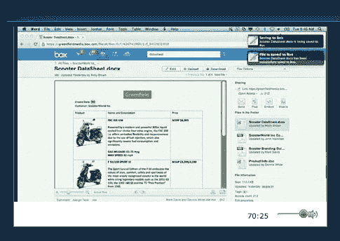

# 框添加“喜欢”功能，创造了一个脸书和谷歌文档 的混合体

> 原文：<https://web.archive.org/web/https://techcrunch.com/2012/10/09/box-to-add-like-feature-creates-a-hybrid-of-facebook-and-google-docs/>

# 框添加“喜欢”功能，创造了一个脸书和谷歌文档的混合体

今天在 Boxworks 的舞台上， [Box](https://web.archive.org/web/20230323233837/http://box.com/) 的首席执行官 Aaron Levie 和他的团队公布了一项服务，这项服务将允许人们在 Box 环境中“喜欢”和编辑文档。

这是 Box 的明智之举，这家公司以文件存储而非社交功能闻名。但是有道理。Box 最近聘请 Writely 创始人萨姆·席勒斯(Sam Schillace)担任公司的工程副总裁。Schillace 最为人所知的是创立了 Writely，然后将其出售给了谷歌，他的工作成为了谷歌文档的基础。Schillace 的才能现在在新产品中得到了展示。

服务是如何工作的？想想 Google Docs:它将集成新的功能，无需在 Box UI 中下载即可创建文档和电子表格。用户还可以编辑存储在 Box 中的任何文件，而无需离开 Box 环境。新的社交功能，如“喜欢”，很快就会添加一个文档。你可以在这里阅读更多关于新用户界面[的信息](https://web.archive.org/web/20230323233837/http://blog.box.com/2012/10/announcing-the-bigger-better-all-new-box-experience/)。这是他们今天在活动中展示的一张快照:

这步棋对 Box 来说绝对是一个转变。它使其更接近于成为一种服务，超越我们从 Salesforce.com 的 ChatterBox 看到的功能，即共享和编辑所有内联文档的能力，同时保持其专注于提供最佳功能。推特上的一个人说，这就像脸书和谷歌文档合二为一。

这项服务是在舞台上宣布的，内嵌了的[框，去掉了处理文档时的额外步骤。它具有拖放、直接启动和无需额外步骤保存等功能。罗恩·米勒在推特上说，这项服务“..允许您在该应用程序内的另一个应用程序中嵌入全框功能。这非常重要，因为它是作品的一部分。”](https://web.archive.org/web/20230323233837/https://techcrunch.com/2012/10/09/box-debuts-html5-embeddable-framework-to-integrate-content-with-third-party-enterprise-software-apps/)

新功能显示了 Box 如何寻求成为工作场所事实上的文件内容管理服务，与任何平台上的任何应用程序集成。