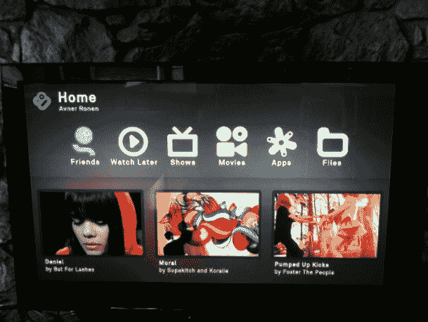
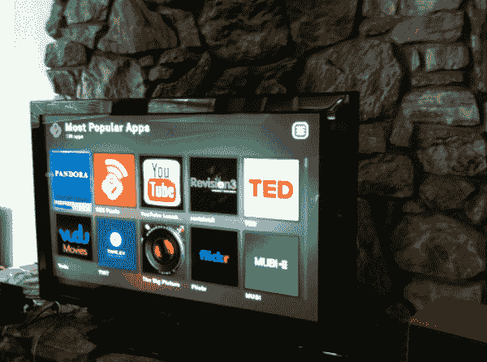

# Boxee 盒子演示(TCTV)

> 原文：<https://web.archive.org/web/http://techcrunch.com/2010/11/10/boxee-box-demo-video/>

明天，第一批售价 199 美元的 Boxee Box 将会送到预订者手中。我今天在 [Boxee](https://web.archive.org/web/20230202213251/http://www.boxee.tv/) 总部从首席执行官 Avner Ronen 那里得到了一个预览演示。上面的视频展示了它在大屏幕电视上的样子。

Boxee Box 是一个小型机顶盒设备，可以将您的电视连接到互联网并显示网络视频。它类似于你可以下载到电脑上的 Boxee 服务，只是有一个专为电视设计的新用户界面。在 Boxee 上浏览视频有很多种方式——按频道、流派或你的朋友在看什么。你可以搜索节目，它会在网上的任何地方获取它们(如果可用并且没有被屏蔽，这是一个很大的假设)。它支持 1080p 的高清视频，并播放 HTML5 网站的所有视频。

您可以将节目保存在播放列表中，以便以后观看，并在找到节目后“订阅”它们，以便它们不断添加到队列中。Boxee Box 不仅为您提供 YouTube，还提供来自网络电视网站、Comedy Central、索尼的 Crackle、Engadget、历史频道、Revision 3、TED 等网站的视频。你也可以知道你的朋友在看什么。Boxee 将向您展示您的朋友在 Twitter、脸书或 Boxee 上分享的任何视频。

它还支持专门的视频观看应用程序，包括网飞、Vudu(按次付费电影)、YouTube Leanback、ted、Pandora(音乐)、Vevo、BBC、纽约时报，甚至(很快)Hulu Plus。最后，它还能让你在通过家庭网络连接的电脑或其他设备上观看任何视频。

