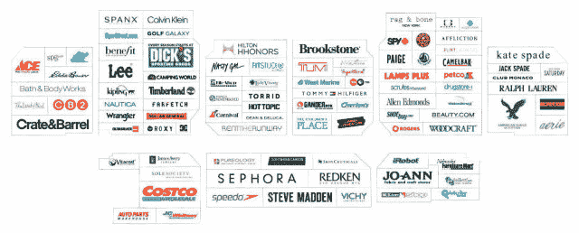
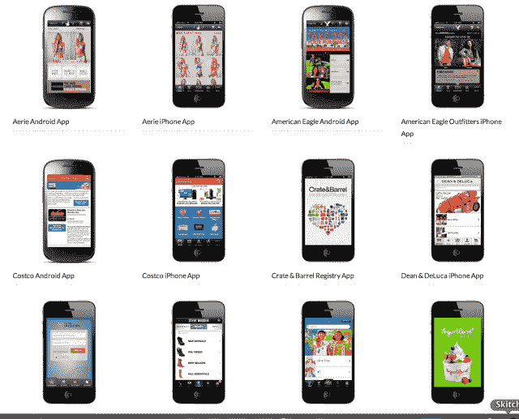

# 品牌化品牌借助移动商务浪潮达到 950 万美元 B 轮 TechCrunch

> 原文：<https://web.archive.org/web/https://techcrunch.com/2013/09/19/branding-brand-rides-m-commerce-wave-to-9-5-million-series-b/>

你可能不熟悉被称为[品牌品牌](https://web.archive.org/web/20221208230357/http://www.brandingbrand.com/)的移动商务供应商，但你可能已经见过它的工作。该公司今天宣布了一项 950 万美元的 B 轮投资，为全球 200 多家顶级零售商的移动电子商务网站[和](https://web.archive.org/web/20221208230357/http://www.brandingbrand.com/collections/mobile-sites)[应用](https://web.archive.org/web/20221208230357/http://www.brandingbrand.com/collections/apps)提供支持，包括美国鹰服饰、好市多、拉尔夫劳伦、丝芙兰、卡尔文克莱恩、Crate & Barrel、Nasty Gal、Kate Spade、Bath & BodyWorks、Brookstone、The Children's Place、Steve Madden、Timberland、汤米·席尔菲格、Dick 's Sporting Goods 等数十家公司。

新一轮融资由现有投资者 [Insight Venture Partners](https://web.archive.org/web/20221208230357/http://www.crunchbase.com/financial-organization/insight-venture-partners) 领投，包括来自 [CrunchFund](https://web.archive.org/web/20221208230357/http://www.crunchbase.com/financial-organization/crunchfund) *的重复投资(披露:TechCrunch 由迈克尔·阿灵顿创立，他也创立了 CrunchFund)* 和 [Lead Edge Capital](https://web.archive.org/web/20221208230357/http://www.crunchbase.com/financial-organization/eastern-advisors) 。还包括新投资者[易贝企业](https://web.archive.org/web/20221208230357/http://www.ebayenterprise.com/)的参与。这使得 Branding Brand 迄今为止的资金总额达到 1700 万美元。

这家总部位于匹兹堡的公司是由卡内基梅隆大学的三位朋友乔伊·拉希米、克里斯托弗·梅森和克里斯蒂娜·科什佐于 2008 年创立的。2009 年，他们推出了第一款产品，推出了一个移动平台，让品牌可以通过移动设备和店内接触到消费者。从那以后，Branding Brand 的年增长率达到了 100%，因其三年来 1，302%的增长率而被命名为 Inc. 500，现在是互联网零售商 500 强的顶级移动平台提供商，其客户数量是第二大供应商的四倍。如今，该公司通过其平台实现了近 10 亿美元的交易，高于 2011 年的 6000 万美元。

为了将零售商带入移动时代，Branding Brand 使用专有技术将企业现有的桌面网站转变为针对智能手机、平板电脑或其他店内平台(如信息亭)设计的移动优化体验。一些代码转换发生在 Branding Brand 创建的 80%的网站中，尽管它使用零售商 API(如果有的话)。

但是，首席执行官克里斯·梅森说，这个过程不仅仅是把一个桌面网站变成一个移动网站。他说:“我们通常还会收录一些与他们现有桌面网站无关的内容。”。例如，他们开发的一款应用可以让用户邀请脸书的朋友加入注册列表。他说，移动应用程序可能需要考虑不同的购物流程，或者它们利用了桌面网站不使用的技术，如智能手机传感器、NFC 或低能耗蓝牙。

该公司声称其移动网站比其他公司更快，他们已经申请了将网站数据转化为品牌自有 API 的专利，这反过来让他们可以将网站输出到可以在一个仪表板上管理的本地体验中。

梅森解释说:“如果你是一家大型零售商，你想开展促销活动，你希望它无缝地出现在你的桌面、应用程序和(移动)网站上。”。“信不信由你，没有哪家提供商能让这一切变得如此简单。所以我们为零售商简化了这一过程。”

品牌化品牌从手机的迅速崛起中受益匪浅，手机如此迅速地被消费者接受，以至于零售商仍未能跟上步伐。到 2011 年年中，只有 48 家在线零售商推出了移动优化网站。T2 明显缺乏 iPad 购物应用，甚至在 iPad 发布一年多后，大多数零售商[仍未推出针对 iPad 优化的网站](https://web.archive.org/web/20221208230357/https://beta.techcrunch.com/2011/12/05/retailers-arent-ready-for-ipad-shopping-trend/)。梅森指出，即使在今天，500 强零售商中仍有 40%没有移动网站。

然而，事情正在发生变化。现在超过一半的零售商[表示](https://web.archive.org/web/20221208230357/http://www.retailcustomerexperience.com/article/214977/Report-Retailers-ready-to-spend-on-expansion-technology)移动和在线购物是影响他们业务的最大趋势之一，根据 SAP 本月发布的一项研究，68%的零售商希望通过移动、在线和社交互动来推动销售，58%的零售商正在建立移动网站，49%的零售商正在开发应用程序。这为品牌成长留下了空间。

品牌化品牌也有助于事情的转化，使用内部分析来监控整个平台的部署。它能够确定在整个在线零售领域拥有如此广泛的足迹后，哪些因素有助于提高转化率。

随着消费者转向新的移动购物方式，该公司现在正与市场上 10 家领先的移动购物聚合商合作。它还向希望自己开发应用程序的零售商授权其 API。

联合创始人 Koshzow 还告诉我们，自从去年秋天 750 万美元的首轮融资以来，Branding Brand 再次实现了 100%的年同比增长，估值也增长了 100%以上。现在她说，Branding Brand 正在努力拓展在线零售之外的领域，最近与希尔顿荣誉酒店(Hilton Honors)和旧金山巴特酒店(San Francisco BART)等新客户一起进入了交通和酒店领域。梅森补充说，与圣地亚哥、芝加哥和华盛顿特区地区交通运营的发展正在进行中。

额外的资金将有助于这些扩张，并允许 Branding Brand 在移动和店内产品上与现有客户更好地合作。随着易贝在新一轮谈判中的加入，两家公司为了知识共享的目的而合作，并进一步巩固他们已经密切的关系。

“这一轮代表了一种利用他们资源的方式，以及他们在这一领域更好的创新知识。在他们这边，他们有所有这些主要的零售商…在过去的几年里，他们一直专注于服务企业[通过[易贝企业](https://web.archive.org/web/20221208230357/http://www.ebayenterprise.com/) ]并与主要零售商合作。我们只知道主要的零售商，”梅森说。

那么，与易贝的交易是否暗示了未来可能的收购？梅森说还没有。今天，它是关于证明品牌品牌可以发展到下一个水平，这将仍然是未来一两年的重点。