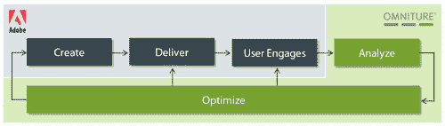

# 重大新闻:Adobe 以约 18 亿美元收购 Omniture 

> 原文：<https://web.archive.org/web/https://techcrunch.com/2009/09/15/breaking-adobe-to-acquire-omniture-for-approximately-1-8-billion/>

# 要闻:Adobe 以约 18 亿美元收购 Omniture

[Adobe Systems](https://web.archive.org/web/20221005214434/http://adobe.com/) 宣布与 [Omniture](https://web.archive.org/web/20221005214434/http://omniture.com/) 达成最终协议，前者将以完全稀释股权价值的方式收购后者，交易价值约为 18 亿美元。根据协议条款，Adobe 将开始以每股 21.50 美元的现金收购 Omniture 的所有发行在外的普通股。该提议比 Omniture 截至昨日收盘的过去 30 个交易日的平均收盘价溢价 45%。

待监管机构批准，该交易预计将于 Adobe 财年第四季度完成。该公司认为，此次收购将增加其 2010 财年的非 GAAP 收益。

Omniture 将成为 Adobe 的一个新业务部门。Omniture 的首席执行官[乔希·詹姆斯](https://web.archive.org/web/20221005214434/http://www.crunchbase.com/person/josh-james)将加入 Adobe Systems，担任该部门的高级副总裁，直接向 Adobe 首席执行官[尚塔努·纳拉延](https://web.archive.org/web/20221005214434/http://www.crunchbase.com/person/shantanu-narayen)汇报。

与此同时，Adobe 报告称，第三季度收益从一年前的每股 50 美分降至每股 35 美分。Adobe 股价在盘后交易中下跌 3.6%，至 34.34 美元。收盘后，Omniture 股票停牌。

从官方声明来看:

> 通过将 Adobe 的内容创建工具和无处不在的客户端与 Omniture 的 Web 分析、测量和优化技术相结合，Adobe 将能够提供能够改变所有数字内容、平台和设备的精彩体验和电子商务的未来的解决方案。
> 
> 两家公司的合并将增加 Adobe 为客户提供的价值。对于设计人员、开发人员和在线营销人员来说，集成的工作流程(在创建工具中嵌入了优化功能)将简化相关内容和应用程序的创建和交付。这种优化将使广告商、广告代理商、出版商和电子零售商从他们的数字媒体投资中获得更大的投资回报，并改善他们的最终用户体验。

Omniture 成立于 1996 年，目前大约有。全球 1200 名员工。它是全球最大的网络分析提供商，拥有 12 个产品组合，为全球 5，000 多家客户提供服务。该公司 2008 财年的收入约为 3 亿美元。