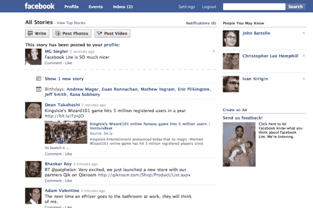
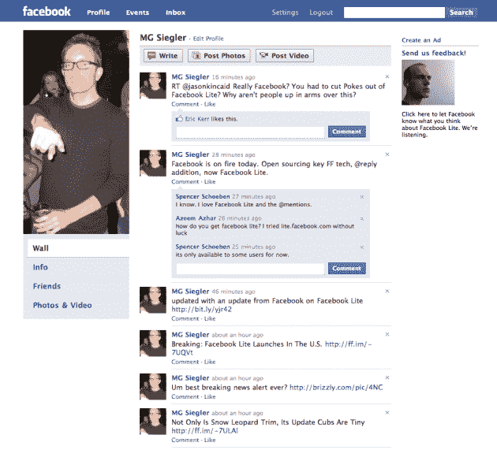
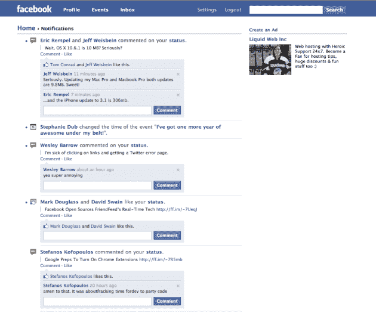

# 踢它的老学校:脸书建兴在美国和印度推出 

> 原文：<https://web.archive.org/web/https://techcrunch.com/2009/09/10/breaking-facebook-lite-launches-in-the-u-s/>

嗯，在这里。正如几周前我们第一次发现一样，[脸书 Lite](https://web.archive.org/web/20230130110830/http://lite.facebook.com/) 刚刚发布，供美国用户测试。简而言之，这个网站比脸书正规网站干净多了，看起来也漂亮多了。我说过要快得多吗？

最初[打算](https://web.archive.org/web/20230130110830/http://techcrunch.com/2009/08/12/what-facebook-lite-actually-is-hint-its-not-twitter/)在高速互联网连接稀少或不存在的国家使用，显然脸书已经意识到所有用户都有拥有一个更小版本服务的真实愿望。我们被告知，除了在美国推出之外，这项服务现在也在印度上线。

正如我们上个月所写的:

> 话虽如此，这项服务完全有可能走向世界其他地方，成为那些不想要脸书提供的所有花哨功能，而只想要速度的人的一种选择。脸书对此没有什么可说的，特别是美国，但这似乎是合理的。

脸书精简版的一大优点是，除了更简洁之外，更新会实时出现在页面底部，这比脸书特有的丑陋工具栏好看多了。这和[脸书卓越的实验性](https://web.archive.org/web/20230130110830/http://techcrunch.com/2009/09/09/facebooks-experimental-notifications-app-for-mac-is-very-very-slick/)Mac 桌面更新程序一起，似乎表明该公司再次致力于用户体验，而不是把事情搞得一团糟。记住，[保持简单，笨蛋](https://web.archive.org/web/20230130110830/http://techcrunch.com/2009/04/28/keep-it-simple-stupid/)。

Lite 进军美国市场的举动也很有趣，因为它的竞争对手 MySpace 在 4 月份也做了类似的事情来消除臃肿。似乎流行瘦。

当然，如果你喜欢脸书上的应用程序，你不会喜欢这个版本，因为它们无处可寻。但是我和其他许多人开始使用脸书的原因首先是因为社会关系和数据。我想尽快访问这些数据，我不在乎玩游戏。

你还会注意到顶部工具栏中增加了一个“事件”标签。再说一次，这比脸书市区好得多，那里的事件被埋在一个分区里。同样在顶部，提要的正上方是一个“查看头条新闻”的方式，而不是那些按顺序列出的。我讨厌不断重复自己，但再次，一个巨大的变化。

您还会看到联系人的当前和即将到来的生日位于提要的顶部。

那么，为什么印度也是如此呢？嗯，首先，印度很多人说英语。第二，正如我们之前提到的，印度是脸书 Lite 最初瞄准的国家之一，印度是几个月前发射的第一个试验空间。印度也是脸书发展非常迅速的地区。事实上，如此之快，以至于雅虎可能已经关闭了自己的社交网络 SpotM 作为回应。然而，谷歌的 Orkut 仍然是这个国家的领导者。

这是今天来自脸书的第三个有趣的发展。今天早上，它宣布将对最近收购的 FriendFeed 背后的关键技术部分进行开源。今天下午早些时候，它开始使用“@回复”语法，模仿人们在竞争对手 Twitter 上交流的方式。

我们联系了脸书，询问他们为什么这么快就决定在美国推出这款游戏。我们收到回复后会更新。

更新:以下是脸书对此事的看法:

> 我们决定在美国推出脸书 Lite，为用户提供一个简单、便捷的 facebook.com 替代品，并希望它能满足这一需求。虽然我们的大部分用户群在美国以外，但我们一直在努力增强新的用户体验，即使是在 facebook.com 容易进入的市场。我们还发现，刚到脸书的人往往对更简单的体验最感兴趣，专注于建立他们的朋友网络，并通过在他们的墙上写字、发送消息和看图片来与他们交流。考虑到这些新用户，我们推出了 Lite 网站。

**更新 2** :这是扎克伯格和他的团队为这个[的发布敲锣](https://web.archive.org/web/20230130110830/http://lite.facebook.com/blake/video/of/Facebook-Lite/153561270165/)。

