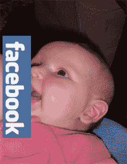

# 乳房不适合脸书技术危机

> 原文：<https://web.archive.org/web/https://techcrunch.com/2007/09/07/breast-isnt-best-on-facebook/>

# 乳房不适合脸书

母乳喂养积极分子(被称为“乳糖主义者”)和脸书之间就脸书的母乳喂养照片爆发了争议。

脸书已经记录了用户母乳喂养的照片，甚至以这些照片构成“淫秽内容”为由，完全禁止用户使用可以说乳糖不耐受者一点也不快乐。

根据 SMH 的一份报告《T4》中的说法，乳糖不耐症患者抱怨说，尽管他们的图像中没有乳头，但他们的图像被移除了，这质疑了脸书猥亵指控的逻辑:“喂养从哪里停止，乳房从哪里开始？”？？偷看一眼乳头？”确实是。

脸书发言人梅雷迪思·钦说，脸书并不阻止母乳喂养者上传自己母乳喂养的照片，但她接着说，“含有裸露乳房的照片确实违反了我们的条款，会被删除”。现在我可能是男性，所以我最近没有第一手经验，但我很困惑，为什么母乳喂养不能包括乳房？

乳糖主义者呼吁支持者加入他们的脸书小组[嘿，脸书，母乳喂养并不下流！](https://web.archive.org/web/20221209125611/http://www.facebook.com/group.php?gid=2517126532)，目前已有 7000 多名会员。