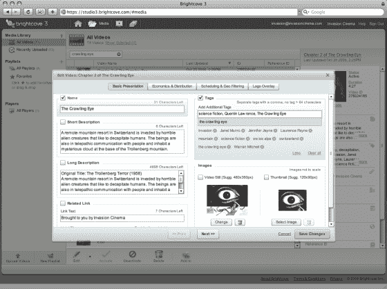

# Brightcove 3(泄露的截图)

> 原文：<https://web.archive.org/web/https://techcrunch.com/2008/10/12/brightcove-3-leaked-screenshots/>

道琼斯、华纳音乐和《纽约时报》等媒体公司使用的网络视频分发平台 Brightcove 正在进行大规模改造。大多数人不会看到它，但它的客户会。他们用来上传、管理和分发视频的新版网络软件即将推出。它将被称为 Brightcove 3。(要了解更多背景，请阅读我们去年 6 月写的 Brightcove 3 测试版的[预览，以及我们 8 月对 Brightcove 首席执行官杰里米·阿莱尔的](https://web.archive.org/web/20221006021528/http://www.beta.techcrunch.com/2008/06/16/brightcove-gutted-and-rebuilt/)[采访](https://web.archive.org/web/20221006021528/http://www.beta.techcrunch.com/2008/08/23/brightcove-ceo-discusses-the-future-and-failures-of-online-video/)。

早在 6 月，我们就注意到:

> *新的发布模式以 Brightcove 的第一个服务器端 API 为中心，允许发布者将视频元数据深度集成到他们的显示页面中。发布者可以选择以对其内容最有意义的方式突出显示相关视频(也许是通过将它们组织成可以按主题或名称浏览的列表)。他们还可以显示描述，并选择优化搜索引擎优化的网址。就货币化而言，页内广告可以与视频广告同步，以产生更有效的印象。*
> 
> 。。。Brightcove 3 拥有一个新的用户界面，不需要出版商在标签之间跳跃来解决设置过程的不同部分。iTunes 外观的控制面板利用了拖放和批量编辑功能，这应该可以简化视频的添加和编辑。

昨天，我们收到了下面泄露的截图，并将其与 Web 软件的相应当前部分进行了配对。据我们所知，他们以前从未在私人测试版之外出现过。从截图来看，Brightcove 3 更加直观，为网络视频发布者提供了比以前更多的选择。点击每个截图查看大图。

这是新的起始页(顶部)和当前的仪表板(底部):

Brightcove 允许客户定制他们的视频播放器。这是新的视频播放器样式编辑器(上图)与当前的样式编辑器(下图):

这是新的标题编辑器(上图)和当前的标题编辑器(下图)。请注意，添加标签和选择视频静止图像和缩略图的功能是如何放在最前面的:

广告选择也在扩大。Brightcove 3(上图)看起来将为每个玩家提供不同广告策略和广告类型(前滚、中滚、后滚)的选择。当前(下图)，用户可以选择“广告”或“无广告”:

而且，我认为这可能是新的，Brightcove 3 将以不同的标准(VP6 和 H.264)和不同的比特率(360，512，900 和 1，500 kbps)创建每个视频的“多种再现”，这大概取决于观众的带宽和软件:

