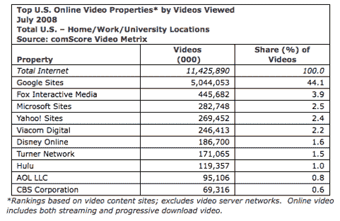
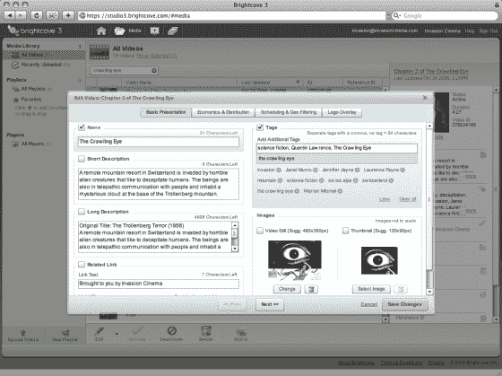
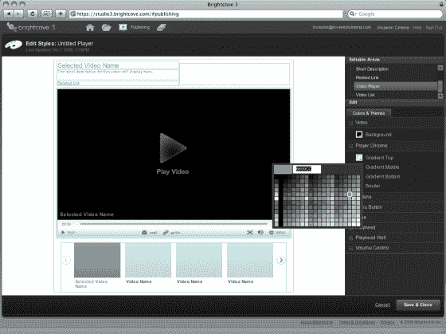

# Brightcove 每月已经在播放“数亿”视频。现在是 Brightcove 3。TechCrunch

> 原文：<https://web.archive.org/web/https://techcrunch.com/2008/10/13/brightcove-is-already-streaming-several-hundred-million-videos-a-month-now-comes-brightcove-3/>

几天前，我们发布了 Brightcove 3 的一些[泄露的截图](https://web.archive.org/web/20221006201629/http://www.beta.techcrunch.com/2008/10/12/brightcove-3-leaked-screenshots/)，Brightcove 3 是 bright cove 的完全[掏空和重建的](https://web.archive.org/web/20221006201629/http://www.beta.techcrunch.com/2008/06/16/brightcove-gutted-and-rebuilt/)网络视频平台，将于周二发布。我采访了 Brightcove 的首席执行官杰里米·阿莱尔(Jeremy Allaire ),他向我介绍了该公司的最新情况，并向我介绍了该服务的所有变化。

Brightcove 是一个网络视频发布平台，已经筹集了 9100 万美元，拥有数百个主要媒体品牌作为其客户，包括道琼斯、Showtime ( *Dexter* 、 *The Tudors* )、Lifetime、AMC ( *Mad Men* )、《时代》杂志和《纽约时报》。电视网络、杂志、报纸和音乐公司都使用 Brightcove 在他们的网站和网络上分发和管理视频。越来越多的大公司如太阳微系统公司，大学如 NYU，政治组织如奥巴马竞选。

Allaire 说，总的来说，他的客户正以“每月几亿个流”的速度分发网络视频，这将使 Brightcove 成为十大视频网络之一。这仍远低于排名第一的 YouTube，该网站每月播放 50 亿视频，但可能与排名第二的 Fox Interactive/MySpace(4.46 亿视频)或第三的微软(2.86 亿视频)相差无几。

至于 Brightcove 的财务状况，Allaire 只会说:

> *我们没有盈利，但我们的烧钱率继续下降。我们预计不会因为我们的增长而不得不筹集额外的资金。*

这家总部位于波士顿的公司现在拥有 160 名员工，业务遍及全球。欧洲现在占收入的 20%和预订量的 34 %,比一年前的零增长了。Alliare 在 5 月份成立了一家单独资本化的日本子公司。

在 Brightcove 3 中，该公司引入了一个简化的用户界面和一套全新的功能。其中包括一种用于创建视频播放器的新标记语言，称为 Brightcove 体验标记语言(BEML)，面向客户和开发人员的新 API，以及智能流媒体技术，该技术可以根据观众的设备和带宽限制动态改变视频质量。

以下是 Brightcove 3 中新功能的摘要:

1.  **自定义玩家。**新的 API 允许对 Brightcove 视频播放器和观看体验进行更深入的定制。Brightcove Experience 标记语言使得任何懂 HTML 的 Web 开发人员都可以轻松地创建复杂的样式、社交工具和视频播放器导航选项。
2.  **定价**。Brightcove 将从一个统一价格转变为三个不同的等级(基本、专业和企业)。对于企业客户来说，订阅费用从每年几千美元开始，一直到几十万美元。
3.  **动态分娩。**每个视频流都会根据观众的带宽和播放器的大小等因素进行实时优化。Brightcove 3 自动为每个视频创建多种格式，适用于从移动到高清的各种观看。
4.  **更多 API**。Brightcove 已经有 API 让开发者定制它的视频播放器。现在，它向那些想为社会评论工具(JS-KIT 就是这么做的)、上下文广告或分析编写插件的开发者开放。该公司还发布了辛迪加 API，用于控制每个视频的广告，无论它出现在哪里。其 Brightcove Media APIs 将使每个视频对搜索引擎可见，并使添加相关视频和其他上下文信息变得更容易。每个 Brightcove 视频现在都有自己唯一的 URL。媒体 API 将允许出版商从视频中提取节目信息，这样他们就可以将它插入到每个页面的 HTML 中。

关于这最后一点，阿莱尔说:

> YouTube 教会了我们所有人这一课。每个视频都有自己的页面，有 20 种不同的方法可以转到下一个视频。

面对 YouTube 的压倒性优势，你如何看待那里的 Brightcove 视频？阿莱尔的回答是:

> *你没有也不需要。你可以在谷歌上找到它。视频是一种媒体类型。它是一种强大的交流媒介。宽带互联网将推动视频。流量会在网站间流动。*

也许有一天，但现在看起来仍然像一个赢家通吃的游戏。阿莱尔认为他可以改变这一点。

以下是阿莱尔关于甜菜 Brightcove 3 的采访。电视:

[http://services . bright cove . com/services/viewer/federated _ F8/271525782](https://web.archive.org/web/20221006201629/http://services.brightcove.com/services/viewer/federated_f8/271525782)

