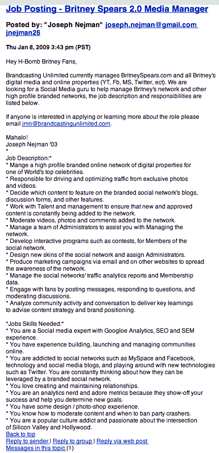

# 布兰妮·斯皮尔斯正在招聘一名在线媒体经理 

> 原文：<https://web.archive.org/web/https://techcrunch.com/2009/01/10/britney-spears-is-hiring-an-online-media-manager/>

# 布兰妮·斯皮尔斯正在招聘一名在线媒体经理

想管理布兰妮的[在线角色](https://web.archive.org/web/20230209055928/https://techcrunch.com/2008/10/19/omg-britney/)？她在 YouTube、Twitter、脸书、MySpace 和其他网站上，有人(当然不是她)必须做所有发布和回复内容的艰苦工作。

这就是你进来的地方。如果你去了哈佛，那是。布兰妮的在线经理 Brandcasting Unlimited 昨天在哈佛专属的私人招聘板上发布了“布兰妮 2.0 媒体经理”的职位列表。在不那么苛刻的工作要求中:你必须“沉迷于社交网络，如 MySpace 和脸书”

完整的工作列表如下:

